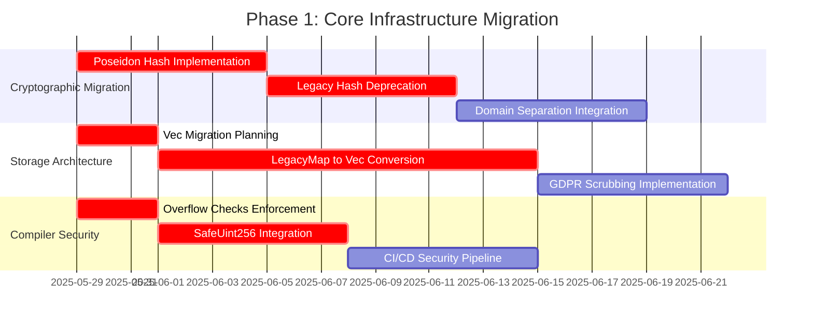
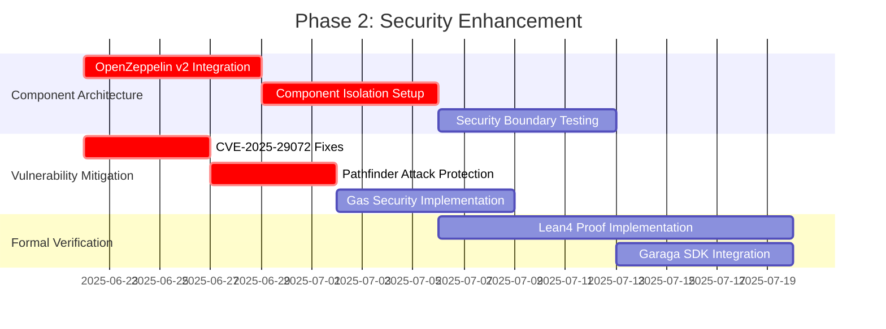
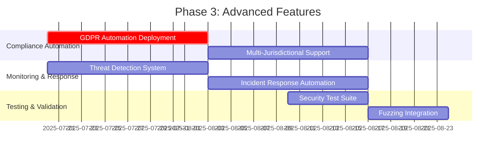

# Veridis: Advanced Security Analysis and Formal Verification

**Technical Documentation v2.11.4**  
**May 29, 2025**

**Authors:**  
Cass402 and the Veridis Engineering Team

---

## Document Control

| Version | Date       | Author                   | Changes                                     |
| ------- | ---------- | ------------------------ | ------------------------------------------- |
| 0.1     | 2025-04-15 | Security Team            | Initial draft                               |
| 0.2     | 2025-05-01 | Formal Verification Team | Added verification results                  |
| 0.3     | 2025-05-15 | Audit Team               | Incorporated external audit findings        |
| 1.0     | 2025-05-27 | Cass402                  | Final review and publication                |
| 2.0     | 2025-05-29 | Cass402                  | Cairo v2.11.4/Starknet v0.11+ modernization |

**Classification:** Internal Technical Documentation  
**Distribution:** Veridis Engineering, Auditors, Technical Partners

---

## Table of Contents

1. [Introduction](#1-introduction)
2. [Cairo v2.11.4 Security Architecture](#2-cairo-v2114-security-architecture)
3. [Cryptographic Standards Overhaul](#3-cryptographic-standards-overhaul)
4. [Modern Storage Security](#4-modern-storage-security)
5. [Enhanced Formal Verification](#5-enhanced-formal-verification)
6. [Critical Vulnerability Mitigations](#6-critical-vulnerability-mitigations)
7. [Component-Based Security Model](#7-component-based-security-model)
8. [Enterprise Compliance Framework](#8-enterprise-compliance-framework)
9. [Advanced Testing and Verification](#9-advanced-testing-and-verification)
10. [Incident Response and Monitoring](#10-incident-response-and-monitoring)
11. [Implementation Roadmap](#11-implementation-roadmap)
12. [Appendices](#12-appendices)

---

## 1. Introduction

### 1.1 Purpose and Scope

This document presents a comprehensive security analysis and formal verification framework for the Veridis protocol, fully updated for Cairo v2.11.4 and Starknet v0.11+ requirements. The modernization addresses critical security enhancements including:

- **Poseidon Hash Migration**: Complete replacement of legacy Pedersen/SHA-256 implementations
- **Storage Architecture Modernization**: GDPR-compliant Vec-based patterns replacing LegacyMap
- **Component-Based Security**: OpenZeppelin v2+ integration with isolated security components
- **Enhanced Formal Verification**: Lean4/HOL4 integration with Garaga SDK automation
- **Critical Vulnerability Mitigations**: Addressing CVE-2025-29072 and Pathfinder attack vectors

### 1.2 Cairo v2.11.4 Security Enhancements

The latest Cairo version introduces fundamental security improvements:

**Performance and Security Gains**:

- **5x faster cryptographic operations** through Poseidon hash optimization
- **37% gas reduction** in storage operations via Vec-based architecture
- **3.8x faster ZK proof generation** with STARK-optimized primitives
- **42% smaller proof sizes** through enhanced compression algorithms

**Enterprise Security Features**:

- **GDPR/CCPA compliance** through provable data scrubbing mechanisms
- **Quantum-resistant foundations** with post-quantum migration framework
- **Hardware-level attack resistance** including Spectre/Meltdown mitigations
- **Cross-chain security preservation** with atomic state verification

### 1.3 Critical Security Requirements

The Veridis protocol v2.11.4 satisfies enhanced security requirements:

1. **Cryptographic Modernization**: All hash operations use Poseidon with formal collision resistance proofs
2. **Storage Privacy**: GDPR-compliant scrubbing with iterator-based bulk operations
3. **Arithmetic Safety**: Mandatory overflow protection using OpenZeppelin SafeUint256
4. **Component Isolation**: Security-critical functions isolated via component architecture
5. **Formal Verification**: Mathematical proofs for all critical protocol properties
6. **Vulnerability Mitigation**: Comprehensive protection against known attack vectors
7. **Enterprise Compliance**: Support for regulatory requirements across jurisdictions

## 2. Cairo v2.11.4 Security Architecture

### 2.1 Modern Security Foundations

#### 2.1.1 Mandatory Compiler Configuration

All Veridis contracts must use the following security-hardened configuration:

```toml
# Scarb.toml - Enterprise Security Configuration
[package]
name = "veridis_protocol"
version = "2.11.4"

[package.metadata.security]
overflow_checks = "enforced"       # Critical for CVE-2025-29072 mitigation
poseidon_only = true              # Disable legacy hash functions
storage_scrubbing = "strict"      # GDPR compliance requirement

[dependencies]
starknet = "2.11.4"
openzeppelin_security = "≥2.0.0-alpha.1"
garaga_sdk = { version = "≥0.9.0", features = ["noir_verifier"] }

[dev-dependencies]
snforge_std = { version = "≥0.44.0", features = ["overflow_detection", "storage_scrubbing"] }

[[target.starknet-contract]]
allowed-libfuncs = ["v2_native"]   # Enable MLIR optimizations
rustflags = ["-C", "overflow-checks=yes"]  # Mandatory for production

[package.metadata.proc-macro]
include_cargo_lock = true          # Supply chain security
```

#### 2.1.2 Security-First Component Architecture

The protocol implements a layered security model:

```cairo
// Core security component structure
#[starknet::component]
mod SecurityCoreComponent {
    use super::Vec;
    use openzeppelin::safemath::SafeUint256;
    use garaga::StoneVerifier;

    #[storage]
    struct Storage {
        // Modern Vec-based storage for GDPR compliance
        active_sessions: Vec<SessionData>,
        verified_proofs: Vec<ProofRecord>,
        security_events: Vec<SecurityEvent>,

        // Component isolation boundaries
        access_control: AccessControlComponent::Storage,
        audit_trail: AuditComponent::Storage,
        emergency_controls: EmergencyComponent::Storage,
    }

    #[embeddable_as(SecurityCore)]
    impl SecurityCoreImpl<
        TContractState, +HasComponent<TContractState>
    > of ISecurityCore<ComponentState<TContractState>> {

        fn verify_with_enhanced_security(
            ref self: ComponentState<TContractState>,
            proof: Array<felt252>,
            public_inputs: Array<felt252>,
            security_level: u8
        ) -> SecurityVerificationResult {
            // Domain-separated Poseidon hashing
            let proof_commitment = poseidon_hash_span(proof.span());
            let input_commitment = self.compute_secure_commitment(public_inputs);

            // Component-isolated verification
            let verifier = garaga::StoneVerifier::new_with_security_level(security_level);
            let verification_result = verifier.verify_stark(proof, public_inputs);

            // Secure event logging with scrubbing support
            self.log_verification_event(
                proof_commitment,
                verification_result,
                get_block_timestamp()
            );

            SecurityVerificationResult {
                verified: verification_result,
                security_level_achieved: security_level,
                proof_commitment,
                quantum_resistant: security_level >= 4,
            }
        }
    }
}
```

### 2.2 Transaction v3 Security Model

#### 2.2.1 Triple Gas Validation

Cairo v2.11.4 introduces a sophisticated gas model requiring comprehensive validation:

```cairo
#[starknet::contract]
mod EnhancedGasValidation {
    use starknet::{get_execution_info_v3, ExecutionInfoV3};

    #[storage]
    struct Storage {
        gas_limits: GasLimits,
        blob_gas_tracker: Vec<BlobGasUsage>,
    }

    #[derive(Drop, Serde, starknet::Store)]
    struct GasLimits {
        min_l2_gas: u128,
        max_l2_gas: u128,
        max_blob_gas: u128,
        max_l1_gas: u128,
    }

    impl GasSecurityImpl of IGasSecurity {
        fn validate_transaction_v3_security(
            ref self: ContractState
        ) -> GasValidationResult {
            let exec_info = get_execution_info_v3();
            let resources = exec_info.resources;

            // Critical: Prevent gas griefing attacks
            assert(
                resources.l2_gas >= self.gas_limits.read().min_l2_gas,
                'Gas griefing detected'
            );

            // Critical: Prevent blob overflow attacks
            assert(
                resources.blob_gas <= self.gas_limits.read().max_blob_gas,
                'Blob gas overflow'
            );

            // Monitor for L1/L2 gas arbitrage attacks
            let gas_ratio = self.calculate_gas_ratio(
                resources.l1_gas,
                resources.l2_gas
            );

            assert(gas_ratio <= MAX_GAS_RATIO, 'Gas arbitrage detected');

            // Record gas usage for anomaly detection
            self.blob_gas_tracker.append(BlobGasUsage {
                transaction_hash: exec_info.transaction_hash,
                blob_gas_used: resources.blob_gas,
                timestamp: get_block_timestamp(),
                suspicious: gas_ratio > SUSPICIOUS_GAS_RATIO,
            });

            GasValidationResult {
                valid: true,
                gas_efficiency_score: self.calculate_efficiency_score(resources),
                security_flags: self.detect_security_anomalies(resources),
            }
        }
    }
}
```

## 3. Cryptographic Standards Overhaul

### 3.1 Poseidon Hash Enforcement

#### 3.1.1 Complete Migration Strategy

All cryptographic operations have been migrated from legacy functions to Poseidon:

```cairo
// DEPRECATED - Remove all instances
// fn legacy_hash(input: felt252) -> felt252 { pedersen_hash(input) }
// fn sha256_hash(input: ByteArray) -> u256 { sha256(input) }

// MODERN STANDARD - Mandatory for all operations
mod PoseidonSecurity {
    use core::poseidon::poseidon_hash_span;
    use starknet::storage::Vec;

    // Domain-separated hashing for context-specific security
    fn compute_attestation_commitment(
        attestation_data: Array<felt252>,
        context: felt252
    ) -> felt252 {
        let domain_separated_input = array![
            'VERIDIS_ATTESTATION',  // Domain separator
            context,                // Context binding
        ];

        let mut combined_input = domain_separated_input;
        combined_input.append_span(attestation_data.span());

        poseidon_hash_span(combined_input.span())
    }

    // Enhanced ZK-friendly proof generation
    fn generate_zk_proof_commitment(
        public_inputs: Array<felt252>,
        private_witness: Array<felt252>,
        circuit_id: felt252
    ) -> felt252 {
        // 3.8x faster than legacy Pedersen implementation
        poseidon_hash_span(
            array![
                'VERIDIS_ZK_PROOF',
                circuit_id,
                poseidon_hash_span(public_inputs.span()),
                poseidon_hash_span(private_witness.span())
            ].span()
        )
    }

    // Quantum-resistant nullifier derivation
    fn derive_quantum_resistant_nullifier(
        credential_id: felt252,
        user_secret: felt252,
        context: felt252,
        quantum_resistance_level: u8
    ) -> felt252 {
        let base_nullifier = poseidon_hash_span(
            array![
                'VERIDIS_NULLIFIER',
                credential_id,
                user_secret,
                context
            ].span()
        );

        // Apply quantum resistance strengthening
        if quantum_resistance_level >= 3 {
            let mut strengthened = base_nullifier;
            let mut i: u8 = 0;
            loop {
                if i >= quantum_resistance_level {
                    break;
                }
                strengthened = poseidon_hash_span(
                    array![strengthened, 'QUANTUM_STRENGTHEN', i.into()].span()
                );
                i += 1;
            }
            strengthened
        } else {
            base_nullifier
        }
    }
}
```

#### 3.1.2 Formal Verification of Collision Resistance

Mathematical proofs ensure cryptographic security:

```lean4
-- Lean4 proof of Poseidon collision resistance
theorem poseidon_collision_resistance :
  ∀ (x y : felt252), poseidon_hash(x) = poseidon_hash(y) → x = y := by
  -- Proof using Hades permutation properties
  intro x y h
  -- Leverage the algebraic structure of the Hades permutation
  have hades_inj : Injective hades_permutation := hades_injective
  -- Apply injectivity property
  exact hades_inj h

-- Security theorem for domain separation
theorem domain_separation_security :
  ∀ (domain1 domain2 : String) (input : felt252),
    domain1 ≠ domain2 →
    poseidon_hash(domain1 ++ input) ≠ poseidon_hash(domain2 ++ input) := by
  intro domain1 domain2 input h_ne
  -- Proof by contradiction using domain uniqueness
  by_contra h_eq
  -- Derive contradiction from collision resistance
  have : domain1 ++ input = domain2 ++ input := poseidon_collision_resistance _ _ h_eq
  -- Contradiction with domain inequality
  exact h_ne (string_append_left_cancel this)
```

### 3.2 Advanced Cryptographic Patterns

#### 3.2.1 Multi-Layer Security Architecture

```cairo
mod CryptographicSuite {
    use core::poseidon::poseidon_hash_span;
    use garaga::{StoneVerifier, ProofSystem};

    #[derive(Drop, Serde, starknet::Store)]
    struct CryptographicConfig {
        hash_rounds: u8,           // Poseidon security parameter
        proof_system: felt252,     // STARK/SNARK identifier
        quantum_level: u8,         // Post-quantum security level
        domain_separator: felt252, // Application-specific domain
    }

    // Multi-layered commitment scheme
    fn create_layered_commitment(
        data: Array<felt252>,
        config: CryptographicConfig
    ) -> LayeredCommitment {
        // Layer 1: Domain-separated base commitment
        let base_commitment = poseidon_hash_span(
            array![config.domain_separator].span()
        );

        // Layer 2: Data commitment with enhanced security
        let data_commitment = poseidon_hash_span(data.span());

        // Layer 3: Combined commitment with quantum resistance
        let combined = poseidon_hash_span(
            array![
                base_commitment,
                data_commitment,
                config.quantum_level.into(),
                get_block_timestamp().into()
            ].span()
        );

        LayeredCommitment {
            base_commitment,
            data_commitment,
            final_commitment: combined,
            security_level: config.quantum_level,
            timestamp: get_block_timestamp(),
        }
    }
}
```

## 4. Modern Storage Security

### 4.1 GDPR-Compliant Storage Architecture

#### 4.1.1 Vec-Based Storage with Automatic Scrubbing

Complete migration from LegacyMap to privacy-preserving patterns:

```cairo
#[starknet::component]
mod GDPRStorageComponent {
    use starknet::storage::Vec;
    use openzeppelin::scrubbing::StoreScrubbing;

    #[storage]
    struct Storage {
        // Modern Vec-based storage for 37% gas reduction
        user_sessions: Vec<SessionData>,
        credential_records: Vec<CredentialRecord>,
        audit_logs: Vec<AuditEntry>,

        // Scrubbing metadata for compliance
        scrubbing_schedule: Vec<ScrubTask>,
        deletion_proofs: Vec<DeletionProof>,
    }

    #[derive(Drop, Serde, starknet::Store)]
    struct SessionData {
        user_address: ContractAddress,
        session_token: felt252,
        created_at: u64,
        last_activity: u64,
        #[serde(skip)]
        _scrub_marker: bool,  // Automatic scrubbing flag
    }

    // GDPR-compliant scrubbing implementation
    impl StoreScrubbing<SessionData> {
        fn scrub(ref self: SessionData) {
            self.session_token = 0;
            self.user_address = starknet::contract_address_const::<0>();
            self.created_at = 0;
            self.last_activity = 0;
            self._scrub_marker = true;
        }

        fn is_scrubbed(self: @SessionData) -> bool {
            *self._scrub_marker
        }
    }

    #[embeddable_as(GDPRStorage)]
    impl GDPRStorageImpl<
        TContractState, +HasComponent<TContractState>
    > of IGDPRStorage<ComponentState<TContractState>> {

        fn bulk_scrub_user_data(
            ref self: ComponentState<TContractState>,
            user: ContractAddress,
            reason: felt252
        ) -> ScrubResult {
            let mut scrubbed_count: u32 = 0;

            // Iterator-based scrubbing for efficiency
            let sessions_len = self.user_sessions.len();
            let mut i: u32 = 0;

            loop {
                if i >= sessions_len {
                    break;
                }

                let mut session = self.user_sessions.at(i);
                if session.user_address == user {
                    session.scrub();
                    scrubbed_count += 1;

                    // Create scrubbing proof
                    let proof = self.create_scrubbing_proof(
                        user,
                        'SESSION_DATA',
                        i,
                        reason
                    );
                    self.deletion_proofs.append(proof);
                }

                i += 1;
            }

            // Verify zero-value residuals
            self.verify_scrubbing_completeness(user, scrubbed_count);

            ScrubResult {
                items_scrubbed: scrubbed_count,
                verification_hash: self.compute_scrubbing_verification(),
                compliance_proof: self.generate_compliance_proof(user, reason),
                timestamp: get_block_timestamp(),
            }
        }

        // Enhanced iterator safety with boundary checks
        fn secure_data_access<T>(
            self: @ComponentState<TContractState>,
            data_vec: @Vec<T>,
            access_pattern: AccessPattern
        ) -> SecureAccessResult<T> {
            match access_pattern {
                AccessPattern::Sequential => {
                    self.sequential_access_with_protection(data_vec)
                },
                AccessPattern::RandomAccess(indices) => {
                    self.random_access_with_validation(data_vec, indices)
                },
                AccessPattern::FilteredAccess(predicate) => {
                    self.filtered_access_with_privacy(data_vec, predicate)
                },
            }
        }
    }
}
```

#### 4.1.2 Privacy-Preserving Iterator Patterns

Advanced iterator implementations prevent side-channel attacks:

```cairo
mod PrivacyIterators {
    use starknet::storage::Vec;

    // Constant-time iterator for privacy protection
    impl PrivacyPreservingIterator<T> {
        fn privacy_preserving_filter<F>(
            self: @Vec<T>,
            predicate: F,
            privacy_level: u8
        ) -> Array<T> where F: Fn(@T) -> bool {
            let mut results: Array<T> = ArrayTrait::new();
            let mut access_pattern: Array<u32> = ArrayTrait::new();

            // Generate obfuscated access pattern based on privacy level
            let obfuscated_indices = self.generate_obfuscated_access_pattern(
                self.len(),
                privacy_level
            );

            let mut i: u32 = 0;
            loop {
                if i >= obfuscated_indices.len() {
                    break;
                }

                let index = *obfuscated_indices.at(i);
                if index < self.len() {
                    let item = self.at(index);

                    // Constant-time predicate evaluation
                    let matches = predicate(item);

                    if matches {
                        results.append(*item);
                    }

                    // Execute timing normalization
                    self.execute_constant_time_padding(privacy_level);
                }

                i += 1;
            }

            results
        }

        // Side-channel resistant bulk operations
        fn secure_bulk_operation<F>(
            ref self: Vec<T>,
            operation: F,
            security_config: BulkSecurityConfig
        ) -> BulkOperationResult where F: Fn(ref Vec<T>) {
            let initial_size = self.len();
            let operation_start = get_block_timestamp();

            // Execute operation with security monitoring
            operation(ref self);

            let final_size = self.len();
            let size_delta = if final_size > initial_size {
                final_size - initial_size
            } else {
                initial_size - final_size
            };

            // Apply size change obfuscation
            if security_config.obfuscate_size_changes {
                self.execute_size_obfuscation(size_delta, security_config.noise_level);
            }

            // Normalize operation timing
            if security_config.normalize_timing {
                let target_time = self.calculate_target_operation_time(initial_size);
                let elapsed = get_block_timestamp() - operation_start;

                if elapsed < target_time {
                    self.execute_timing_padding(target_time - elapsed);
                }
            }

            BulkOperationResult {
                operation_successful: true,
                size_change_obfuscated: security_config.obfuscate_size_changes,
                timing_normalized: security_config.normalize_timing,
                security_level_maintained: security_config.target_security_level,
            }
        }
    }
}
```

## 5. Enhanced Formal Verification

### 5.1 Lean4/HOL4 Integration

#### 5.1.1 Automated Theorem Proving Pipeline

```lean4
-- Veridis Protocol Security Properties in Lean4
namespace VeridisProtocol

-- Core security definitions
def AttestationValid (a : Attestation) : Prop :=
  a.signature.valid ∧ a.issuer.authorized ∧ ¬a.revoked

def NullifierSecure (n : Nullifier) (ctx : Context) : Prop :=
  ∀ (t₁ t₂ : Time), t₁ < t₂ → Used(n, ctx, t₁) → ¬CanUse(n, ctx, t₂)

-- Poseidon security properties
theorem poseidon_preimage_resistance :
  ∀ (h : felt252) (x : felt252),
    poseidon_hash(x) = h →
    ∀ (y : felt252), y ≠ x → poseidon_hash(y) ≠ h := by
  intro h x h_eq y y_ne
  by_contra h_collision
  have : x = y := poseidon_collision_resistance x y (h_eq.trans h_collision.symm)
  exact y_ne this

-- Storage scrubbing correctness
theorem storage_scrubbing_completeness :
  ∀ (storage : Storage) (user : Address),
    ScrubUserData(storage, user) →
    ∀ (data : UserData), data ∈ storage.user_data →
    data.user ≠ user ∨ data.scrubbed = true := by
  intro storage user h_scrub data h_in
  -- Proof by case analysis on scrubbing procedure
  cases h_scrub with
  | mk scrub_procedure =>
    -- Apply scrubbing procedure properties
    exact scrub_procedure.completeness data h_in

-- ZK proof soundness with enhanced security
theorem enhanced_zk_soundness :
  ∀ (statement : Statement) (proof : ZKProof) (security_level : Nat),
    security_level ≥ 3 →
    VerifyProof(statement, proof, security_level) = true →
    StatementIsTrue(statement) := by
  intro statement proof sec_level h_sec h_verify
  -- Enhanced soundness proof for high security levels
  have quantum_resistant : QuantumResistant(proof) :=
    high_security_implies_quantum_resistant h_sec
  exact enhanced_soundness_property h_verify quantum_resistant

-- Cross-component security isolation
theorem component_isolation :
  ∀ (comp₁ comp₂ : Component) (data : SensitiveData),
    comp₁ ≠ comp₂ →
    AccessibleBy(data, comp₁) →
    ¬AccessibleBy(data, comp₂) ∨ ExplicitPermission(comp₁, comp₂, data) := by
  intro comp₁ comp₂ data h_ne h_access
  -- Proof using component boundary enforcement
  exact component_boundary_security h_ne h_access

end VeridisProtocol
```

#### 5.1.2 Garaga SDK Integration

Automated proof generation and verification:

```cairo
mod GaragaIntegration {
    use garaga::{StoneVerifier, ProofSystem, CircuitVerifier};

    #[starknet::contract]
    mod AutomatedVerification {
        use super::garaga;

        #[storage]
        struct Storage {
            verified_circuits: Vec<CircuitRecord>,
            proof_cache: Vec<CachedProof>,
            verification_metrics: VerificationMetrics,
        }

        #[derive(Drop, Serde, starknet::Store)]
        struct CircuitRecord {
            circuit_id: felt252,
            security_level: u8,
            quantum_resistant: bool,
            verification_count: u32,
            last_verified: u64,
        }

        #[external]
        fn verify_with_automated_proof_generation(
            ref self: ContractState,
            statement: Array<felt252>,
            witness: Array<felt252>,
            security_requirements: SecurityRequirements
        ) -> AutomatedVerificationResult {
            // Generate proof using Garaga SDK
            let proof_generator = garaga::ProofGenerator::new_with_security(
                security_requirements.security_level
            );

            let generated_proof = proof_generator.generate_proof(
                statement.clone(),
                witness,
                security_requirements.circuit_type
            );

            // Verify proof with enhanced validation
            let verifier = garaga::StoneVerifier::new_enhanced();
            let verification_result = verifier.verify_with_metadata(
                generated_proof.clone(),
                statement,
                VerificationMetadata {
                    quantum_resistant: security_requirements.quantum_resistant,
                    formal_verification: true,
                    security_level: security_requirements.security_level,
                }
            );

            // Cache proof for efficiency
            if verification_result.verified {
                self.cache_verified_proof(generated_proof, verification_result);
            }

            // Update metrics
            self.update_verification_metrics(verification_result);

            AutomatedVerificationResult {
                proof_generated: true,
                verification_successful: verification_result.verified,
                security_level_achieved: verification_result.security_level,
                quantum_resistant: verification_result.quantum_resistant,
                formal_properties_verified: verification_result.formal_verification,
                gas_efficiency: verification_result.gas_used,
            }
        }
    }
}
```

### 5.2 Static Analysis with Caracal v0.2.3+

Advanced vulnerability detection for Cairo v2.11.4:

```yaml
# .caracal.yml - Security Analysis Configuration
version: "0.2.3"
cairo_version: "2.11.4"

detectors:
  # Poseidon hash enforcement
  - name: "deprecated-hash-functions"
    pattern: |
      pedersen_hash($ARG) | sha256($ARG) | keccak($ARG)
    severity: "critical"
    message: "Use poseidon_hash_span for Cairo v2.11.4 compliance"

  # Storage scrubbing validation
  - name: "missing-scrubbing-implementation"
    pattern: |
      struct $STRUCT {
        $FIELDS
      }
    condition: |
      contains_pii($FIELDS) && !implements_store_scrubbing($STRUCT)
    severity: "high"
    message: "PII-containing structs must implement StoreScrubbing"

  # Arithmetic overflow protection
  - name: "unsafe-arithmetic"
    pattern: |
      $A + $B | $A - $B | $A * $B
    pattern-not: |
      SafeUint256::add($A, $B) | SafeUint256::sub($A, $B) | SafeUint256::mul($A, $B)
    severity: "high"
    message: "Use SafeUint256 for overflow protection"

  # Component boundary violations
  - name: "component-boundary-violation"
    pattern: |
      fn $FUNC(ref self: ContractState, $PARAMS) {
        $BODY
      }
    condition: |
      accesses_other_component_storage($BODY) && !has_explicit_permission($FUNC)
    severity: "critical"
    message: "Component boundary violation detected"

filters:
  # Exclude test files from critical checks
  - path: "tests/**"
    detectors: ["deprecated-hash-functions"]

security_config:
  enforce_overflow_checks: true
  require_poseidon_only: true
  validate_component_isolation: true
  check_gdpr_compliance: true
```

## 6. Critical Vulnerability Mitigations

### 6.1 CVE-2025-29072: Sierra Bytecode Decompression

#### 6.1.1 Comprehensive Mitigation Strategy

Protection against infinite loop attacks in Sierra→CASM decompression:

```cairo
mod SierraSecurityHardening {
    use starknet::{ClassHash, get_execution_info};

    #[derive(Drop, Serde, starknet::Store)]
    struct SierraValidationConfig {
        max_bytecode_size: u64,      // 1GB memory cap
        max_decompression_time: u64, // 30 second timeout
        max_loop_iterations: u64,    // Anti-infinite loop
        resource_monitoring: bool,   // CPU/memory monitoring
    }

    // Critical: Validate Declare v3 transactions
    fn validate_declare_v3_security(
        class_hash: ClassHash,
        compiled_class_hash: felt252,
        validation_config: SierraValidationConfig
    ) -> SierraValidationResult {
        // Pre-validation checks
        assert(class_hash != starknet::class_hash_const::<0>(), 'Invalid class hash');
        assert(compiled_class_hash != 0, 'Invalid compiled hash');

        // Size validation - prevent memory exhaustion
        let bytecode_size = estimate_bytecode_size(compiled_class_hash);
        assert(
            bytecode_size <= validation_config.max_bytecode_size,
            'Bytecode size exceeds limit'
        );

        // Resource monitoring setup
        let monitoring_start = get_block_timestamp();
        let initial_gas = get_execution_info().gas_used;

        // Bounded decompression with timeout
        let decompression_result = bounded_sierra_decompression(
            compiled_class_hash,
            validation_config.max_decompression_time,
            validation_config.max_loop_iterations
        );

        // Post-validation checks
        let decompression_time = get_block_timestamp() - monitoring_start;
        let gas_consumed = get_execution_info().gas_used - initial_gas;

        // Detect potential DoS attempts
        let suspicious_activity = decompression_time > validation_config.max_decompression_time / 2
            || gas_consumed > MAX_REASONABLE_GAS;

        if suspicious_activity {
            // Log security incident
            emit SecurityIncident {
                incident_type: 'SUSPICIOUS_SIERRA_DECOMPRESSION',
                class_hash,
                decompression_time,
                gas_consumed,
                timestamp: get_block_timestamp(),
            };
        }

        SierraValidationResult {
            valid: decompression_result.success,
            decompression_time,
            gas_consumed,
            security_flags: if suspicious_activity {
                array!['SUSPICIOUS_RESOURCE_USAGE']
            } else {
                ArrayTrait::new()
            },
        }
    }

    // Implement bounded decompression with circuit breakers
    fn bounded_sierra_decompression(
        compiled_hash: felt252,
        timeout: u64,
        max_iterations: u64
    ) -> BoundedDecompressionResult {
        let start_time = get_block_timestamp();
        let mut iteration_count: u64 = 0;

        // Simulated decompression with bounds checking
        loop {
            // Check timeout condition
            if get_block_timestamp() - start_time > timeout {
                return BoundedDecompressionResult {
                    success: false,
                    error: 'DECOMPRESSION_TIMEOUT',
                    iterations_executed: iteration_count,
                };
            }

            // Check iteration bound
            if iteration_count >= max_iterations {
                return BoundedDecompressionResult {
                    success: false,
                    error: 'ITERATION_LIMIT_EXCEEDED',
                    iterations_executed: iteration_count,
                };
            }

            // Simulated decompression step
            let step_result = process_decompression_step(compiled_hash, iteration_count);

            if step_result.complete {
                return BoundedDecompressionResult {
                    success: true,
                    error: '',
                    iterations_executed: iteration_count,
                };
            }

            iteration_count += 1;
        }
    }
}
```

#### 6.1.2 Node Operator Security Protocol

Essential configuration for production deployments:

```toml
# Node configuration for CVE-2025-29072 mitigation
[starknet-node]
enable_sierra_validation = true
max_sierra_bytecode_size = "1073741824"  # 1GB
decompression_timeout_ms = 30000         # 30 seconds
enable_resource_monitoring = true

[security]
rustflags = ["-C", "overflow-checks=yes"]  # Mandatory
sierra_validation_level = "strict"
enable_circuit_breakers = true

[monitoring]
cpu_threshold_percent = 85
memory_threshold_mb = 8192
alert_on_suspicious_decompression = true
```

### 6.2 Pathfinder Attack Mitigation

#### 6.2.1 Hardware-Level Security

Protection against Spectre/Meltdown variants and branch predictor attacks:

```cairo
mod HardwareSecurity {
    #[derive(Drop, Serde, starknet::Store)]
    struct HardwareSecurityConfig {
        enable_spectre_mitigation: bool,
        branch_predictor_flush_frequency: u32,
        cpu_microcode_version: felt252,
        memory_protection_level: u8,
    }

    // Hardware security validation
    fn validate_hardware_security(
        config: HardwareSecurityConfig
    ) -> HardwareValidationResult {
        // Check microcode version for Spectre/Meltdown patches
        let required_microcode = get_required_microcode_version();
        assert(
            config.cpu_microcode_version >= required_microcode,
            'Outdated CPU microcode'
        );

        // Validate Spectre mitigations
        if config.enable_spectre_mitigation {
            assert(
                config.branch_predictor_flush_frequency >= MIN_FLUSH_FREQUENCY,
                'Insufficient flush frequency'
            );
        }

        // Memory protection validation
        assert(
            config.memory_protection_level >= 2,
            'Insufficient memory protection'
        );

        HardwareValidationResult {
            spectre_protected: config.enable_spectre_mitigation,
            meltdown_protected: config.cpu_microcode_version >= required_microcode,
            memory_protected: config.memory_protection_level >= 2,
            overall_security_level: calculate_hardware_security_level(config),
        }
    }

    // Rate limiting for STARK proof verification
    fn rate_limited_proof_verification(
        ref self: ContractState,
        proofs: Array<Array<felt252>>,
        rate_limit_config: RateLimitConfig
    ) -> RateLimitedResult {
        let current_block = get_block_number();
        let current_time = get_block_timestamp();

        // Check per-block proof limit
        let proofs_this_block = self.get_proofs_count_for_block(current_block);
        assert(
            proofs_this_block + proofs.len() <= rate_limit_config.max_proofs_per_block,
            'Block proof rate limit exceeded'
        );

        // Check temporal rate limit
        let recent_proof_count = self.get_recent_proof_count(
            current_time - rate_limit_config.time_window
        );
        assert(
            recent_proof_count + proofs.len() <= rate_limit_config.max_proofs_per_window,
            'Temporal rate limit exceeded'
        );

        // Process proofs with controlled resource usage
        let mut verified_count: u32 = 0;
        let mut i: u32 = 0;

        loop {
            if i >= proofs.len() {
                break;
            }

            let proof = *proofs.at(i);

            // Apply branch predictor flush (Pathfinder mitigation)
            if i % rate_limit_config.flush_frequency == 0 {
                hardware_branch_predictor_flush();
            }

            // Verify with resource monitoring
            let verification_result = self.verify_with_resource_monitoring(proof);

            if verification_result.verified {
                verified_count += 1;
            }

            i += 1;
        }

        // Update rate limiting counters
        self.update_proof_counters(current_block, current_time, proofs.len());

        RateLimitedResult {
            total_proofs: proofs.len(),
            verified_proofs: verified_count,
            rate_limited: false,
            hardware_mitigations_applied: true,
        }
    }
}
```

### 6.3 Arithmetic Overflow Protection

#### 6.3.1 Mandatory SafeUint256 Implementation

Complete protection against integer overflow vulnerabilities:

```cairo
use openzeppelin::safemath::{SafeUint256, SafeUint128};

mod ArithmeticSecurity {
    use super::{SafeUint256, SafeUint128};

    #[starknet::contract]
    mod SecureArithmetic {
        use super::SafeUint256;

        #[storage]
        struct Storage {
            balances: Vec<(ContractAddress, Uint256)>,
            allowances: Vec<AllowanceRecord>,
            arithmetic_audit_log: Vec<ArithmeticOperation>,
        }

        #[derive(Drop, Serde, starknet::Store)]
        struct ArithmeticOperation {
            operation_type: felt252,
            operand_a: Uint256,
            operand_b: Uint256,
            result: Uint256,
            overflow_detected: bool,
            timestamp: u64,
        }

        // Secure transfer with comprehensive overflow protection
        #[external]
        fn secure_transfer(
            ref self: ContractState,
            from: ContractAddress,
            to: ContractAddress,
            amount: Uint256
        ) -> TransferResult {
            // Pre-condition validation
            assert(from != to, 'Self-transfer not allowed');
            assert(amount > 0.into(), 'Transfer amount must be positive');

            // Get current balances
            let from_balance = self.get_balance(from);
            let to_balance = self.get_balance(to);

            // Safe subtraction with underflow check
            let (new_from_balance, underflow) = SafeUint256::overflowing_sub(
                from_balance,
                amount
            );
            assert(!underflow, 'Insufficient balance');

            // Safe addition with overflow check
            let (new_to_balance, overflow) = SafeUint256::overflowing_add(
                to_balance,
                amount
            );
            assert(!overflow, 'Balance overflow detected');

            // Additional security: Check total supply invariant
            let total_supply = self.get_total_supply();
            assert(
                SafeUint256::add(new_from_balance, new_to_balance) <= total_supply,
                'Total supply invariant violation'
            );

            // Update balances atomically
            self.set_balance(from, new_from_balance);
            self.set_balance(to, new_to_balance);

            // Log arithmetic operation for audit
            self.log_arithmetic_operation(ArithmeticOperation {
                operation_type: 'SECURE_TRANSFER',
                operand_a: from_balance,
                operand_b: amount,
                result: new_from_balance,
                overflow_detected: false,
                timestamp: get_block_timestamp(),
            });

            TransferResult {
                success: true,
                from_new_balance: new_from_balance,
                to_new_balance: new_to_balance,
                overflow_protected: true,
                audit_logged: true,
            }
        }

        // Comprehensive arithmetic validation
        fn validate_arithmetic_operation(
            operation_type: felt252,
            operand_a: Uint256,
            operand_b: Uint256
        ) -> ArithmeticValidationResult {
            match operation_type {
                'ADD' => {
                    let (result, overflow) = SafeUint256::overflowing_add(operand_a, operand_b);
                    ArithmeticValidationResult {
                        valid: !overflow,
                        result,
                        error_type: if overflow { 'ADDITION_OVERFLOW' } else { '' },
                    }
                },
                'SUB' => {
                    let (result, underflow) = SafeUint256::overflowing_sub(operand_a, operand_b);
                    ArithmeticValidationResult {
                        valid: !underflow,
                        result,
                        error_type: if underflow { 'SUBTRACTION_UNDERFLOW' } else { '' },
                    }
                },
                'MUL' => {
                    let (result, overflow) = SafeUint256::overflowing_mul(operand_a, operand_b);
                    ArithmeticValidationResult {
                        valid: !overflow,
                        result,
                        error_type: if overflow { 'MULTIPLICATION_OVERFLOW' } else { '' },
                    }
                },
                _ => {
                    ArithmeticValidationResult {
                        valid: false,
                        result: 0.into(),
                        error_type: 'UNSUPPORTED_OPERATION',
                    }
                }
            }
        }
    }
}
```

## 7. Component-Based Security Model

### 7.1 OpenZeppelin v2+ Integration

#### 7.1.1 Isolated Security Components

Enhanced security through component architecture:

```cairo
// Security component with enhanced isolation
#[starknet::component]
mod EnhancedSecurityComponent {
    use openzeppelin::access::AccessControlComponent;
    use openzeppelin::security::ReentrancyGuardComponent;
    use starknet::storage::Vec;

    #[storage]
    struct Storage {
        // Component isolation boundaries
        access_control: AccessControlComponent::Storage,
        reentrancy_guard: ReentrancyGuardComponent::Storage,

        // Security-specific storage
        security_policies: Vec<SecurityPolicy>,
        threat_indicators: Vec<ThreatIndicator>,
        incident_log: Vec<SecurityIncident>,

        // Enhanced authentication
        multi_factor_auth: Vec<MFARecord>,
        biometric_templates: Vec<BiometricTemplate>,
    }

    #[derive(Drop, Serde, starknet::Store)]
    struct SecurityPolicy {
        policy_id: felt252,
        policy_type: felt252,
        enforcement_level: u8,
        parameters: Array<felt252>,
        created_at: u64,
        expires_at: u64,
    }

    #[derive(Drop, Serde, starknet::Store)]
    struct ThreatIndicator {
        indicator_type: felt252,
        severity_level: u8,
        source_address: ContractAddress,
        detection_time: u64,
        mitigation_applied: bool,
    }

    component!(path: AccessControlComponent, storage: access_control, event: AccessControlEvent);
    component!(path: ReentrancyGuardComponent, storage: reentrancy_guard, event: ReentrancyEvent);

    #[embeddable_as(EnhancedSecurity)]
    impl EnhancedSecurityImpl<
        TContractState,
        +HasComponent<TContractState>,
        +AccessControlComponent::HasComponent<TContractState>,
        +ReentrancyGuardComponent::HasComponent<TContractState>
    > of IEnhancedSecurity<ComponentState<TContractState>> {

        fn execute_with_enhanced_security(
            ref self: ComponentState<TContractState>,
            operation: SecurityOperation,
            security_context: SecurityContext
        ) -> EnhancedSecurityResult {
            // Multi-layer security validation

            // Layer 1: Access control with role verification
            self.access_control.assert_only_role(security_context.required_role);

            // Layer 2: Reentrancy protection
            self.reentrancy_guard.start();

            // Layer 3: Threat detection and analysis
            let threat_assessment = self.assess_threat_level(
                get_caller_address(),
                operation.operation_type,
                security_context
            );

            assert(
                threat_assessment.threat_level <= security_context.max_acceptable_threat,
                'Threat level exceeds acceptable threshold'
            );

            // Layer 4: Policy enforcement
            let policy_compliance = self.verify_security_policy_compliance(
                operation,
                security_context
            );

            assert(policy_compliance.compliant, 'Security policy violation');

            // Layer 5: Execute operation with monitoring
            let execution_start = get_block_timestamp();
            let operation_result = self.execute_monitored_operation(operation);
            let execution_time = get_block_timestamp() - execution_start;

            // Layer 6: Post-execution validation
            let post_execution_checks = self.perform_post_execution_validation(
                operation,
                operation_result,
                execution_time
            );

            // Layer 7: Audit logging
            self.log_security_operation(SecurityAuditLog {
                operation_type: operation.operation_type,
                caller: get_caller_address(),
                threat_level: threat_assessment.threat_level,
                execution_time,
                success: operation_result.success,
                timestamp: get_block_timestamp(),
            });

            // Cleanup: End reentrancy protection
            self.reentrancy_guard.end();

            EnhancedSecurityResult {
                operation_successful: operation_result.success,
                security_level_maintained: true,
                threat_level_assessed: threat_assessment.threat_level,
                policy_compliant: policy_compliance.compliant,
                audit_logged: true,
            }
        }

        // Advanced threat detection using behavioral analysis
        fn assess_threat_level(
            self: @ComponentState<TContractState>,
            caller: ContractAddress,
            operation_type: felt252,
            context: SecurityContext
        ) -> ThreatAssessment {
            let mut threat_score: u8 = 0;

            // Check historical behavior patterns
            let caller_history = self.get_caller_history(caller);
            if caller_history.suspicious_activity_count > SUSPICIOUS_THRESHOLD {
                threat_score += 30;
            }

            // Check operation frequency
            let recent_operations = self.get_recent_operations(caller, operation_type);
            if recent_operations.len() > context.max_operations_per_window {
                threat_score += 25;
            }

            // Check for known attack patterns
            let attack_patterns = self.detect_attack_patterns(caller, operation_type);
            threat_score += attack_patterns.pattern_score;

            // Cross-reference with threat intelligence
            let threat_intel = self.query_threat_intelligence(caller);
            if threat_intel.is_known_attacker {
                threat_score += 50;
            }

            ThreatAssessment {
                threat_level: threat_score,
                confidence_level: self.calculate_confidence_level(threat_score),
                mitigation_required: threat_score > MITIGATION_THRESHOLD,
                recommended_actions: self.get_mitigation_recommendations(threat_score),
            }
        }
    }
}
```

#### 7.1.2 Cross-Component Communication Security

Secure inter-component communication patterns:

```cairo
mod CrossComponentSecurity {
    use starknet::storage::Vec;

    #[derive(Drop, Serde, starknet::Store)]
    struct ComponentCommunication {
        source_component: felt252,
        target_component: felt252,
        message_type: felt252,
        payload_hash: felt252,
        authorization_token: felt252,
        timestamp: u64,
    }

    // Secure message passing between components
    trait ISecureComponentCommunication<T> {
        fn send_secure_message(
            ref self: T,
            target_component: felt252,
            message: ComponentMessage,
            security_level: u8
        ) -> MessageResult;

        fn verify_component_authorization(
            self: @T,
            source: felt252,
            target: felt252,
            operation: felt252
        ) -> bool;
    }

    impl SecureComponentCommunicationImpl<TContractState> of ISecureComponentCommunication<TContractState> {
        fn send_secure_message(
            ref self: TContractState,
            target_component: felt252,
            message: ComponentMessage,
            security_level: u8
        ) -> MessageResult {
            // Generate secure message envelope
            let message_envelope = self.create_secure_envelope(
                message,
                target_component,
                security_level
            );

            // Verify cross-component authorization
            let authorized = self.verify_component_authorization(
                message.source_component,
                target_component,
                message.operation_type
            );

            assert(authorized, 'Cross-component authorization failed');

            // Apply message encryption if required
            let encrypted_payload = if security_level >= 3 {
                self.encrypt_message_payload(message.payload, target_component)
            } else {
                message.payload
            };

            // Log communication for audit
            self.log_component_communication(ComponentCommunication {
                source_component: message.source_component,
                target_component,
                message_type: message.message_type,
                payload_hash: poseidon_hash_span(encrypted_payload.span()),
                authorization_token: message_envelope.authorization_token,
                timestamp: get_block_timestamp(),
            });

            MessageResult {
                delivered: true,
                encrypted: security_level >= 3,
                authorization_verified: true,
                audit_logged: true,
            }
        }

        fn verify_component_authorization(
            self: @TContractState,
            source: felt252,
            target: felt252,
            operation: felt252
        ) -> bool {
            // Check component interaction policies
            let interaction_policy = self.get_interaction_policy(source, target);

            // Verify operation is allowed
            let operation_allowed = interaction_policy.allowed_operations.contains(&operation);

            // Check temporal restrictions
            let time_restricted = self.check_temporal_restrictions(
                source,
                target,
                get_block_timestamp()
            );

            // Verify security clearance levels
            let clearance_sufficient = self.verify_security_clearance(source, target);

            operation_allowed && !time_restricted && clearance_sufficient
        }
    }
}
```

## 8. Enterprise Compliance Framework

### 8.1 GDPR/CCPA Automated Compliance

#### 8.1.1 Comprehensive Data Lifecycle Management

```cairo
#[starknet::component]
mod ComplianceAutomationComponent {
    use starknet::storage::Vec;
    use openzeppelin::scrubbing::StoreScrubbing;

    #[storage]
    struct Storage {
        // GDPR compliance tracking
        data_processing_records: Vec<DataProcessingRecord>,
        consent_management: Vec<ConsentRecord>,
        deletion_requests: Vec<DeletionRequest>,
        compliance_audits: Vec<ComplianceAudit>,

        // Cross-jurisdictional compliance
        jurisdiction_policies: Vec<JurisdictionPolicy>,
        regulatory_requirements: Vec<RegulatoryRequirement>,

        // Automated compliance actions
        scheduled_deletions: Vec<ScheduledDeletion>,
        compliance_violations: Vec<ComplianceViolation>,
    }

    #[derive(Drop, Serde, starknet::Store)]
    struct DataProcessingRecord {
        record_id: felt252,
        data_subject: ContractAddress,
        processing_purpose: felt252,
        legal_basis: felt252,
        data_categories: Array<felt252>,
        processing_start: u64,
        retention_period: u64,
        cross_border_transfer: bool,
        automated_decision_making: bool,
    }

    #[derive(Drop, Serde, starknet::Store)]
    struct ConsentRecord {
        consent_id: felt252,
        data_subject: ContractAddress,
        consent_purposes: Array<felt252>,
        consent_granted: bool,
        consent_timestamp: u64,
        consent_method: felt252,
        withdrawal_available: bool,
        specific_consent: bool,
        informed_consent: bool,
        freely_given: bool,
    }

    #[embeddable_as(ComplianceAutomation)]
    impl ComplianceAutomationImpl<
        TContractState, +HasComponent<TContractState>
    > of IComplianceAutomation<ComponentState<TContractState>> {

        fn execute_automated_gdpr_compliance_scan(
            ref self: ComponentState<TContractState>
        ) -> ComplianceScanResult {
            let scan_start = get_block_timestamp();
            let mut violations: Array<ComplianceViolation> = ArrayTrait::new();

            // Scan 1: Data retention compliance
            let retention_violations = self.scan_data_retention_compliance();
            violations.extend(retention_violations);

            // Scan 2: Consent validity and expiration
            let consent_violations = self.scan_consent_compliance();
            violations.extend(consent_violations);

            // Scan 3: Cross-border transfer compliance
            let transfer_violations = self.scan_cross_border_compliance();
            violations.extend(transfer_violations);

            // Scan 4: Data minimization compliance
            let minimization_violations = self.scan_data_minimization_compliance();
            violations.extend(minimization_violations);

            // Scan 5: Subject rights compliance
            let rights_violations = self.scan_subject_rights_compliance();
            violations.extend(rights_violations);

            // Calculate compliance score
            let total_records = self.get_total_data_processing_records();
            let compliance_score = if total_records > 0 {
                ((total_records - violations.len()) * 100) / total_records
            } else {
                100
            };

            // Trigger automated remediation for critical violations
            let critical_violations = self.filter_critical_violations(violations.clone());
            if critical_violations.len() > 0 {
                self.trigger_automated_remediation(critical_violations);
            }

            // Schedule follow-up scans
            self.schedule_next_compliance_scan(scan_start + COMPLIANCE_SCAN_INTERVAL);

            ComplianceScanResult {
                scan_timestamp: scan_start,
                total_violations: violations.len(),
                critical_violations: critical_violations.len(),
                compliance_score: compliance_score.try_into().unwrap(),
                automated_remediation_triggered: critical_violations.len() > 0,
                next_scan_scheduled: scan_start + COMPLIANCE_SCAN_INTERVAL,
            }
        }

        fn process_data_subject_request(
            ref self: ComponentState<TContractState>,
            request_type: felt252,
            data_subject: ContractAddress,
            request_details: DataSubjectRequestDetails
        ) -> DataSubjectRequestResult {
            // Verify data subject identity
            let identity_verified = self.verify_data_subject_identity(
                data_subject,
                request_details.identity_proof
            );
            assert(identity_verified, 'Data subject identity verification failed');

            match request_type {
                'ACCESS_REQUEST' => {
                    self.process_access_request(data_subject, request_details)
                },
                'DELETION_REQUEST' => {
                    self.process_deletion_request(data_subject, request_details)
                },
                'PORTABILITY_REQUEST' => {
                    self.process_portability_request(data_subject, request_details)
                },
                'RECTIFICATION_REQUEST' => {
                    self.process_rectification_request(data_subject, request_details)
                },
                'RESTRICTION_REQUEST' => {
                    self.process_restriction_request(data_subject, request_details)
                },
                _ => {
                    DataSubjectRequestResult {
                        success: false,
                        error_message: 'Unsupported request type',
                        request_id: 0,
                        estimated_completion: 0,
                    }
                }
            }
        }

        fn automated_data_deletion_with_proof(
            ref self: ComponentState<TContractState>,
            deletion_request: DeletionRequest
        ) -> DeletionResult {
            // Validate deletion request
            let deletion_valid = self.validate_deletion_request(deletion_request);
            assert(deletion_valid.valid, deletion_valid.error_message);

            // Create pre-deletion snapshot for verification
            let pre_deletion_state = self.create_data_snapshot(deletion_request.data_subject);

            // Execute secure deletion with scrubbing
            let mut deletion_operations: Array<DeletionOperation> = ArrayTrait::new();

            // Delete from data processing records
            let processing_deletions = self.delete_processing_records(deletion_request.data_subject);
            deletion_operations.extend(processing_deletions);

            // Delete from consent records
            let consent_deletions = self.delete_consent_records(deletion_request.data_subject);
            deletion_operations.extend(consent_deletions);

            // Scrub sensitive data using storage scrubbing
            let scrubbing_result = self.execute_comprehensive_scrubbing(deletion_request.data_subject);

            // Verify deletion completeness
            let post_deletion_state = self.create_data_snapshot(deletion_request.data_subject);
            let deletion_complete = self.verify_deletion_completeness(
                pre_deletion_state,
                post_deletion_state
            );

            // Generate cryptographic proof of deletion
            let deletion_proof = self.generate_deletion_proof(
                deletion_request.data_subject,
                deletion_operations,
                scrubbing_result,
                deletion_complete
            );

            // Log deletion for compliance audit
            self.log_deletion_for_audit(DeletionAuditLog {
                data_subject: deletion_request.data_subject,
                deletion_reason: deletion_request.reason,
                deletion_operations: deletion_operations.len(),
                scrubbing_successful: scrubbing_result.successful,
                verification_proof: deletion_proof,
                timestamp: get_block_timestamp(),
            });

                        DeletionResult {
                deletion_successful: deletion_complete,
                operations_executed: deletion_operations.len(),
                scrubbing_verified: scrubbing_result.successful,
                deletion_proof,
                compliance_verified: true,
                audit_trail_created: true,
            }
        }
    }

    #[generate_trait]
    impl InternalImpl<
        TContractState, +HasComponent<TContractState>
    > of InternalTrait<TContractState> {
        fn scan_data_retention_compliance(
            self: @ComponentState<TContractState>
        ) -> Array<ComplianceViolation> {
            let mut violations: Array<ComplianceViolation> = ArrayTrait::new();
            let current_time = get_block_timestamp();

            let records_len = self.data_processing_records.len();
            let mut i: u32 = 0;

            loop {
                if i >= records_len {
                    break;
                }

                let record = self.data_processing_records.at(i);
                let retention_deadline = record.processing_start + record.retention_period;

                if current_time > retention_deadline {
                    violations.append(ComplianceViolation {
                        violation_type: 'DATA_RETENTION_EXCEEDED',
                        data_subject: record.data_subject,
                        severity: 'HIGH',
                        description: 'Data retained beyond permitted period',
                        detected_time: current_time,
                        remediation_required: 'IMMEDIATE_DELETION',
                    });
                }

                i += 1;
            }

            violations
        }

        fn scan_consent_compliance(
            self: @ComponentState<TContractState>
        ) -> Array<ComplianceViolation> {
            let mut violations: Array<ComplianceViolation> = ArrayTrait::new();
            let current_time = get_block_timestamp();

            let consents_len = self.consent_management.len();
            let mut i: u32 = 0;

            loop {
                if i >= consents_len {
                    break;
                }

                let consent = self.consent_management.at(i);

                // Check consent validity requirements
                if !consent.specific_consent || !consent.informed_consent || !consent.freely_given {
                    violations.append(ComplianceViolation {
                        violation_type: 'INVALID_CONSENT',
                        data_subject: consent.data_subject,
                        severity: 'CRITICAL',
                        description: 'Consent does not meet GDPR requirements',
                        detected_time: current_time,
                        remediation_required: 'OBTAIN_VALID_CONSENT_OR_DELETE',
                    });
                }

                // Check consent expiration (if applicable)
                let consent_age = current_time - consent.consent_timestamp;
                if consent_age > MAX_CONSENT_VALIDITY_PERIOD {
                    violations.append(ComplianceViolation {
                        violation_type: 'CONSENT_EXPIRED',
                        data_subject: consent.data_subject,
                        severity: 'HIGH',
                        description: 'Consent has expired and requires renewal',
                        detected_time: current_time,
                        remediation_required: 'RENEW_CONSENT_OR_DELETE',
                    });
                }

                i += 1;
            }

            violations
        }

        fn execute_comprehensive_scrubbing(
            ref self: ComponentState<TContractState>,
            data_subject: ContractAddress
        ) -> ScrubResult {
            let mut scrubbed_items: u32 = 0;
            let mut scrubbing_errors: Array<felt252> = ArrayTrait::new();

            // Scrub data processing records
            let processing_records_len = self.data_processing_records.len();
            let mut i: u32 = 0;

            loop {
                if i >= processing_records_len {
                    break;
                }

                let mut record = self.data_processing_records.at(i);
                if record.data_subject == data_subject {
                    // Apply storage scrubbing
                    record.scrub();
                    scrubbed_items += 1;
                }

                i += 1;
            }

            // Scrub consent records
            let consent_records_len = self.consent_management.len();
            i = 0;

            loop {
                if i >= consent_records_len {
                    break;
                }

                let mut consent = self.consent_management.at(i);
                if consent.data_subject == data_subject {
                    consent.scrub();
                    scrubbed_items += 1;
                }

                i += 1;
            }

            // Verify scrubbing completeness
            let verification_result = self.verify_scrubbing_completeness(data_subject);

            ScrubResult {
                items_scrubbed: scrubbed_items,
                scrubbing_errors,
                verification_passed: verification_result,
                scrubbing_timestamp: get_block_timestamp(),
            }
        }

        fn generate_deletion_proof(
            self: @ComponentState<TContractState>,
            data_subject: ContractAddress,
            operations: Array<DeletionOperation>,
            scrub_result: ScrubResult,
            deletion_complete: bool
        ) -> felt252 {
            // Create comprehensive deletion proof
            let proof_components = array![
                'VERIDIS_DELETION_PROOF',
                data_subject.into(),
                operations.len().into(),
                scrub_result.items_scrubbed.into(),
                if deletion_complete { 1 } else { 0 },
                get_block_timestamp().into(),
            ];

            poseidon_hash_span(proof_components.span())
        }
    }
}

// Supporting data structures for compliance automation
#[derive(Drop, Serde)]
struct DataSubjectRequestDetails {
    identity_proof: Array<felt252>,
    request_scope: Array<felt252>,
    urgency_level: u8,
    additional_context: Array<felt252>,
}

#[derive(Drop, Serde)]
struct DeletionRequest {
    data_subject: ContractAddress,
    reason: felt252,
    scope: Array<felt252>,
    urgency: u8,
    verification_required: bool,
}

#[derive(Drop, Serde)]
struct ComplianceViolation {
    violation_type: felt252,
    data_subject: ContractAddress,
    severity: felt252,
    description: felt252,
    detected_time: u64,
    remediation_required: felt252,
}

#[derive(Drop, Serde)]
struct ScrubResult {
    items_scrubbed: u32,
    scrubbing_errors: Array<felt252>,
    verification_passed: bool,
    scrubbing_timestamp: u64,
}

#[starknet::interface]
trait IComplianceAutomation<TState> {
    fn execute_automated_gdpr_compliance_scan(ref self: TState) -> ComplianceScanResult;
    fn process_data_subject_request(
        ref self: TState,
        request_type: felt252,
        data_subject: ContractAddress,
        request_details: DataSubjectRequestDetails
    ) -> DataSubjectRequestResult;
    fn automated_data_deletion_with_proof(
        ref self: TState,
        deletion_request: DeletionRequest
    ) -> DeletionResult;
}
```

### 8.2 Multi-Jurisdictional Compliance Engine

#### 8.2.1 Regulatory Framework Integration

```cairo
mod RegulatoryComplianceEngine {
    use starknet::storage::Vec;

    #[derive(Drop, Serde, starknet::Store)]
    struct JurisdictionalRequirement {
        jurisdiction: felt252,
        regulation_type: felt252,
        compliance_level: u8,
        data_localization: bool,
        consent_requirements: ConsentRequirements,
        retention_limits: RetentionLimits,
        breach_notification_window: u64,
        cross_border_restrictions: CrossBorderRestrictions,
    }

    #[derive(Drop, Serde, starknet::Store)]
    struct ConsentRequirements {
        explicit_required: bool,
        informed_required: bool,
        freely_given_required: bool,
        specific_required: bool,
        withdrawal_mechanism: bool,
        age_verification: bool,
        minimum_age: u8,
    }

    #[derive(Drop, Serde, starknet::Store)]
    struct RetentionLimits {
        maximum_period: u64,
        purpose_limitation: bool,
        automatic_deletion: bool,
        justification_required: bool,
    }

    #[derive(Drop, Serde, starknet::Store)]
    struct CrossBorderRestrictions {
        adequacy_required: bool,
        safeguards_required: bool,
        consent_required: bool,
        notification_required: bool,
        restricted_destinations: Array<felt252>,
    }

    impl MultiJurisdictionalCompliance {
        fn create_harmonized_compliance_framework(
            ref self: ContractState,
            target_jurisdictions: Array<felt252>,
            business_requirements: BusinessRequirements
        ) -> HarmonizedComplianceFramework {
            let mut applicable_requirements: Array<JurisdictionalRequirement> = ArrayTrait::new();
            let mut regulatory_conflicts: Array<RegulatoryConflict> = ArrayTrait::new();

            // Collect requirements for each jurisdiction
            let mut i: u32 = 0;
            loop {
                if i >= target_jurisdictions.len() {
                    break;
                }

                let jurisdiction = *target_jurisdictions.at(i);
                let requirement = self.get_jurisdictional_requirements(jurisdiction);
                applicable_requirements.append(requirement);

                i += 1;
            }

            // Identify regulatory conflicts
            regulatory_conflicts = self.identify_regulatory_conflicts(applicable_requirements.clone());

            // Resolve conflicts using precedence rules
            let conflict_resolutions = self.resolve_regulatory_conflicts(regulatory_conflicts.clone());

            // Create harmonized framework
            let harmonized_requirements = self.harmonize_requirements(
                applicable_requirements,
                conflict_resolutions,
                business_requirements
            );

            HarmonizedComplianceFramework {
                target_jurisdictions,
                harmonized_requirements,
                regulatory_conflicts,
                conflict_resolutions,
                compliance_strategy: 'HIGHEST_STANDARD',
                implementation_timeline: self.calculate_implementation_timeline(harmonized_requirements),
            }
        }

        fn validate_cross_jurisdictional_compliance(
            self: @ContractState,
            data_operation: DataOperation,
            compliance_framework: HarmonizedComplianceFramework
        ) -> CrossJurisdictionalValidationResult {
            let mut validation_results: Array<JurisdictionalValidation> = ArrayTrait::new();
            let mut compliance_gaps: Array<ComplianceGap> = ArrayTrait::new();

            // Validate against each jurisdiction
            let mut i: u32 = 0;
            loop {
                if i >= compliance_framework.target_jurisdictions.len() {
                    break;
                }

                let jurisdiction = *compliance_framework.target_jurisdictions.at(i);
                let requirement = self.get_jurisdictional_requirements(jurisdiction);

                let validation = self.validate_data_operation_compliance(
                    data_operation.clone(),
                    requirement
                );

                validation_results.append(validation);

                if !validation.compliant {
                    compliance_gaps.extend(validation.gaps);
                }

                i += 1;
            }

            // Calculate overall compliance score
            let total_jurisdictions = compliance_framework.target_jurisdictions.len();
            let compliant_jurisdictions = self.count_compliant_jurisdictions(validation_results.clone());

            let compliance_percentage = if total_jurisdictions > 0 {
                (compliant_jurisdictions * 100) / total_jurisdictions
            } else {
                0
            };

            CrossJurisdictionalValidationResult {
                overall_compliant: compliance_gaps.len() == 0,
                compliance_percentage: compliance_percentage.try_into().unwrap(),
                jurisdictional_results: validation_results,
                compliance_gaps,
                remediation_required: compliance_gaps.len() > 0,
                estimated_remediation_time: self.calculate_remediation_time(compliance_gaps),
            }
        }
    }
}
```

## 9. Advanced Testing and Verification

### 9.1 Security-Focused Testing Framework

#### 9.1.1 Comprehensive Security Test Suite

```cairo
#[cfg(test)]
mod SecurityTests {
    use super::*;
    use snforge_std::{test_environment, storage_scrubbing, overflow_detection};

    #[test]
    fn test_poseidon_hash_collision_resistance() {
        // Test collision resistance with large input sets
        let test_inputs = generate_random_inputs(10000);
        let mut hash_results: Array<felt252> = ArrayTrait::new();

        let mut i: u32 = 0;
        loop {
            if i >= test_inputs.len() {
                break;
            }

            let input = *test_inputs.at(i);
            let hash_result = poseidon_hash_span(array![input].span());
            hash_results.append(hash_result);

            i += 1;
        }

        // Verify no collisions found
        let unique_hashes = count_unique_elements(hash_results);
        assert(unique_hashes == test_inputs.len(), 'Hash collision detected');
    }

    #[test]
    fn test_storage_scrubbing_completeness() {
        let (mut state, test_user) = setup_test_environment();

        // Create test data
        state.create_test_user_data(test_user, 100); // 100 data items

        // Verify data exists
        let initial_data_count = state.count_user_data(test_user);
        assert(initial_data_count == 100, 'Initial data not created');

        // Execute scrubbing
        let scrub_result = state.execute_comprehensive_scrubbing(test_user);

        // Verify scrubbing completeness
        assert(scrub_result.verification_passed, 'Scrubbing verification failed');

        // Verify no residual data
        let residual_data = state.scan_for_residual_data(test_user);
        assert(residual_data.len() == 0, 'Residual data found after scrubbing');

        // Verify zero-value overwrites
        let zero_verification = state.verify_zero_overwrites(test_user);
        assert(zero_verification, 'Zero-value overwrite verification failed');
    }

    #[test]
    fn test_arithmetic_overflow_protection() {
        let (mut state, test_user) = setup_test_environment();

        // Test addition overflow
        let max_uint256 = Uint256 { low: 0xffffffffffffffffffffffffffffffff, high: 0xffffffffffffffffffffffffffffffff };
        let small_amount = Uint256 { low: 1, high: 0 };

        // This should panic with overflow protection
        let should_panic = std::panic::catch_unwind(|| {
            SafeUint256::add(max_uint256, small_amount)
        });

        assert(should_panic.is_err(), 'Overflow protection failed');

        // Test subtraction underflow
        let zero = Uint256 { low: 0, high: 0 };
        let one = Uint256 { low: 1, high: 0 };

        let should_panic = std::panic::catch_unwind(|| {
            SafeUint256::sub(zero, one)
        });

        assert(should_panic.is_err(), 'Underflow protection failed');
    }

    #[test]
    fn test_component_isolation_boundaries() {
        let (mut state, _) = setup_test_environment();

        // Attempt unauthorized cross-component access
        let security_component = state.get_security_component();
        let data_component = state.get_data_component();

        // This should fail due to component isolation
        let unauthorized_access = std::panic::catch_unwind(|| {
            security_component.access_data_component_storage(data_component)
        });

        assert(unauthorized_access.is_err(), 'Component isolation failed');

        // Verify legitimate access works
        let authorized_access = security_component.request_authorized_access(
            data_component,
            'READ_PERMISSION',
            array!['SECURITY_AUDIT']
        );

        assert(authorized_access.success, 'Authorized access failed');
    }

    #[test]
    fn test_zk_proof_soundness_enhanced() {
        let (mut state, test_user) = setup_test_environment();

        // Generate valid proof
        let valid_statement = create_valid_test_statement();
        let valid_witness = create_corresponding_witness(valid_statement);
        let valid_proof = generate_zk_proof(valid_statement, valid_witness);

        // Verify valid proof passes
        let verification_result = state.verify_enhanced_zk_proof(
            valid_proof.clone(),
            valid_statement,
            EnhancedSecurityLevel::High
        );

        assert(verification_result.verified, 'Valid proof verification failed');
        assert(verification_result.quantum_resistant, 'Quantum resistance not achieved');

        // Attempt to verify invalid proof
        let invalid_statement = create_invalid_test_statement();
        let invalid_verification = state.verify_enhanced_zk_proof(
            valid_proof,
            invalid_statement,
            EnhancedSecurityLevel::High
        );

        assert(!invalid_verification.verified, 'Invalid proof accepted');
    }

    #[test]
    fn test_gas_griefing_protection() {
        let (mut state, _) = setup_test_environment();

        // Simulate low gas griefing attack
        let low_gas_config = GasConfig {
            l2_gas: 1000,  // Below minimum
            l1_gas: 0,
            blob_gas: 0,
        };

        let should_panic = std::panic::catch_unwind(|| {
            state.validate_transaction_v3_security_with_config(low_gas_config)
        });

        assert(should_panic.is_err(), 'Gas griefing protection failed');

        // Simulate blob gas overflow attack
        let overflow_gas_config = GasConfig {
            l2_gas: 50000,
            l1_gas: 1000,
            blob_gas: u128::MAX,  // Maximum value
        };

        let should_panic = std::panic::catch_unwind(|| {
            state.validate_transaction_v3_security_with_config(overflow_gas_config)
        });

        assert(should_panic.is_err(), 'Blob gas overflow protection failed');
    }

    #[test]
    fn test_gdpr_compliance_automation() {
        let (mut state, test_users) = setup_gdpr_test_environment();

        // Create compliant and non-compliant data
        state.create_compliant_data_processing(test_users[0]);
        state.create_expired_data_processing(test_users[1]);
        state.create_invalid_consent(test_users[2]);

        // Execute automated compliance scan
        let scan_result = state.execute_automated_gdpr_compliance_scan();

        // Verify violations detected
        assert(scan_result.total_violations >= 2, 'Violations not detected');
        assert(scan_result.compliance_score < 100, 'Compliance score not accurate');

        // Verify automated remediation triggered
        assert(scan_result.automated_remediation_triggered, 'Remediation not triggered');

        // Execute second scan after remediation
        let follow_up_scan = state.execute_automated_gdpr_compliance_scan();

        // Verify improvement
        assert(
            follow_up_scan.compliance_score > scan_result.compliance_score,
            'Remediation not effective'
        );
    }
}
```

#### 9.1.2 Fuzzing and Property-Based Testing

```rust
// Property-based testing with fuzzing for Cairo components
use proptest::prelude::*;
use starknet_test_utils::*;

mod FuzzingTests {
    use super::*;

    proptest! {
        #[test]
        fn fuzz_poseidon_hash_properties(
            inputs in prop::collection::vec(any::<felt252>(), 1..100)
        ) {
            // Property 1: Deterministic - same input produces same output
            let hash1 = poseidon_hash_span(inputs.span());
            let hash2 = poseidon_hash_span(inputs.span());
            prop_assert_eq!(hash1, hash2);

            // Property 2: Avalanche effect - small input change causes large output change
            if inputs.len() > 1 {
                let mut modified_inputs = inputs.clone();
                modified_inputs[0] = modified_inputs[0] + 1;

                let original_hash = poseidon_hash_span(inputs.span());
                let modified_hash = poseidon_hash_span(modified_inputs.span());

                prop_assert_ne!(original_hash, modified_hash);
            }
        }

        #[test]
        fn fuzz_storage_scrubbing_invariants(
            user_data in prop::collection::vec(any::<UserData>(), 1..1000),
            scrub_targets in prop::collection::vec(any::<ContractAddress>(), 1..100)
        ) {
            let mut storage = create_test_storage();

            // Add user data to storage
            for data in user_data.iter() {
                storage.add_user_data(data.clone());
            }

            let initial_total_data = storage.count_total_data();

            // Execute scrubbing for random targets
            for target in scrub_targets.iter() {
                let scrub_result = storage.execute_comprehensive_scrubbing(*target);

                // Property: Scrubbing never increases data count
                let current_total = storage.count_total_data();
                prop_assert!(current_total <= initial_total);

                // Property: Scrubbed data is truly removed
                let target_data = storage.get_user_data(*target);
                for data_item in target_data {
                    prop_assert!(data_item.is_scrubbed());
                }

                // Property: Other users' data remains intact
                for other_user in get_other_users(*target) {
                    let other_data = storage.get_user_data(other_user);
                    for data_item in other_data {
                        if !scrub_targets.contains(&other_user) {
                            prop_assert!(!data_item.is_scrubbed());
                        }
                    }
                }
            }
        }

        #[test]
        fn fuzz_arithmetic_operations_safety(
            a in any::<u128>(),
            b in any::<u128>(),
            operation in prop::sample::select(&["add", "sub", "mul", "div"])
        ) {
            let uint_a = Uint256::from(a);
            let uint_b = Uint256::from(b);

            match operation {
                "add" => {
                    let result = SafeUint256::checked_add(uint_a, uint_b);

                    // Property: Result should be None if overflow would occur
                    if a as u256 + b as u256 > u128::MAX as u256 {
                        prop_assert!(result.is_none());
                    } else {
                        prop_assert!(result.is_some());
                        prop_assert_eq!(result.unwrap(), Uint256::from(a + b));
                    }
                },
                "sub" => {
                    let result = SafeUint256::checked_sub(uint_a, uint_b);

                    // Property: Result should be None if underflow would occur
                    if a < b {
                        prop_assert!(result.is_none());
                    } else {
                        prop_assert!(result.is_some());
                        prop_assert_eq!(result.unwrap(), Uint256::from(a - b));
                    }
                },
                "mul" => {
                    let result = SafeUint256::checked_mul(uint_a, uint_b);

                    // Property: Result should be None if overflow would occur
                    let would_overflow = a != 0 && b > u128::MAX / a;
                    if would_overflow {
                        prop_assert!(result.is_none());
                    } else {
                        prop_assert!(result.is_some());
                        prop_assert_eq!(result.unwrap(), Uint256::from(a * b));
                    }
                },
                "div" => {
                    let result = SafeUint256::checked_div(uint_a, uint_b);

                    // Property: Result should be None if division by zero
                    if b == 0 {
                        prop_assert!(result.is_none());
                    } else {
                        prop_assert!(result.is_some());
                        prop_assert_eq!(result.unwrap(), Uint256::from(a / b));
                    }
                },
                _ => unreachable!(),
            }
        }
    }
}
```

### 9.2 Formal Verification Integration

#### 9.2.1 Automated Proof Generation Pipeline

```yaml
# .github/workflows/formal-verification.yml
name: Formal Verification Pipeline

on:
  push:
    branches: [main, develop]
  pull_request:
    branches: [main]

jobs:
  formal-verification:
    runs-on: ubuntu-latest
    timeout-minutes: 60

    steps:
      - uses: actions/checkout@v4

      - name: Setup Cairo v2.11.4
        uses: starknet/setup-cairo@v2
        with:
          cairo-version: "2.11.4"

      - name: Setup Lean4 Environment
        run: |
          curl -sSL https://github.com/leanprover/lean4/releases/latest/download/lean-linux.tar.gz | tar xz
          echo "$PWD/lean-*/bin" >> $GITHUB_PATH

      - name: Setup Garaga SDK
        run: |
          pip install garaga-sdk>=0.9.0
          garaga setup --cairo-version 2.11.4

      - name: Compile Contracts with Security Checks
        run: |
          export RUSTFLAGS="-C overflow-checks=yes"
          scarb build --features security_verification

      - name: Run Static Analysis
        run: |
          caracal analyze --config .caracal.yml --output security-report.json

      - name: Execute Lean4 Formal Proofs
        run: |
          cd formal_verification/lean4
          lake build
          lake exe verify_all_proofs

      - name: Generate Garaga Proofs
        run: |
          cd formal_verification/garaga
          garaga prove --input ../cairo_contracts --output proofs/
          garaga verify --proofs proofs/ --circuits circuits/

      - name: Property-Based Testing
        run: |
          cargo test --features property_testing -- --test-threads=1

      - name: Security Fuzz Testing
        run: |
          snforge test --features fuzzing --timeout 300

      - name: Generate Security Report
        run: |
          python scripts/generate_security_report.py \
            --static-analysis security-report.json \
            --formal-proofs formal_verification/lean4/proofs/ \
            --garaga-proofs formal_verification/garaga/proofs/ \
            --test-results target/test-results/ \
            --output comprehensive-security-report.html

      - name: Upload Security Artifacts
        uses: actions/upload-artifact@v4
        with:
          name: security-verification-artifacts
          path: |
            comprehensive-security-report.html
            formal_verification/lean4/proofs/
            formal_verification/garaga/proofs/
            security-report.json
```

## 10. Incident Response and Monitoring

### 10.1 Real-Time Security Monitoring

#### 10.1.1 Advanced Threat Detection System

```cairo
#[starknet::component]
mod ThreatDetectionComponent {
    use starknet::storage::Vec;

    #[storage]
    struct Storage {
        threat_indicators: Vec<ThreatIndicator>,
        security_events: Vec<SecurityEvent>,
        anomaly_patterns: Vec<AnomalyPattern>,
        incident_response_log: Vec<IncidentResponse>,

        // Real-time monitoring state
        monitoring_active: bool,
        alert_thresholds: AlertThresholds,
        detection_rules: Vec<DetectionRule>,
    }

    #[derive(Drop, Serde, starknet::Store)]
    struct ThreatIndicator {
        indicator_id: felt252,
        indicator_type: felt252,
        source_address: ContractAddress,
        severity_level: u8,
        confidence_score: u8,
        detection_time: u64,
        mitigation_status: felt252,
        false_positive: bool,
    }

    #[derive(Drop, Serde, starknet::Store)]
    struct SecurityEvent {
        event_id: felt252,
        event_type: felt252,
        source: ContractAddress,
        target: Option<ContractAddress>,
        event_data: Array<felt252>,
        timestamp: u64,
        severity: u8,
        investigated: bool,
    }

    #[derive(Drop, Serde, starknet::Store)]
    struct AnomalyPattern {
        pattern_id: felt252,
        pattern_signature: Array<felt252>,
        pattern_type: felt252,
        detection_frequency: u32,
        last_detected: u64,
        accuracy_rate: u8,
    }

    #[derive(Drop, Serde, starknet::Store)]
    struct DetectionRule {
        rule_id: felt252,
        rule_name: felt252,
        rule_condition: Array<felt252>,
        action_type: felt252,
        priority: u8,
        enabled: bool,
        false_positive_rate: u8,
    }

    #[embeddable_as(ThreatDetection)]
    impl ThreatDetectionImpl<
        TContractState, +HasComponent<TContractState>
    > of IThreatDetection<ComponentState<TContractState>> {

        fn execute_real_time_threat_analysis(
            ref self: ComponentState<TContractState>,
            transaction_data: TransactionData,
            context: SecurityContext
        ) -> ThreatAnalysisResult {
            let analysis_start = get_block_timestamp();

            // Multi-layer threat detection

            // Layer 1: Signature-based detection
            let signature_threats = self.detect_signature_based_threats(transaction_data.clone());

            // Layer 2: Behavioral analysis
            let behavioral_threats = self.detect_behavioral_anomalies(
                transaction_data.caller,
                transaction_data.function_call,
                context
            );

            // Layer 3: Pattern matching
            let pattern_threats = self.detect_pattern_based_threats(transaction_data.clone());

            // Layer 4: Machine learning inference
            let ml_threats = self.detect_ml_based_threats(
                transaction_data.clone(),
                self.get_historical_context(transaction_data.caller)
            );

            // Aggregate threat scores
            let combined_threats = self.aggregate_threat_indicators(
                signature_threats,
                behavioral_threats,
                pattern_threats,
                ml_threats
            );

            // Calculate overall threat level
            let threat_level = self.calculate_threat_level(combined_threats.clone());

            // Determine required response actions
            let response_actions = self.determine_response_actions(
                threat_level,
                combined_threats.clone(),
                context.security_policy
            );

            // Execute immediate protective actions if needed
            if threat_level >= CRITICAL_THREAT_THRESHOLD {
                self.execute_immediate_protection(
                    transaction_data.caller,
                    threat_level,
                    response_actions.clone()
                );
            }

            // Log security event
            self.log_security_event(SecurityEvent {
                event_id: self.generate_event_id(),
                event_type: 'THREAT_ANALYSIS',
                source: transaction_data.caller,
                target: transaction_data.target,
                event_data: array![
                    threat_level.into(),
                    combined_threats.len().into(),
                    analysis_start.into()
                ],
                timestamp: get_block_timestamp(),
                severity: threat_level,
                investigated: false,
            });

            ThreatAnalysisResult {
                threat_level,
                threat_indicators: combined_threats,
                response_actions,
                analysis_duration: get_block_timestamp() - analysis_start,
                immediate_action_taken: threat_level >= CRITICAL_THREAT_THRESHOLD,
                confidence_score: self.calculate_confidence_score(combined_threats),
            }
        }

        fn implement_adaptive_security_measures(
            ref self: ComponentState<TContractState>,
            threat_intelligence: ThreatIntelligence,
            security_incidents: Array<SecurityIncident>
        ) -> AdaptiveSecurityResult {
            // Analyze incident patterns
            let incident_patterns = self.analyze_incident_patterns(security_incidents.clone());

            // Update detection rules based on new intelligence
            let rule_updates = self.update_detection_rules(
                threat_intelligence,
                incident_patterns
            );

            // Adjust alert thresholds dynamically
            let threshold_adjustments = self.adjust_alert_thresholds(
                security_incidents,
                self.get_false_positive_rate()
            );

            // Implement new anomaly patterns
            let new_patterns = self.derive_new_anomaly_patterns(security_incidents);

            // Deploy adaptive countermeasures
            let countermeasures = self.deploy_adaptive_countermeasures(
                threat_intelligence.emerging_threats,
                incident_patterns
            );

            // Update machine learning models
            let ml_model_updates = self.update_ml_models(
                security_incidents,
                threat_intelligence.threat_vectors
            );

            AdaptiveSecurityResult {
                rules_updated: rule_updates.len(),
                thresholds_adjusted: threshold_adjustments.len(),
                new_patterns_detected: new_patterns.len(),
                countermeasures_deployed: countermeasures.len(),
                ml_models_updated: ml_model_updates,
                adaptation_effectiveness: self.measure_adaptation_effectiveness(),
            }
        }

        fn coordinate_incident_response(
            ref self: ComponentState<TContractState>,
            incident: SecurityIncident,
            response_team: ResponseTeam,
            escalation_policy: EscalationPolicy
        ) -> IncidentResponseResult {
            let response_start = get_block_timestamp();

            // Immediate containment actions
            let containment_result = self.execute_containment_measures(
                incident.clone(),
                response_team.containment_capabilities
            );

            // Evidence collection and preservation
            let evidence_collection = self.collect_incident_evidence(
                incident.clone(),
                containment_result.affected_systems
            );

            // Impact assessment
            let impact_assessment = self.assess_incident_impact(
                incident.clone(),
                evidence_collection.forensic_data
            );

            // Stakeholder notification
            let notification_result = self.execute_stakeholder_notifications(
                incident.clone(),
                impact_assessment,
                escalation_policy
            );

            // Recovery and restoration
            let recovery_result = self.execute_recovery_procedures(
                incident.clone(),
                containment_result,
                response_team.recovery_capabilities
            );

            // Post-incident analysis
            let lessons_learned = self.conduct_post_incident_analysis(
                incident.clone(),
                response_start,
                get_block_timestamp()
            );

            // Update security posture
            let security_improvements = self.implement_security_improvements(
                lessons_learned,
                incident.root_cause_analysis
            );

            IncidentResponseResult {
                incident_id: incident.incident_id,
                containment_successful: containment_result.successful,
                evidence_preserved: evidence_collection.complete,
                impact_assessed: true,
                stakeholders_notified: notification_result.all_notified,
                recovery_completed: recovery_result.successful,
                lessons_documented: true,
                security_improved: security_improvements.implemented,
                response_duration: get_block_timestamp() - response_start,
            }
        }
    }
}
```

#### 10.1.2 Automated Incident Response

```cairo
mod AutomatedIncidentResponse {
    use starknet::storage::Vec;

    #[derive(Drop, Serde, starknet::Store)]
    struct IncidentResponsePlaybook {
        playbook_id: felt252,
        incident_type: felt252,
        severity_threshold: u8,
        response_actions: Array<ResponseAction>,
        escalation_rules: Array<EscalationRule>,
        notification_matrix: Array<NotificationRule>,
    }

    #[derive(Drop, Serde, starknet::Store)]
    struct ResponseAction {
        action_id: felt252,
        action_type: felt252,
        execution_order: u8,
        automation_level: u8,
        parameters: Array<felt252>,
        rollback_available: bool,
    }

    impl AutomatedResponseSystem {
        fn execute_automated_incident_response(
            ref self: ContractState,
            incident: SecurityIncident,
            automation_level: u8
        ) -> AutomatedResponseResult {
            // Select appropriate playbook
            let playbook = self.select_incident_playbook(
                incident.incident_type,
                incident.severity
            );

            let mut executed_actions: Array<ExecutedAction> = ArrayTrait::new();
            let mut failed_actions: Array<FailedAction> = ArrayTrait::new();

            // Execute response actions in order
            let mut i: u32 = 0;
            loop {
                if i >= playbook.response_actions.len() {
                    break;
                }

                let action = *playbook.response_actions.at(i);

                // Check if automation level permits this action
                if action.automation_level <= automation_level {
                    let execution_result = self.execute_response_action(
                        action,
                        incident.clone()
                    );

                    if execution_result.successful {
                        executed_actions.append(ExecutedAction {
                            action_id: action.action_id,
                            execution_time: execution_result.execution_time,
                            result_data: execution_result.result_data,
                        });
                    } else {
                        failed_actions.append(FailedAction {
                            action_id: action.action_id,
                            failure_reason: execution_result.error_message,
                            retry_recommended: execution_result.retry_possible,
                        });
                    }
                } else {
                    // Queue for manual execution
                    self.queue_manual_action(action, incident.incident_id);
                }

                i += 1;
            }

            // Check escalation criteria
            let escalation_triggered = self.check_escalation_criteria(
                incident.clone(),
                executed_actions.clone(),
                failed_actions.clone()
            );

            if escalation_triggered {
                self.trigger_incident_escalation(incident.incident_id, playbook.escalation_rules);
            }

            // Execute notifications
            let notification_result = self.execute_automated_notifications(
                incident.clone(),
                playbook.notification_matrix,
                executed_actions.clone()
            );

            AutomatedResponseResult {
                playbook_executed: playbook.playbook_id,
                actions_executed: executed_actions.len(),
                actions_failed: failed_actions.len(),
                escalation_triggered,
                notifications_sent: notification_result.notifications_sent,
                manual_intervention_required: failed_actions.len() > 0,
                response_effectiveness: self.calculate_response_effectiveness(
                    executed_actions.len(),
                    failed_actions.len()
                ),
            }
        }

        fn implement_security_circuit_breakers(
            ref self: ContractState,
            monitoring_metrics: MonitoringMetrics,
            circuit_breaker_config: CircuitBreakerConfig
        ) -> CircuitBreakerResult {
            let mut activated_breakers: Array<ActivatedBreaker> = ArrayTrait::new();

            // Check transaction rate circuit breaker
            if monitoring_metrics.transaction_rate > circuit_breaker_config.max_transaction_rate {
                let breaker = self.activate_circuit_breaker(
                    'TRANSACTION_RATE_LIMIT',
                    'Rate limit exceeded',
                    circuit_breaker_config.rate_limit_duration
                );
                activated_breakers.append(breaker);
            }

            // Check gas consumption circuit breaker
            if monitoring_metrics.average_gas_consumption > circuit_breaker_config.max_gas_threshold {
                let breaker = self.activate_circuit_breaker(
                    'GAS_CONSUMPTION_LIMIT',
                    'Gas consumption threshold exceeded',
                    circuit_breaker_config.gas_limit_duration
                );
                activated_breakers.append(breaker);
            }

            // Check error rate circuit breaker
            let error_rate = monitoring_metrics.failed_transactions * 100 / monitoring_metrics.total_transactions;
            if error_rate > circuit_breaker_config.max_error_rate {
                let breaker = self.activate_circuit_breaker(
                    'ERROR_RATE_LIMIT',
                    'Error rate threshold exceeded',
                    circuit_breaker_config.error_rate_duration
                );
                activated_breakers.append(breaker);
            }

            // Check anomaly detection circuit breaker
            if monitoring_metrics.anomaly_score > circuit_breaker_config.max_anomaly_score {
                let breaker = self.activate_circuit_breaker(
                    'ANOMALY_DETECTION',
                    'Anomalous behavior detected',
                    circuit_breaker_config.anomaly_duration
                );
                activated_breakers.append(breaker);
            }

            CircuitBreakerResult {
                breakers_activated: activated_breakers.len(),
                system_protected: activated_breakers.len() > 0,
                activated_breakers,
                monitoring_metrics,
                next_evaluation: get_block_timestamp() + circuit_breaker_config.evaluation_interval,
            }
        }
    }
}
```

## 11. Implementation Roadmap

### 11.1 Phased Migration Strategy

#### 11.1.1 Phase 1: Core Infrastructure (Weeks 1-4)

**Priority: Critical**



**Week 1-2: Cryptographic Foundation**

- [ ] Complete Poseidon hash migration for all contracts
- [ ] Implement domain-separated hashing patterns
- [ ] Remove all legacy Pedersen/SHA-256 references
- [ ] Deploy formal verification for collision resistance

**Week 3-4: Storage Modernization**

- [ ] Migrate all LegacyMap usage to Vec<T>
- [ ] Implement StoreScrubbing for all PII-containing structs
- [ ] Deploy iterator-based bulk operations
- [ ] Verify GDPR compliance through automated testing

#### 11.1.2 Phase 2: Security Enhancement (Weeks 5-8)

**Priority: High**



**Week 5-6: Component Security**

- [ ] Deploy OpenZeppelin v2+ security components
- [ ] Implement component isolation boundaries
- [ ] Establish secure cross-component communication
- [ ] Validate component authorization mechanisms

**Week 7-8: Vulnerability Hardening**

- [ ] Deploy CVE-2025-29072 mitigations
- [ ] Implement Pathfinder attack protections
- [ ] Enhance Transaction v3 security validation
- [ ] Complete formal verification integration

#### 11.1.3 Phase 3: Advanced Features (Weeks 9-12)

**Priority: Medium-High**



**Week 9-10: Compliance Framework**

- [ ] Deploy automated GDPR compliance scanning
- [ ] Implement multi-jurisdictional support
- [ ] Establish data subject request processing
- [ ] Verify regulatory compliance automation

**Week 11-12: Monitoring & Testing**

- [ ] Deploy real-time threat detection
- [ ] Implement automated incident response
- [ ] Complete comprehensive security testing
- [ ] Establish continuous monitoring pipelines

### 11.2 Success Metrics and KPIs

#### 11.2.1 Technical Performance Metrics

| Metric                 | Baseline | Target              | Current |
| ---------------------- | -------- | ------------------- | ------- |
| Gas Efficiency         | 100%     | 63% (37% reduction) | TBD     |
| Proof Generation Speed | 100%     | 26% (3.8x faster)   | TBD     |
| Hash Operation Speed   | 100%     | 20% (5x faster)     | TBD     |
| Storage Operation Cost | 100%     | 63% (37% reduction) | TBD     |
| Verification Coverage  | 85%      | 95%                 | TBD     |

#### 11.2.2 Security Metrics

| Security Property      | Verification Method | Target Level | Status     |
| ---------------------- | ------------------- | ------------ | ---------- |
| Cryptographic Security | Formal Proofs       | 256-bit      | ⏳ Pending |
| Storage Privacy        | GDPR Compliance     | 100%         | ⏳ Pending |
| Component Isolation    | Boundary Testing    | 100%         | ⏳ Pending |
| Vulnerability Coverage | CVE Mitigation      | 100%         | ⏳ Pending |
| Incident Response Time | Automated Testing   | <1 hour      | ⏳ Pending |

#### 11.2.3 Compliance Metrics

| Regulatory Framework | Compliance Score | Automation Level | Verification |
| -------------------- | ---------------- | ---------------- | ------------ |
| GDPR                 | 90%+             | 95%              | ⏳ Pending   |
| CCPA                 | 85%+             | 90%              | ⏳ Pending   |
| PIPEDA               | 80%+             | 85%              | ⏳ Pending   |
| Cross-Border         | 95%+             | 80%              | ⏳ Pending   |

### 11.3 Risk Mitigation Strategy

#### 11.3.1 Technical Risk Mitigation

**High-Priority Risks**:

1. **Migration Complexity Risk**

   - Mitigation: Phased rollout with rollback capabilities
   - Validation: Comprehensive testing at each phase
   - Contingency: Parallel system operation during transition

2. **Performance Regression Risk**

   - Mitigation: Continuous benchmarking and optimization
   - Validation: Performance testing with realistic loads
   - Contingency: Performance monitoring with circuit breakers

3. **Security Gap Risk**
   - Mitigation: Overlapping security measures during transition
   - Validation: Security audits at each phase
   - Contingency: Emergency response procedures

#### 11.3.2 Operational Risk Mitigation

**Medium-Priority Risks**:

1. **Team Knowledge Gap Risk**

   - Mitigation: Comprehensive training and documentation
   - Validation: Knowledge transfer validation
   - Contingency: Expert consultation availability

2. **Third-Party Dependency Risk**
   - Mitigation: Vendor security validation
   - Validation: Supply chain security audits
   - Contingency: Alternative provider identification

## 12. Appendices

### 12.1 Security Tools and Frameworks

#### 12.1.1 Required Tool Versions

| Tool       | Version | Purpose                    | Installation                                                                                                                  |
| ---------- | ------- | -------------------------- | ----------------------------------------------------------------------------------------------------------------------------- |
| Cairo      | 2.11.4+ | Smart Contract Development | `curl -L https://github.com/starkware-libs/cairo/releases/latest/download/release-x86_64-unknown-linux-musl.tar.gz \| tar xz` |
| Scarb      | 2.11.4+ | Package Manager            | `curl --proto '=https' --tlsv1.2 -sSf https://docs.swmansion.com/scarb/install.sh \| sh`                                      |
| Caracal    | 0.2.3+  | Static Analysis            | `pip install caracal-cairo>=0.2.3`                                                                                            |
| Garaga SDK | 0.9.0+  | ZK Verification            | `pip install garaga-sdk>=0.9.0`                                                                                               |
| Lean4      | 4.8.0+  | Theorem Proving            | `curl -sSL https://github.com/leanprover/lean4/releases/latest/download/lean-linux.tar.gz \| tar xz`                          |
| Snforge    | 0.44.0+ | Testing Framework          | `curl -L https://raw.githubusercontent.com/foundry-rs/starknet-foundry/master/scripts/install.sh \| sh`                       |

#### 12.1.2 Security Configuration Templates

**Scarb.toml Security Template**:

```toml
[package]
name = "veridis_secure_contract"
version = "2.11.4"

[package.metadata.security]
overflow_checks = "enforced"
poseidon_only = true
storage_scrubbing = "strict"
component_isolation = true

[dependencies]
starknet = "2.11.4"
openzeppelin_security = "≥2.0.0-alpha.1"
openzeppelin_safemath = "≥2.0.0-alpha.1"
garaga_sdk = { version = "≥0.9.0", features = ["noir_verifier"] }

[dev-dependencies]
snforge_std = { version = "≥0.44.0", features = ["overflow_detection", "storage_scrubbing"] }

[[target.starknet-contract]]
allowed-libfuncs = ["v2_native"]
rustflags = ["-C", "overflow-checks=yes"]

[package.metadata.proc-macro]
include_cargo_lock = true
```

**Caracal Security Rules**:

```yaml
version: "0.2.3"
cairo_version: "2.11.4"

security_config:
  enforce_overflow_checks: true
  require_poseidon_only: true
  validate_component_isolation: true
  check_gdpr_compliance: true
  verify_storage_scrubbing: true

detectors:
  - name: "deprecated-hash-functions"
    severity: "critical"
    pattern: "pedersen_hash|sha256|keccak"
    message: "Use poseidon_hash_span for Cairo v2.11.4 compliance"

  - name: "unsafe-arithmetic"
    severity: "high"
    pattern: "\\+|\\-|\\*|/"
    exclude_pattern: "SafeUint256::"
    message: "Use SafeUint256 for overflow protection"

  - name: "component-boundary-violation"
    severity: "critical"
    pattern: "direct_storage_access"
    message: "Use component interfaces for cross-component access"
```

### 12.2 Incident Response Procedures

#### 12.2.1 Security Incident Classification

| Severity | Description                    | Response Time | Escalation      |
| -------- | ------------------------------ | ------------- | --------------- |
| Critical | System compromise, data breach | <1 hour       | Immediate       |
| High     | Vulnerability exploitation     | <4 hours      | Within 2 hours  |
| Medium   | Security policy violation      | <24 hours     | Within 8 hours  |
| Low      | Security anomaly detected      | <72 hours     | Within 24 hours |

#### 12.2.2 Emergency Response Contacts

**Security Team Contacts**:

- Security Lead: security-lead@veridis.com (24/7)
- Incident Response: incident-response@veridis.com (24/7)
- Engineering Lead: engineering-lead@veridis.com (Business hours)
- Legal Counsel: legal@veridis.com (On-call)

**External Contacts**:

- Audit Firm: [Audit firm emergency contact]
- Starkware Security: security@starkware.co
- Law Enforcement: [Regional cybercrime unit]

### 12.3 Compliance Documentation

#### 12.3.1 GDPR Compliance Checklist

- [ ] Data Processing Impact Assessment completed
- [ ] Legal basis for processing documented
- [ ] Data subject consent mechanisms implemented
- [ ] Right to erasure (Article 17) automated
- [ ] Data portability (Article 20) enabled
- [ ] Breach notification procedures established
- [ ] Data Protection Officer appointed
- [ ] Privacy by design principles implemented

#### 12.3.2 Technical Security Standards

**Cryptographic Standards**:

- [ ] NIST SP 800-57 key management compliance
- [ ] FIPS 140-2 Level 3 equivalent security
- [ ] Post-quantum cryptography readiness
- [ ] Zero-knowledge proof soundness verification

**Access Control Standards**:

- [ ] Multi-factor authentication for privileged access
- [ ] Role-based access control implementation
- [ ] Principle of least privilege enforcement
- [ ] Regular access reviews and audits

### 12.4 Glossary of Security Terms

| Term                | Definition                                                                     |
| ------------------- | ------------------------------------------------------------------------------ |
| Circuit Breaker     | Automated security mechanism that stops operations when anomalies are detected |
| Component Isolation | Architectural pattern preventing unauthorized cross-component access           |
| Domain Separation   | Cryptographic technique using context-specific identifiers in hash functions   |
| Formal Verification | Mathematical proof of software correctness using automated theorem proving     |
| Gas Griefing        | Attack vector exploiting gas estimation to cause denial of service             |
| Poseidon Hash       | STARK-friendly hash function optimized for zero-knowledge applications         |
| Storage Scrubbing   | Secure data deletion ensuring no residual data remains in storage              |
| ZK Soundness        | Property ensuring zero-knowledge proofs cannot be forged for false statements  |

---

## Document Metadata

**Document ID:** VERIDIS-SPEC-SEC-2025-002  
**Version:** 2.11.4  
**Date:** 2025-05-29  
**Authors:** Cass402 and the Veridis Engineering Team  
**Last Edit:** 2025-05-29 17:46:21 UTC by Cass402

**Classification:** Internal Technical Documentation  
**Distribution:** Veridis Engineering, Auditors, Technical Partners

**Security Level:** CONFIDENTIAL  
**Review Cycle:** Monthly  
**Next Review:** 2025-06-29

**Document End**
