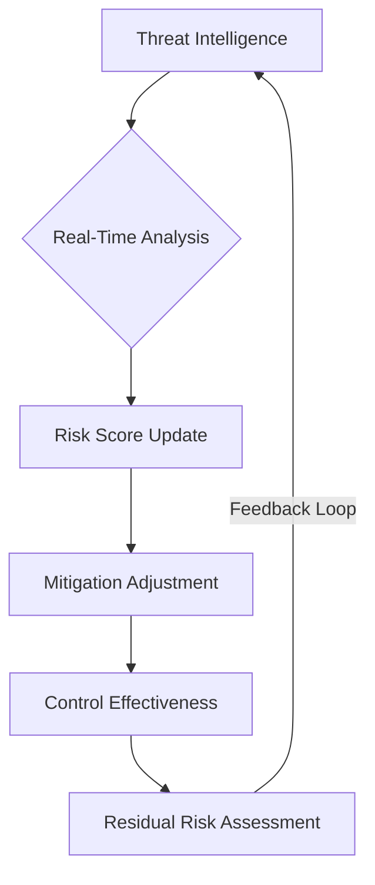
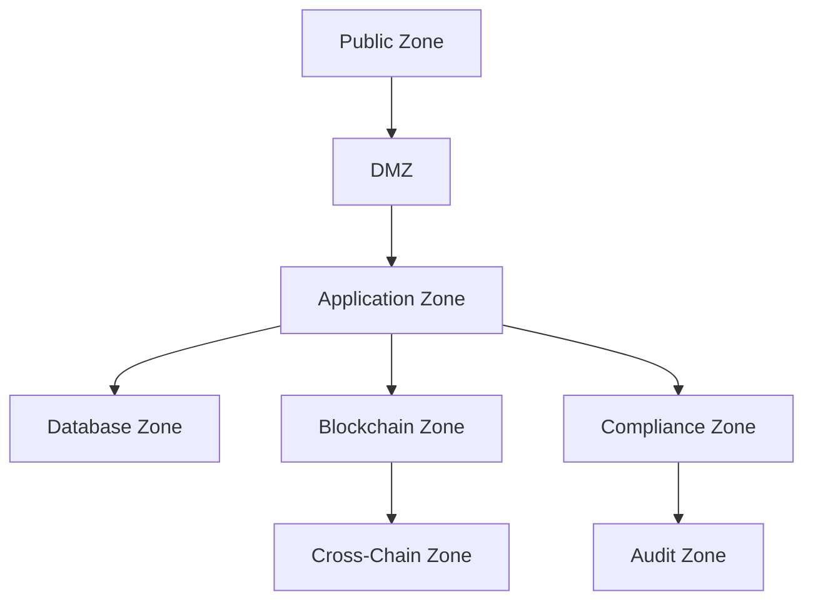
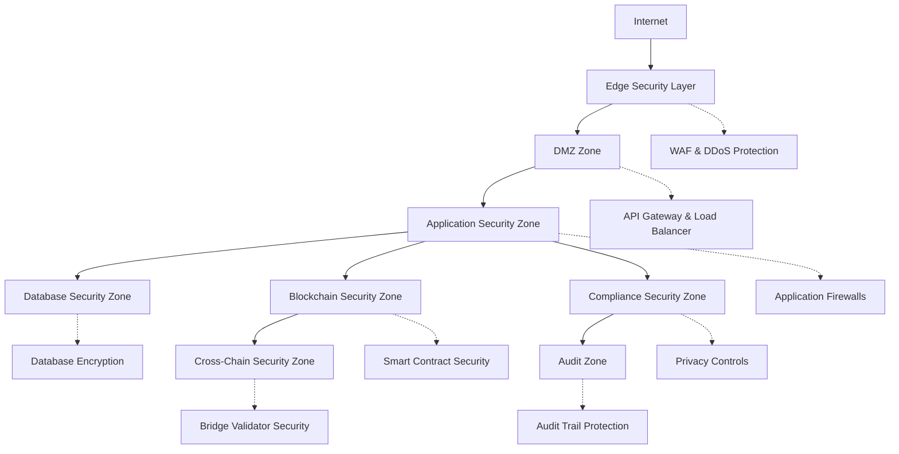
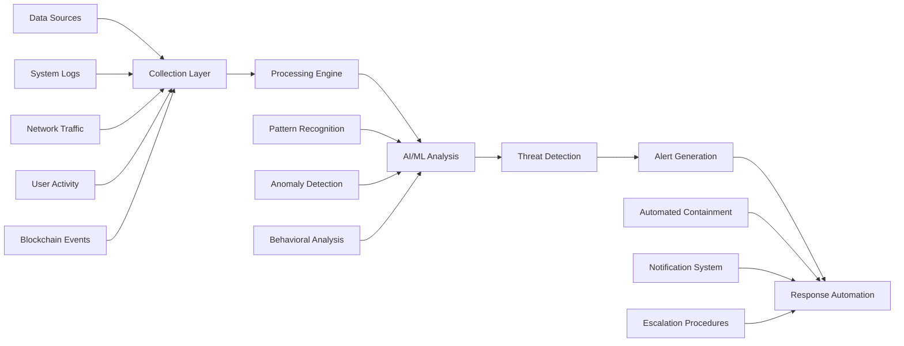

# Veridis: Threat Model and Risk Assessment

**Document ID:** VRD-THRM-2025-001  
**Version:** 2.11.4  
**Last Updated:** 2025-05-30

## Table of Contents

1. [Introduction](#1-introduction)
2. [Methodology](#2-methodology)
3. [System Overview](#3-system-overview)
4. [Threat Analysis](#4-threat-analysis)
5. [Risk Assessment](#5-risk-assessment)
6. [Mitigation Strategies](#6-mitigation-strategies)
7. [Monitoring and Incident Response](#7-monitoring-and-incident-response)
8. [Next-Generation Threat Landscape](#8-next-generation-threat-landscape)
9. [Security Validation](#9-security-validation)
10. [Residual Risks](#10-residual-risks)
11. [Appendices](#11-appendices)

## 1. Introduction

### 1.1 Purpose

This document provides a comprehensive threat model and risk assessment for the Veridis platform, a blockchain-based attestation and cross-chain infrastructure that integrates advanced cryptographic techniques, enterprise-grade security measures, and regulatory compliance frameworks. The Veridis platform represents a comprehensive digital identity and attestation system that enables privacy-preserving credential verification, cross-chain interoperability, and enterprise-grade compliance automation.

The threat model systematically analyzes potential security risks, attack vectors, and mitigation strategies across the entire Veridis ecosystem, encompassing smart contract vulnerabilities, cross-chain bridge security, compliance risks, and enterprise-level threats. Through detailed threat categorization and quantitative risk analysis, this document enables stakeholders to understand the security posture of Veridis and implement appropriate countermeasures to protect against evolving threat landscapes.

### 1.2 Scope

This threat model and risk assessment covers:

- **Core Attestation Protocol Components**

  - Zero-knowledge proof generation and verification systems
  - Attestation registry and lifecycle management
  - Nullifier registry and double-spending prevention
  - Identity verification and eligibility systems
  - Merkle tree implementation and proof verification

- **Advanced Cryptographic Systems**

  - Cairo v2.11.4/Starknet v0.11+ security architecture
  - Poseidon hash migration and implementation
  - Post-quantum cryptographic transition pathways
  - Component-based security isolation
  - Formal verification frameworks

- **Cross-Chain Infrastructure**

  - Cross-chain bridge and message relay systems
  - Multi-chain attestation synchronization
  - Cross-chain identity consistency
  - Bridge validator security and consensus
  - State root verification and inclusion proofs

- **Enterprise Compliance Framework**

  - GDPR/CCPA automated compliance systems
  - Multi-jurisdictional regulatory support
  - Data lifecycle management and automated scrubbing
  - Audit trail generation and compliance reporting
  - Regulatory change management and adaptation

- **Infrastructure and Operations**
  - Smart contract implementation security
  - Node infrastructure and consensus security
  - Monitoring and threat detection systems
  - Incident response and recovery procedures
  - Performance optimization and availability

The assessment encompasses both technical and operational aspects, focusing on threats to:

- **Attestation Integrity**: Ensuring attestations cannot be forged or manipulated
- **Privacy Guarantees**: Protecting user identity and credential information
- **Cross-Chain Security**: Maintaining security properties across blockchain networks
- **Compliance Assurance**: Meeting regulatory requirements across jurisdictions
- **System Availability**: Ensuring reliable service delivery and performance
- **Data Protection**: Safeguarding personal and sensitive information
- **Economic Security**: Protecting against financial and economic attacks

### 1.3 Audience

This document is intended for:

- Security engineers and auditors responsible for system security assessment
- Protocol developers implementing Veridis components
- Enterprise customers requiring security assurance
- Compliance officers managing regulatory requirements
- Integration partners with security dependencies
- Operational staff responsible for system deployment and monitoring
- Risk management teams evaluating security posture
- Regulatory authorities requiring security documentation
- Academic researchers studying digital identity security
- Third-party auditors conducting security reviews

### 1.4 References

- Veridis System Architecture Specification (VRD-ARCH-2025-001)
- Veridis Security Analysis and Formal Verification (VRD-SEC-2025-002)
- Veridis Privacy Analysis and Technical Deep Dive (VRD-PRIV-2025-001)
- Cairo v2.11.4 Security Enhancement Documentation
- Starknet v0.11+ Security Framework Specification
- NIST SP 800-30: Guide for Conducting Risk Assessments
- MITRE ATT&CK Framework for Enterprise
- ISO 27005: Information Security Risk Management
- NIST Cybersecurity Framework (CSF) v2.0
- STRIDE Threat Modeling Methodology
- PASTA (Process for Attack Simulation and Threat Analysis)
- GDPR Technical and Organisational Measures Guidance
- CCPA Security and Privacy Requirements
- OpenZeppelin Security Framework v2.0+
- Post-Quantum Cryptography Standardization (NIST)

## 2. Methodology

### 2.1 Threat Modeling Approach

This assessment utilizes a hybrid threat modeling approach combining multiple established methodologies to provide comprehensive threat coverage and risk assessment:

#### 2.1.1 STRIDE Model Enhanced

The enhanced STRIDE threat classification framework categorizes threats with additional dimensions:

- **S**poofing: Identity forgery, attestation impersonation, cross-chain identity manipulation
- **T**ampering: Data modification, smart contract manipulation, cross-chain message tampering
- **R**epudiation: Transaction denial, attestation repudiation, audit trail manipulation
- **I**nformation Disclosure: Privacy breach, credential leakage, metadata exposure
- **D**enial of Service: System disruption, resource exhaustion, cross-chain communication blocking
- **E**levation of Privilege: Unauthorized access, permission escalation, component boundary violations

Each STRIDE category is enhanced with:

- **Sophistication Level**: Simple, Moderate, Advanced, Nation-State
- **Detection Difficulty**: Easy, Moderate, Hard, Very Hard
- **Recovery Complexity**: Simple, Moderate, Complex, Very Complex

#### 2.1.2 PASTA Framework Integration

Process for Attack Simulation and Threat Analysis (PASTA) provides risk-centric modeling:

1. **Business Objectives Definition**: Enterprise attestation requirements and compliance goals
2. **Technical Scope Analysis**: Component decomposition and trust boundary identification
3. **Application Decomposition**: Smart contract and protocol component analysis
4. **Threat Analysis**: Systematic threat identification across all system layers
5. **Vulnerability Analysis**: Technical and logical vulnerability assessment
6. **Attack Modeling**: Attack tree development and scenario simulation
7. **Risk Impact Analysis**: Business impact assessment and quantification

#### 2.1.3 Attack Trees and Kill Chains

Attack trees model specific threat scenarios showing attack progression:

```
Goal: Compromise Attestation Integrity

1. Direct Attestation Manipulation
   1.1 Smart Contract Vulnerability Exploitation
      1.1.1 Reentrancy attack on attestation registry
      1.1.2 Access control bypass in issuance functions
      1.1.3 Integer overflow in attestation counting
   1.2 Cryptographic Attack
      1.2.1 Hash collision attack on Poseidon implementation
      1.2.2 Zero-knowledge proof forgery
      1.2.3 Merkle tree manipulation
   1.3 Cross-Chain Attack
      1.3.1 Bridge validator compromise
      1.3.2 Cross-chain message replay
      1.3.3 State root manipulation

2. Indirect Compromise Paths
   2.1 Identity System Compromise
      2.1.1 Sybil attack on identity registry
      2.1.2 Identity credential theft
      2.1.3 Eligibility verification bypass
   2.2 Infrastructure Attack
      2.2.1 Node compromise and consensus manipulation
      2.2.2 Network partition and isolation attacks
      2.2.3 DNS/BGP hijacking of critical infrastructure
```

#### 2.1.4 Component-Based Threat Analysis

Enhanced threat analysis considers the component-based architecture:

- **Component Isolation Threats**: Boundary violations and unauthorized access
- **Inter-Component Communication**: Message tampering and privilege escalation
- **Component Dependency Risks**: Supply chain and third-party component threats
- **Component Upgrade Threats**: Upgrade manipulation and version rollback attacks

### 2.2 Risk Assessment Method

Risk is calculated using an enhanced multi-dimensional formula:

```
Risk = (Likelihood × Impact × Sophistication_Factor) + Compliance_Risk + Business_Risk
```

Where:

- **Likelihood**: Probability of threat realization (1-5 scale)
- **Impact**: Severity of consequences (1-5 scale)
- **Sophistication_Factor**: Attack complexity multiplier (0.5-2.0)
- **Compliance_Risk**: Regulatory penalty exposure (0-10)
- **Business_Risk**: Business continuity impact (0-10)

#### 2.2.1 Enhanced Risk Scoring

Resulting risk scores are categorized as:

- **Minimal Risk**: 1-15 (Monitor)
- **Low Risk**: 16-30 (Standard Controls)
- **Medium Risk**: 31-50 (Enhanced Monitoring)
- **High Risk**: 51-70 (Active Mitigation Required)
- **Critical Risk**: 71-100 (Immediate Action Required)

#### 2.2.2 Multi-Dimensional Risk Analysis

The assessment incorporates multiple risk dimensions:

1. **Technical Risk**: System vulnerability and exploit potential
2. **Business Risk**: Operational impact and financial consequences
3. **Compliance Risk**: Regulatory penalty and legal liability
4. **Reputational Risk**: Brand damage and customer confidence impact
5. **Strategic Risk**: Competitive disadvantage and market position

### 2.3 Dynamic Risk Assessment Process

The threat model incorporates continuous risk assessment with real-time updates:



This process ensures:

1. **Real-Time Risk Adjustment**: Continuous update based on threat intelligence
2. **Adaptive Mitigation**: Dynamic adjustment of security controls
3. **Effectiveness Monitoring**: Continuous assessment of control performance
4. **Feedback Integration**: Learning from incidents and near-misses
5. **Predictive Analysis**: Forward-looking risk assessment and scenario planning

### 2.4 Assessment Process

The comprehensive assessment followed this systematic process:

1. **Asset Inventory and Classification**: Identification of all system assets and data flows
2. **Trust Boundary Analysis**: Mapping of security boundaries and access points
3. **Threat Agent Profiling**: Analysis of potential attackers and their capabilities
4. **Attack Surface Mapping**: Comprehensive enumeration of potential attack vectors
5. **Vulnerability Assessment**: Technical and logical vulnerability identification
6. **Threat Scenario Development**: Creation of detailed attack scenarios and paths
7. **Risk Quantification**: Calculation of risk scores and impact assessments
8. **Mitigation Strategy Development**: Design of comprehensive security controls
9. **Residual Risk Analysis**: Assessment of remaining risks after mitigation
10. **Continuous Monitoring Design**: Framework for ongoing threat assessment

## 3. System Overview

### 3.1 Core Components

The Veridis platform comprises the following principal components organized in a layered architecture:

#### 3.1.1 Core Protocol Layer

**Attestation Engine**

- Zero-Knowledge Proof Generation and Verification
- Attestation Registry with lifecycle management
- Nullifier Registry for double-spending prevention
- Merkle Tree implementation for efficient proofs
- Cryptographic Commitment Management

**Identity and Verification Systems**

- Identity Registry with cross-chain consistency
- Eligibility Verification Engine
- Credential Lifecycle Management
- Privacy-Preserving Authentication
- Multi-Factor Authentication Integration

**Cryptographic Infrastructure**

- Poseidon Hash Implementation (Cairo v2.11.4 compliant)
- Post-Quantum Cryptographic Transition Engine
- Formal Verification Framework Integration
- Component-Based Security Architecture
- Cryptographic Key Management

#### 3.1.2 Cross-Chain Infrastructure Layer

**Bridge and Messaging Systems**

- Cross-Chain Bridge with validator consensus
- Message Relay and Verification System
- State Root Synchronization
- Cross-Chain Identity Anchoring
- Multi-Chain Attestation Aggregation

**Consensus and Validation**

- Bridge Validator Set Management
- Threshold Signature Implementation
- Byzantine Fault Tolerance
- Finality and Confirmation Management
- Cross-Chain Dispute Resolution

#### 3.1.3 Enterprise Compliance Layer

**Automated Compliance Framework**

- GDPR/CCPA Compliance Automation
- Multi-Jurisdictional Regulatory Support
- Data Lifecycle Management
- Automated Data Scrubbing
- Compliance Audit Trail Generation

**Privacy and Data Protection**

- Privacy-by-Design Implementation
- Data Minimization Controls
- Consent Management System
- Cross-Border Transfer Controls
- Data Subject Rights Automation

#### 3.1.4 Application and Integration Layer

**User Interfaces and APIs**

- Enterprise Integration APIs
- Developer SDK and Tools
- Administrative Dashboard
- Compliance Reporting Interface
- Real-Time Monitoring Console

**Infrastructure and Operations**

- Smart Contract Deployment Framework
- Node Infrastructure Management
- Performance Monitoring and Optimization
- Incident Response Automation
- Circuit Breaker Implementation

### 3.2 Trust Boundaries

The Veridis system contains multiple trust boundaries that define security zones:

#### 3.2.1 Primary Trust Boundaries

1. **User Device Boundary**: Between user devices and network infrastructure
2. **Network Perimeter**: Between public internet and Veridis infrastructure
3. **Blockchain Boundary**: Between Veridis contracts and underlying blockchains
4. **Cross-Chain Boundary**: Between different blockchain networks and bridges
5. **Component Boundary**: Between OpenZeppelin security components
6. **Administrative Boundary**: Between administrative functions and user operations
7. **Compliance Boundary**: Between compliance systems and operational data
8. **Third-Party Boundary**: Between Veridis systems and external integrations

#### 3.2.2 Security Zones



Each zone implements specific security controls:

- **Public Zone**: Rate limiting, DDoS protection, input validation
- **DMZ**: Web application firewalls, API gateways, load balancers
- **Application Zone**: Application-level security, business logic protection
- **Database Zone**: Database security, encryption at rest, access controls
- **Blockchain Zone**: Smart contract security, transaction validation
- **Cross-Chain Zone**: Bridge security, multi-signature controls
- **Compliance Zone**: Data protection, privacy controls, audit logging
- **Audit Zone**: Forensic capabilities, compliance reporting, log integrity

### 3.3 Data Flows

Critical data flows that cross trust boundaries include:

#### 3.3.1 Core Data Flows

1. **Attestation Issuance Flow**

   ```
   User → API Gateway → Identity Verification → Attestation Engine → Blockchain
   ```

2. **Credential Verification Flow**

   ```
   Verifier → API → ZK Proof System → Attestation Registry → Verification Result
   ```

3. **Cross-Chain Attestation Flow**

   ```
   Source Chain → Bridge Validators → Message Relay → Target Chain → State Update
   ```

4. **Compliance Data Flow**

   ```
   User Data → Compliance Engine → Data Classification → Lifecycle Management → Audit Trail
   ```

5. **Identity Management Flow**
   ```
   Identity Creation → Verification → Registry Update → Cross-Chain Sync → Consistency Check
   ```

#### 3.3.2 Critical Data Elements

- **Personal Identifiable Information (PII)**: Subject to GDPR/CCPA protections
- **Attestation Data**: Cryptographically protected credential information
- **Cross-Chain Messages**: Bridge communications requiring integrity protection
- **Audit Logs**: Compliance and forensic data requiring tamper-proofing
- **Cryptographic Keys**: Requiring hardware security module protection
- **Administrative Commands**: Requiring multi-signature authorization

### 3.4 Cryptographic Dependencies

The Veridis protocol relies on the following cryptographic primitives:

#### 3.4.1 Modern Cryptographic Implementation

**Poseidon Hash Functions**

- Domain-separated hashing for different contexts
- Optimized STARK-friendly hash implementation
- 3.8x performance improvement over legacy functions
- Formal verification of collision resistance

**Zero-Knowledge Proof Systems**

- zk-STARKs for scalable proof generation
- zk-SNARKs for specific circuit optimizations
- Groth16 for efficient verification
- PLONK for universal setup requirements

**Post-Quantum Cryptography**

- Dilithium digital signatures for quantum resistance
- Kyber key encapsulation for secure key exchange
- SPHINCS+ hash-based signatures for long-term security
- Transition framework for cryptographic agility

#### 3.4.2 Advanced Security Features

**Component-Based Security**

- OpenZeppelin v2+ security components
- Isolated component boundaries
- Secure inter-component communication
- Component authorization and access control

**Enterprise Cryptographic Controls**

- Hardware Security Module (HSM) integration
- Key rotation and lifecycle management
- Cryptographic algorithm flexibility
- Multi-signature authorization schemes

## 4. Threat Analysis

### 4.1 Threat Actors

The following threat actors are considered in this assessment:

| ID    | Threat Actor                | Motivation                                | Capability  | Resources   | Primary Targets                        |
| ----- | --------------------------- | ----------------------------------------- | ----------- | ----------- | -------------------------------------- |
| TA-1  | Opportunistic Attacker      | Financial gain, credential theft          | Low-Medium  | Low         | User accounts, simple vulnerabilities  |
| TA-2  | Sophisticated Cybercriminal | Large-scale fraud, data monetization      | Medium-High | Medium-High | Enterprise customers, valuable data    |
| TA-3  | Malicious Enterprise User   | Competitive advantage, insider trading    | Medium      | Medium      | Business attestations, competitor data |
| TA-4  | Nation-State Actor          | Surveillance, geopolitical influence      | High        | Very High   | Infrastructure, mass surveillance      |
| TA-5  | Rogue Administrator         | Financial gain, sabotage, espionage       | High        | Medium      | Administrative systems, audit trails   |
| TA-6  | Compliance Violator         | Regulatory evasion, cost reduction        | Medium      | Medium      | Compliance systems, audit data         |
| TA-7  | Cross-Chain Attacker        | Bridge exploitation, fund theft           | Medium-High | High        | Bridge infrastructure, validator sets  |
| TA-8  | Privacy Adversary           | Deanonymization, surveillance             | Medium-High | Medium-High | Privacy systems, user correlations     |
| TA-9  | Smart Contract Exploiter    | DeFi attacks, protocol manipulation       | Medium-High | Medium      | Smart contracts, protocol logic        |
| TA-10 | Supply Chain Attacker       | Backdoor insertion, dependency compromise | High        | Medium-High | Dependencies, development tools        |
| TA-11 | Quantum-Capable Adversary   | Cryptographic breakthrough exploitation   | Very High   | Very High   | Cryptographic systems, long-term data  |
| TA-12 | AI-Enhanced Threat Actor    | Automated vulnerability discovery         | High        | Medium-High | All systems, pattern recognition       |
| TA-13 | Regulatory Authority        | Compliance enforcement, legal action      | Medium      | Very High   | Compliance data, audit systems         |

### 4.2 STRIDE Analysis

#### 4.2.1 Core Attestation System

| ID      | Threat                                | STRIDE Category        | MITRE Tactic | NIST Control | Description                                      | Components Affected                   |
| ------- | ------------------------------------- | ---------------------- | ------------ | ------------ | ------------------------------------------------ | ------------------------------------- |
| T-AT-1  | Attestation Forgery                   | Spoofing               | TA0043       | IA-9         | Creating fraudulent attestations                 | Attestation Engine, ZK Proof System   |
| T-AT-2  | Attestation Data Tampering            | Tampering              | TA0006       | SI-7         | Modifying existing attestation data              | Attestation Registry, Storage Layer   |
| T-AT-3  | Attestation Repudiation               | Repudiation            | TA0040       | AU-10        | Denying issuance of legitimate attestations      | Audit Trail, Attestation Registry     |
| T-AT-4  | Credential Privacy Breach             | Information Disclosure | TA0009       | SC-8         | Exposing private credential information          | ZK Proof System, Privacy Layer        |
| T-AT-5  | Attestation Service Denial            | Denial of Service      | TA0040       | SC-5         | Preventing legitimate attestation issuance       | Attestation Engine, API Gateway       |
| T-AT-6  | Unauthorized Attestation Authority    | Elevation of Privilege | TA0004       | AC-6         | Gaining unauthorized attestation issuance rights | Access Control, Administrative System |
| T-AT-7  | Double-Spending Attack                | Tampering              | TA0006       | SI-7         | Reusing nullifiers or credentials multiple times | Nullifier Registry, Verification      |
| T-AT-8  | Merkle Tree Manipulation              | Tampering              | TA0006       | SC-13        | Manipulating inclusion proofs                    | Merkle Tree, Proof Generation         |
| T-AT-9  | Zero-Knowledge Proof Forgery          | Spoofing               | TA0043       | SC-13        | Creating invalid proofs that verify as valid     | ZK Circuit, Verification System       |
| T-AT-10 | Attestation Lifecycle Manipulation    | Tampering              | TA0006       | CM-5         | Unauthorized revocation or status changes        | Lifecycle Management, State Machine   |
| T-AT-11 | Cross-Chain Attestation Inconsistency | Tampering              | TA0006       | SI-7         | Creating inconsistent attestations across chains | Cross-Chain Sync, Bridge System       |
| T-AT-12 | Quantum Attack on Attestation Crypto  | Multiple               | TA0006       | SC-13        | Breaking cryptographic protections               | All Cryptographic Components          |

#### 4.2.2 Identity and Verification Systems

| ID      | Threat                              | STRIDE Category        | MITRE Tactic | NIST Control | Description                                      | Components Affected                 |
| ------- | ----------------------------------- | ---------------------- | ------------ | ------------ | ------------------------------------------------ | ----------------------------------- |
| T-ID-1  | Identity Spoofing Attack            | Spoofing               | TA0043       | IA-4         | Impersonating legitimate users                   | Identity Registry, Authentication   |
| T-ID-2  | Identity Data Tampering             | Tampering              | TA0006       | SI-7         | Modifying identity information                   | Identity Registry, User Profiles    |
| T-ID-3  | Identity Verification Bypass        | Spoofing               | TA0043       | IA-9         | Circumventing identity verification processes    | Verification Engine, KYC System     |
| T-ID-4  | PII Data Exposure                   | Information Disclosure | TA0009       | SC-7         | Unauthorized access to personal information      | Identity Registry, Privacy Controls |
| T-ID-5  | Identity Service Disruption         | Denial of Service      | TA0040       | SC-5         | Preventing identity verification operations      | Identity Service, Verification APIs |
| T-ID-6  | Administrative Privilege Escalation | Elevation of Privilege | TA0004       | AC-6         | Gaining unauthorized administrative access       | Access Control, Admin Console       |
| T-ID-7  | Sybil Attack on Identity System     | Spoofing               | TA0043       | IA-4         | Creating multiple fake identities                | Identity Registry, Anti-Sybil       |
| T-ID-8  | Identity Correlation Attack         | Information Disclosure | TA0009       | SC-7         | Linking pseudonymous identities to real ones     | Privacy Controls, Anonymization     |
| T-ID-9  | Cross-Chain Identity Manipulation   | Tampering              | TA0006       | IA-4         | Creating inconsistent identities across chains   | Cross-Chain Identity, Bridge System |
| T-ID-10 | Eligibility Criteria Manipulation   | Tampering              | TA0006       | CM-5         | Unauthorized changes to eligibility requirements | Eligibility Engine, Governance      |
| T-ID-11 | Biometric Template Attack           | Spoofing               | TA0043       | IA-6         | Spoofing or stealing biometric templates         | Biometric System, Template Storage  |
| T-ID-12 | Identity Recovery Attack            | Spoofing               | TA0043       | IA-5         | Unauthorized account recovery                    | Recovery System, Backup Keys        |

#### 4.2.3 Cross-Chain Bridge Infrastructure

| ID      | Threat                            | STRIDE Category        | MITRE Tactic | NIST Control | Description                                         | Components Affected                     |
| ------- | --------------------------------- | ---------------------- | ------------ | ------------ | --------------------------------------------------- | --------------------------------------- |
| T-CB-1  | Bridge Validator Compromise       | Elevation of Privilege | TA0004       | AC-6         | Compromising bridge validator keys                  | Validator Set, Consensus System         |
| T-CB-2  | Cross-Chain Message Tampering     | Tampering              | TA0006       | SI-7         | Modifying messages during cross-chain transfer      | Message Relay, Communication Layer      |
| T-CB-3  | Message Replay Attack             | Spoofing               | TA0043       | IA-9         | Replaying valid messages to cause duplicate actions | Replay Protection, Message Validation   |
| T-CB-4  | State Root Manipulation           | Tampering              | TA0006       | SI-7         | Providing false blockchain state information        | State Verification, Root Validation     |
| T-CB-5  | Bridge Service Denial             | Denial of Service      | TA0040       | SC-5         | Disrupting cross-chain communication                | Bridge Infrastructure, Validator Nodes  |
| T-CB-6  | Unauthorized Bridge Operations    | Elevation of Privilege | TA0004       | AC-6         | Performing unauthorized cross-chain operations      | Bridge Controls, Authorization          |
| T-CB-7  | Validator Censorship Attack       | Denial of Service      | TA0040       | SC-5         | Selectively blocking specific messages              | Validator Consensus, Message Processing |
| T-CB-8  | Cross-Chain Finality Manipulation | Tampering              | TA0006       | SI-7         | Exploiting different finality models                | Finality Detection, Confirmation Logic  |
| T-CB-9  | Bridge Fund Theft                 | Tampering              | TA0006       | AC-3         | Unauthorized withdrawal of bridged assets           | Asset Management, Fund Security         |
| T-CB-10 | Network Partition Attack          | Denial of Service      | TA0040       | SC-5         | Isolating bridge validators from networks           | Network Infrastructure, Connectivity    |
| T-CB-11 | Multi-Signature Threshold Attack  | Elevation of Privilege | TA0004       | AC-6         | Compromising sufficient validators for threshold    | Multi-Sig System, Key Management        |
| T-CB-12 | Oracle Data Manipulation          | Tampering              | TA0006       | SI-10        | Providing false external data to bridge             | Oracle System, External Data Feeds      |

#### 4.2.4 Enterprise Compliance Framework

| ID      | Threat                               | STRIDE Category        | MITRE Tactic | NIST Control | Description                                       | Components Affected                            |
| ------- | ------------------------------------ | ---------------------- | ------------ | ------------ | ------------------------------------------------- | ---------------------------------------------- |
| T-CP-1  | Compliance Data Falsification        | Tampering              | TA0006       | SI-7         | Manipulating compliance records and reports       | Compliance Engine, Audit Data                  |
| T-CP-2  | GDPR Violation Through Data Exposure | Information Disclosure | TA0009       | SC-7         | Unauthorized access to personal data              | Data Protection, Privacy Controls              |
| T-CP-3  | Audit Trail Manipulation             | Tampering              | TA0006       | AU-9         | Modifying or deleting audit logs                  | Audit System, Log Management                   |
| T-CP-4  | Unauthorized Data Access             | Information Disclosure | TA0009       | AC-3         | Accessing protected compliance data               | Access Control, Data Classification            |
| T-CP-5  | Compliance Service Disruption        | Denial of Service      | TA0040       | SC-5         | Preventing compliance monitoring and reporting    | Compliance Infrastructure, Monitoring          |
| T-CP-6  | Data Retention Policy Violation      | Tampering              | TA0006       | SI-5         | Improper data retention or premature deletion     | Data Lifecycle, Retention Management           |
| T-CP-7  | Cross-Border Data Transfer Violation | Tampering              | TA0006       | SC-7         | Unauthorized international data transfers         | Cross-Border Controls, Geographic Restrictions |
| T-CP-8  | Consent Management Bypass            | Elevation of Privilege | TA0004       | AC-16        | Circumventing user consent requirements           | Consent System, Permission Management          |
| T-CP-9  | Data Subject Rights Violation        | Denial of Service      | TA0040       | AC-16        | Preventing exercise of data subject rights        | Rights Management, Subject Portal              |
| T-CP-10 | Regulatory Reporting Manipulation    | Tampering              | TA0006       | SI-7         | Falsifying regulatory compliance reports          | Reporting System, Compliance Dashboard         |
| T-CP-11 | Data Scrubbing Failure               | Information Disclosure | TA0009       | SC-4         | Incomplete or failed data deletion                | Data Scrubbing, Deletion Verification          |
| T-CP-12 | Jurisdictional Arbitrage Attack      | Elevation of Privilege | TA0004       | CM-5         | Exploiting regulatory differences between regions | Multi-Jurisdictional Framework                 |

#### 4.2.5 Smart Contract Implementation

| ID      | Threat                            | STRIDE Category        | MITRE Tactic | NIST Control | Description                                 | Components Affected                   |
| ------- | --------------------------------- | ---------------------- | ------------ | ------------ | ------------------------------------------- | ------------------------------------- |
| T-SC-1  | Reentrancy Vulnerability          | Elevation of Privilege | TA0004       | SI-10        | Exploiting recursive function calls         | All Smart Contracts                   |
| T-SC-2  | Access Control Bypass             | Elevation of Privilege | TA0004       | AC-3         | Circumventing contract permission systems   | Access Control Functions              |
| T-SC-3  | Integer Overflow/Underflow Attack | Tampering              | TA0006       | SI-10        | Exploiting arithmetic vulnerabilities       | Mathematical Operations               |
| T-SC-4  | Front-Running Attack              | Tampering              | TA0006       | SI-7         | Manipulating transaction ordering           | Transaction Processing, MEV           |
| T-SC-5  | Smart Contract Logic Error        | Multiple               | Multiple     | SI-10        | Exploiting implementation bugs              | Contract Logic, Business Rules        |
| T-SC-6  | Gas Limit Denial of Service       | Denial of Service      | TA0040       | SC-5         | Causing functions to exceed gas limits      | Resource Management, Gas Optimization |
| T-SC-7  | Proxy Contract Manipulation       | Elevation of Privilege | TA0004       | CM-5         | Exploiting upgradeable contract patterns    | Proxy Implementation, Upgrade Logic   |
| T-SC-8  | Storage Collision Attack          | Tampering              | TA0006       | SC-28        | Exploiting storage layout conflicts         | Contract Storage, Proxy Patterns      |
| T-SC-9  | Signature Replay Attack           | Spoofing               | TA0043       | IA-9         | Reusing valid signatures in wrong contexts  | Signature Verification, Nonce System  |
| T-SC-10 | Oracle Manipulation Attack        | Tampering              | TA0006       | SI-10        | Providing false external data               | Oracle Integration, External Data     |
| T-SC-11 | Contract Upgrade Manipulation     | Tampering              | TA0006       | CM-5         | Unauthorized or malicious contract upgrades | Upgrade System, Governance            |
| T-SC-12 | Component Boundary Violation      | Elevation of Privilege | TA0004       | AC-6         | Breaking component isolation                | Component Architecture, Boundaries    |

### 4.3 Attack Trees

#### 4.3.1 Attestation Integrity Compromise Attack Tree

```
Goal: Compromise the integrity of issued attestations

1. Direct Attestation Manipulation
   1.1 Smart Contract Exploitation
      1.1.1 Reentrancy attack on attestation issuance
      1.1.2 Access control bypass in admin functions
      1.1.3 Storage collision in proxy contracts
      1.1.4 Integer overflow in attestation counting
   1.2 Cryptographic Attack
      1.2.1 Poseidon hash collision discovery
      1.2.2 Zero-knowledge proof circuit manipulation
      1.2.3 Merkle tree inclusion proof forgery
      1.2.4 Post-quantum cryptographic break
   1.3 Component Boundary Violation
      1.3.1 OpenZeppelin component isolation bypass
      1.3.2 Inter-component communication manipulation
      1.3.3 Component authorization circumvention

2. Cross-Chain Manipulation
   2.1 Bridge Infrastructure Attack
      2.1.1 Validator key compromise (threshold attack)
      2.1.2 State root manipulation
      2.1.3 Cross-chain message tampering
      2.1.4 Consensus manipulation attack
   2.2 Network-Level Attack
      2.2.1 BGP hijacking of validator communications
      2.2.2 DNS poisoning of bridge endpoints
      2.2.3 Network partition isolation
      2.2.4 DDoS attack on bridge infrastructure

3. Indirect Compromise Paths
   3.1 Identity System Compromise
      3.1.1 Identity verification bypass
      3.1.2 Sybil attack on identity registry
      3.1.3 Administrative privilege escalation
      3.1.4 Cross-chain identity inconsistency
   3.2 Infrastructure Compromise
      3.2.1 Node infrastructure penetration
      3.2.2 Administrative system compromise
      3.2.3 Development environment infiltration
      3.2.4 Supply chain attack on dependencies
```

#### 4.3.2 Privacy Compromise Attack Tree

```
Goal: Expose private user information and break privacy guarantees

1. Cryptographic Privacy Attack
   1.1 Zero-Knowledge Proof Attack
      1.1.1 Circuit implementation vulnerability exploitation
      1.1.2 Side-channel attack on proof generation
      1.1.3 Trusted setup compromise (if applicable)
      1.1.4 Quantum attack on proof cryptography
   1.2 Hash Function Attack
      1.2.1 Poseidon hash preimage discovery
      1.2.2 Domain separation bypass
      1.2.3 Hash collision exploitation
   1.3 Commitment Scheme Attack
      1.3.1 Commitment opening without knowledge
      1.3.2 Commitment binding failure
      1.3.3 Hiding property violation

2. Metadata Analysis Attack
   2.1 Transaction Pattern Analysis
      2.1.1 Timing correlation attacks
      2.1.2 Transaction graph analysis
      2.1.3 Gas usage pattern recognition
      2.1.4 Network traffic analysis
   2.2 Cross-Chain Correlation
      2.2.1 Cross-chain transaction linking
      2.2.2 Bridge usage pattern analysis
      2.2.3 Multi-chain identity correlation
   2.3 AI-Enhanced Analysis
      2.3.1 Machine learning pattern recognition
      2.3.2 Behavioral profiling algorithms
      2.3.3 Statistical correlation analysis

3. System-Level Privacy Breach
   3.1 Component Isolation Failure
      3.1.1 Privacy component boundary violation
      3.1.2 Unauthorized data access between components
      3.1.3 Privilege escalation to access private data
   3.2 Compliance System Compromise
      3.2.1 GDPR compliance system manipulation
      3.2.2 Data scrubbing failure exploitation
      3.2.3 Audit trail access for private data
   3.3 Infrastructure Attack
      3.3.1 Database compromise for PII access
      3.3.2 Memory dumping for private key recovery
      3.3.3 Network sniffing for private communications
```

#### 4.3.3 Cross-Chain Bridge Compromise Attack Tree

```
Goal: Compromise cross-chain attestation integrity and availability

1. Validator Attack
   1.1 Key Compromise Attack
      1.1.1 Individual validator key theft
      1.1.2 Threshold signature compromise
      1.1.3 Hardware security module attack
      1.1.4 Social engineering against validators
   1.2 Validator Collusion
      1.2.1 Economic incentive for malicious behavior
      1.2.2 Coercion or blackmail of validators
      1.2.3 Regulatory pressure on validators
      1.2.4 Sybil attack on validator selection
   1.3 Infrastructure Compromise
      1.3.1 Validator node penetration
      1.3.2 Cloud infrastructure compromise
      1.3.3 Network isolation of honest validators
      1.3.4 DDoS attack on validator infrastructure

2. Protocol-Level Attack
   2.1 Message Manipulation
      2.1.1 Cross-chain message replay
      2.1.2 Message content tampering
      2.1.3 Message ordering manipulation
      2.1.4 Message censorship attack
   2.2 State Verification Attack
      2.2.1 False state root submission
      2.2.2 State verification bypass
      2.2.3 Finality assumption exploitation
      2.2.4 Chain reorganization attack
   2.3 Economic Attack
      2.3.1 Fee manipulation attack
      2.3.2 Resource exhaustion through expensive operations
      2.3.3 MEV extraction from bridge operations
      2.3.4 Flash loan attack on bridge funds

3. Network-Level Attack
   3.1 Communication Disruption
      3.1.1 BGP hijacking of bridge traffic
      3.1.2 DNS poisoning of bridge endpoints
      3.1.3 TLS certificate compromise
      3.1.4 Network partition between chains
   3.2 Oracle Manipulation
      3.2.1 Price oracle manipulation
      3.2.2 State oracle data poisoning
      3.2.3 Oracle availability attack
      3.2.4 Oracle front-running
```

### 4.4 Specific Vulnerability Analysis

#### 4.4.1 Cairo v2.11.4 Specific Vulnerabilities

| ID     | Vulnerability                  | Description                                      | Affected Components                     |
| ------ | ------------------------------ | ------------------------------------------------ | --------------------------------------- |
| V-C-1  | Poseidon Implementation Flaws  | Bugs in new Poseidon hash implementation         | Hash Functions, Cryptographic Layer     |
| V-C-2  | Storage Migration Issues       | Problems with LegacyMap to Vec migration         | Storage Layer, Data Migration           |
| V-C-3  | Component Isolation Weaknesses | OpenZeppelin component boundary violations       | Component Architecture                  |
| V-C-4  | SafeUint256 Bypass             | Circumventing overflow protection mechanisms     | Arithmetic Operations                   |
| V-C-5  | Formal Verification Gaps       | Unverified code paths or circuit implementations | Critical Functions, ZK Circuits         |
| V-C-6  | Post-Quantum Transition Flaws  | Vulnerabilities during cryptographic migration   | Cryptographic Infrastructure            |
| V-C-7  | CVE-2025-29072 Exploitation    | Sierra bytecode decompression vulnerabilities    | Node Infrastructure, Consensus          |
| V-C-8  | Transaction v3 Model Attacks   | Multi-resource fee model exploitation            | Transaction Processing, Fee Calculation |
| V-C-9  | GDPR Scrubbing Implementation  | Incomplete or bypassable data deletion           | Privacy Controls, Data Management       |
| V-C-10 | Circuit Breaker Manipulation   | Bypassing or triggering false circuit breakers   | Security Controls, System Protection    |

#### 4.4.2 Cross-Chain Specific Vulnerabilities

| ID     | Vulnerability                     | Description                                            | Affected Components                       |
| ------ | --------------------------------- | ------------------------------------------------------ | ----------------------------------------- |
| V-X-1  | Bridge Validator Set Manipulation | Controlling sufficient validators for threshold        | Validator Consensus, Multi-Signature      |
| V-X-2  | Cross-Chain State Inconsistency   | Different states across chains causing conflicts       | State Synchronization, Consensus          |
| V-X-3  | Message Relay Timing Attacks      | Exploiting timing differences in message processing    | Message Processing, Consensus Timing      |
| V-X-4  | Finality Assumption Exploitation  | Different finality models creating attack windows      | Finality Detection, Confirmation Logic    |
| V-X-5  | Multi-Chain Identity Conflicts    | Inconsistent identity states across blockchains        | Identity Synchronization, Cross-Chain     |
| V-X-6  | Bridge Liquidity Attacks          | Draining bridge funds through economic manipulation    | Asset Management, Economic Security       |
| V-X-7  | Cross-Chain MEV Exploitation      | Extracting value from cross-chain transaction ordering | Transaction Ordering, MEV Protection      |
| V-X-8  | Network Partition Exploitation    | Exploiting network splits to manipulate consensus      | Network Infrastructure, Connectivity      |
| V-X-9  | Oracle Data Lag Exploitation      | Using stale oracle data for profitable trades          | Oracle Integration, Data Freshness        |
| V-X-10 | Cross-Chain Replay Protection     | Bypassing replay protection across different chains    | Message Authentication, Replay Prevention |

#### 4.4.3 Enterprise Compliance Vulnerabilities

| ID     | Vulnerability                     | Description                                           | Affected Components                      |
| ------ | --------------------------------- | ----------------------------------------------------- | ---------------------------------------- |
| V-E-1  | GDPR Compliance Bypass            | Circumventing automated compliance controls           | Compliance Engine, Privacy Controls      |
| V-E-2  | Multi-Jurisdictional Conflicts    | Conflicting regulations across jurisdictions          | Regulatory Framework, Compliance Logic   |
| V-E-3  | Data Classification Errors        | Misclassifying sensitive data for protection          | Data Classification, Privacy Controls    |
| V-E-4  | Audit Trail Manipulation          | Modifying or corrupting compliance audit logs         | Audit System, Log Integrity              |
| V-E-5  | Consent Management Weaknesses     | Bypassing or manipulating user consent systems        | Consent System, User Rights Management   |
| V-E-6  | Cross-Border Transfer Violations  | Unauthorized data transfers across jurisdictions      | Geographic Controls, Data Sovereignty    |
| V-E-7  | Data Retention Policy Failures    | Improper data retention or deletion timing            | Lifecycle Management, Retention Controls |
| V-E-8  | Subject Rights Implementation     | Inadequate implementation of data subject rights      | Rights Management, User Portal           |
| V-E-9  | Regulatory Reporting Manipulation | Falsifying compliance reports to regulators           | Reporting System, Compliance Dashboard   |
| V-E-10 | Third-Party Compliance Risks      | Compliance failures in integrated third-party systems | Integration Framework, Vendor Management |

## 5. Risk Assessment

### 5.1 Risk Matrix

The risk assessment utilizes a comprehensive matrix evaluating likelihood, impact, and additional risk factors:


### 5.2 Risk Scoring Methodology

#### 5.2.1 Enhanced Risk Calculation

```
Total_Risk = (Likelihood × Impact × Sophistication_Factor) + Compliance_Risk + Business_Risk

Where:
- Likelihood: 1-5 (Very Low to Very High)
- Impact: 1-5 (Minimal to Catastrophic)
- Sophistication_Factor: 0.5-2.0 (Simple to Nation-State)
- Compliance_Risk: 0-10 (No penalty to Severe regulatory action)
- Business_Risk: 0-10 (No impact to Business-critical)
```

#### 5.2.2 Risk Categories

- **Minimal Risk (1-15)**: Monitoring sufficient, standard controls
- **Low Risk (16-30)**: Enhanced monitoring, basic additional controls
- **Medium Risk (31-50)**: Active management, enhanced controls required
- **High Risk (51-70)**: Priority mitigation, dedicated resources required
- **Critical Risk (71-100)**: Immediate action required, executive escalation

### 5.3 Core Protocol Risk Assessment

#### 5.3.1 Attestation System Risks

| Risk ID | Risk Description                      | Threats    | Likelihood | Impact | Soph. | Compliance | Business | Total | Category |
| ------- | ------------------------------------- | ---------- | ---------- | ------ | ----- | ---------- | -------- | ----- | -------- |
| R-AT-1  | Attestation integrity compromise      | T-AT-1,2,7 | 2          | 5      | 1.5   | 8          | 9        | 32    | Medium   |
| R-AT-2  | Zero-knowledge proof system failure   | T-AT-9     | 2          | 5      | 1.8   | 6          | 8        | 32    | Medium   |
| R-AT-3  | Cross-chain attestation inconsistency | T-AT-11    | 3          | 4      | 1.2   | 5          | 7        | 26    | Low      |
| R-AT-4  | Credential privacy breach             | T-AT-4     | 2          | 5      | 1.5   | 9          | 8        | 32    | Medium   |
| R-AT-5  | Double-spending attack                | T-AT-7     | 2          | 4      | 1.0   | 3          | 6        | 17    | Low      |
| R-AT-6  | Merkle tree manipulation              | T-AT-8     | 2          | 4      | 1.5   | 4          | 6        | 22    | Low      |
| R-AT-7  | Attestation authority compromise      | T-AT-6     | 2          | 5      | 1.7   | 7          | 9        | 33    | Medium   |
| R-AT-8  | Service denial attack                 | T-AT-5     | 3          | 3      | 1.0   | 4          | 8        | 21    | Low      |
| R-AT-9  | Lifecycle manipulation attack         | T-AT-10    | 2          | 4      | 1.2   | 5          | 6        | 21    | Low      |
| R-AT-10 | Quantum cryptographic attack          | T-AT-12    | 1          | 5      | 2.0   | 7          | 9        | 26    | Low      |

#### 5.3.2 Identity System Risks

| Risk ID | Risk Description                    | Threats  | Likelihood | Impact | Soph. | Compliance | Business | Total | Category |
| ------- | ----------------------------------- | -------- | ---------- | ------ | ----- | ---------- | -------- | ----- | -------- |
| R-ID-1  | Identity spoofing and impersonation | T-ID-1,7 | 3          | 4      | 1.2   | 6          | 7        | 27    | Low      |
| R-ID-2  | PII data exposure                   | T-ID-4   | 2          | 5      | 1.3   | 9          | 8        | 30    | Low      |
| R-ID-3  | Identity verification bypass        | T-ID-3   | 2          | 4      | 1.5   | 7          | 7        | 26    | Low      |
| R-ID-4  | Cross-chain identity manipulation   | T-ID-9   | 2          | 4      | 1.4   | 5          | 6        | 22    | Low      |
| R-ID-5  | Administrative privilege escalation | T-ID-6   | 2          | 5      | 1.6   | 6          | 9        | 31    | Medium   |
| R-ID-6  | Sybil attack on identity system     | T-ID-7   | 3          | 3      | 1.1   | 4          | 6        | 19    | Low      |
| R-ID-7  | Identity correlation attack         | T-ID-8   | 3          | 3      | 1.4   | 7          | 5        | 24    | Low      |
| R-ID-8  | Biometric system compromise         | T-ID-11  | 2          | 4      | 1.7   | 8          | 7        | 29    | Low      |
| R-ID-9  | Identity recovery system abuse      | T-ID-12  | 2          | 4      | 1.3   | 5          | 6        | 21    | Low      |
| R-ID-10 | Eligibility criteria manipulation   | T-ID-10  | 2          | 3      | 1.2   | 6          | 5        | 18    | Low      |

#### 5.3.3 Cross-Chain Bridge Risks

| Risk ID | Risk Description                 | Threats   | Likelihood | Impact | Soph. | Compliance | Business | Total | Category |
| ------- | -------------------------------- | --------- | ---------- | ------ | ----- | ---------- | -------- | ----- | -------- |
| R-CB-1  | Bridge validator compromise      | T-CB-1,11 | 2          | 5      | 1.8   | 6          | 9        | 33    | Medium   |
| R-CB-2  | Cross-chain message tampering    | T-CB-2    | 2          | 4      | 1.5   | 5          | 7        | 24    | Low      |
| R-CB-3  | State root manipulation          | T-CB-4    | 2          | 5      | 1.7   | 6          | 8        | 31    | Medium   |
| R-CB-4  | Message replay attack            | T-CB-3    | 2          | 4      | 1.2   | 4          | 6        | 20    | Low      |
| R-CB-5  | Validator censorship             | T-CB-7    | 3          | 3      | 1.3   | 5          | 7        | 23    | Low      |
| R-CB-6  | Bridge fund theft                | T-CB-9    | 2          | 5      | 1.6   | 4          | 9        | 29    | Low      |
| R-CB-7  | Network partition attack         | T-CB-10   | 2          | 4      | 1.4   | 3          | 8        | 22    | Low      |
| R-CB-8  | Finality manipulation            | T-CB-8    | 2          | 4      | 1.6   | 5          | 7        | 24    | Low      |
| R-CB-9  | Oracle data manipulation         | T-CB-12   | 3          | 3      | 1.2   | 4          | 6        | 20    | Low      |
| R-CB-10 | Multi-signature threshold attack | T-CB-11   | 1          | 5      | 2.0   | 5          | 9        | 24    | Low      |

#### 5.3.4 Enterprise Compliance Risks

| Risk ID | Risk Description                     | Threats  | Likelihood | Impact | Soph. | Compliance | Business | Total | Category |
| ------- | ------------------------------------ | -------- | ---------- | ------ | ----- | ---------- | -------- | ----- | -------- |
| R-CP-1  | GDPR compliance violation            | T-CP-2,6 | 3          | 4      | 1.1   | 10         | 7        | 34    | Medium   |
| R-CP-2  | Audit trail manipulation             | T-CP-3   | 2          | 4      | 1.4   | 8          | 6        | 25    | Low      |
| R-CP-3  | Data retention policy violation      | T-CP-6   | 2          | 3      | 1.0   | 9          | 5        | 20    | Low      |
| R-CP-4  | Cross-border data transfer violation | T-CP-7   | 2          | 4      | 1.2   | 9          | 6        | 25    | Low      |
| R-CP-5  | Consent management bypass            | T-CP-8   | 2          | 4      | 1.3   | 8          | 6        | 24    | Low      |
| R-CP-6  | Data scrubbing failure               | T-CP-11  | 2          | 4      | 1.1   | 9          | 6        | 24    | Low      |
| R-CP-7  | Regulatory reporting manipulation    | T-CP-10  | 2          | 3      | 1.3   | 8          | 5        | 21    | Low      |
| R-CP-8  | Multi-jurisdictional conflicts       | T-CP-12  | 3          | 3      | 1.1   | 8          | 6        | 25    | Low      |
| R-CP-9  | Data subject rights violation        | T-CP-9   | 2          | 3      | 1.0   | 9          | 5        | 20    | Low      |
| R-CP-10 | Compliance data falsification        | T-CP-1   | 2          | 4      | 1.4   | 9          | 6        | 26    | Low      |

#### 5.3.5 Smart Contract Implementation Risks

| Risk ID | Risk Description                      | Threats  | Likelihood | Impact | Soph. | Compliance | Business | Total | Category |
| ------- | ------------------------------------- | -------- | ---------- | ------ | ----- | ---------- | -------- | ----- | -------- |
| R-SC-1  | Reentrancy vulnerability exploitation | T-SC-1   | 2          | 5      | 1.2   | 4          | 8        | 26    | Low      |
| R-SC-2  | Access control bypass                 | T-SC-2   | 2          | 5      | 1.3   | 5          | 8        | 28    | Low      |
| R-SC-3  | Integer overflow/underflow            | T-SC-3   | 1          | 4      | 1.0   | 3          | 6        | 13    | Minimal  |
| R-SC-4  | Front-running and MEV attacks         | T-SC-4   | 3          | 3      | 1.2   | 3          | 6        | 20    | Low      |
| R-SC-5  | Smart contract logic errors           | T-SC-5   | 3          | 4      | 1.1   | 4          | 7        | 24    | Low      |
| R-SC-6  | Gas limit denial of service           | T-SC-6   | 3          | 3      | 1.0   | 2          | 6        | 17    | Low      |
| R-SC-7  | Proxy contract manipulation           | T-SC-7,8 | 2          | 5      | 1.5   | 4          | 8        | 27    | Low      |
| R-SC-8  | Signature replay attacks              | T-SC-9   | 2          | 3      | 1.2   | 3          | 5        | 16    | Low      |
| R-SC-9  | Oracle manipulation                   | T-SC-10  | 2          | 4      | 1.4   | 4          | 6        | 22    | Low      |
| R-SC-10 | Component boundary violations         | T-SC-12  | 2          | 4      | 1.6   | 5          | 7        | 25    | Low      |

### 5.4 Critical Risk Summary

The following risks are identified as having the highest potential impact on the Veridis protocol:

#### 5.4.1 Top Critical and High Risks

1. **GDPR Compliance Violation (R-CP-1)**: Score 34 - Medium Risk

   - High compliance penalties and business impact
   - Automated systems may fail under sophisticated attacks
   - Requires continuous monitoring and validation

2. **Attestation Integrity Compromise (R-AT-1)**: Score 32 - Medium Risk

   - Core system functionality at risk
   - High business and compliance impact
   - Complex attack vectors require sophisticated mitigation

3. **Bridge Validator Compromise (R-CB-1)**: Score 33 - Medium Risk

   - Critical cross-chain functionality threatened
   - High sophistication attacks with severe business impact
   - Threshold-based attacks particularly concerning

4. **Zero-Knowledge Proof System Failure (R-AT-2)**: Score 32 - Medium Risk

   - Fundamental privacy and verification system at risk
   - High technical complexity in attacks and mitigation
   - Severe business consequences if compromised

5. **Credential Privacy Breach (R-AT-4)**: Score 32 - Medium Risk
   - Core privacy guarantees threatened
   - High compliance and business risk
   - Sophisticated cryptographic attacks possible

#### 5.4.2 Emerging High-Priority Risks

6. **State Root Manipulation (R-CB-3)**: Score 31 - Medium Risk

   - Cross-chain security foundation threatened
   - Sophisticated attacks with high business impact

7. **Administrative Privilege Escalation (R-ID-5)**: Score 31 - Medium Risk

   - System-wide administrative access at risk
   - High potential for cascading security failures

8. **Attestation Authority Compromise (R-AT-7)**: Score 33 - Medium Risk
   - Fundamental trust model threatened
   - High sophistication required but severe consequences

### 5.5 Risk Trend Analysis

#### 5.5.1 Risk Evolution Patterns

**Increasing Risk Trends:**

- Cross-chain attacks becoming more sophisticated
- AI-enhanced vulnerability discovery
- Quantum computing advancement timeline
- Regulatory complexity increasing globally
- Supply chain attacks on DeFi protocols

**Decreasing Risk Trends:**

- Smart contract security tools improving
- Formal verification adoption increasing
- Best practices maturation in industry
- Security-by-design principles adoption
- Community security awareness growth

#### 5.5.2 Risk Interdependencies

**High-Impact Risk Chains:**

1. **Identity Compromise → Attestation Manipulation → Cross-Chain Propagation**
2. **Bridge Validator Attack → State Manipulation → Compliance Violation**
3. **Privacy Breach → Regulatory Investigation → Business Disruption**
4. **Smart Contract Exploit → Fund Loss → System Confidence Collapse**

## 6. Mitigation Strategies

### 6.1 Core Protocol Mitigations

#### 6.1.1 Attestation System Security Controls

| Risk ID | Mitigation Strategy                                                                                                                                                                    | Implementation Priority | Effectiveness | Cost   |
| ------- | -------------------------------------------------------------------------------------------------------------------------------------------------------------------------------------- | ----------------------- | ------------- | ------ |
| R-AT-1  | 1. Formal verification of attestation contracts<br>2. Multi-signature issuance for high-value attestations<br>3. Real-time integrity monitoring<br>4. Cryptographic commitment schemes | Critical                | High          | High   |
| R-AT-2  | 1. Circuit formal verification using Lean4<br>2. Trusted setup ceremony with transparency<br>3. Multiple ZK proof system support<br>4. Side-channel resistant implementations          | Critical                | High          | High   |
| R-AT-3  | 1. Cross-chain state consistency protocols<br>2. Consensus-based attestation synchronization<br>3. Conflict detection and resolution<br>4. Merkle proof validation across chains       | High                    | Medium        | Medium |
| R-AT-4  | 1. Zero-knowledge proof privacy guarantees<br>2. Metadata minimization techniques<br>3. Decoy transaction injection<br>4. Privacy-preserving analytics                                 | Critical                | High          | Medium |
| R-AT-5  | 1. Cryptographic nullifier system<br>2. On-chain nullifier registry<br>3. Double-spending detection<br>4. Nullifier uniqueness verification                                            | High                    | High          | Low    |
| R-AT-6  | 1. Merkle tree implementation audits<br>2. Proof verification libraries<br>3. Inclusion proof validation<br>4. Tree structure integrity checks                                         | High                    | High          | Medium |
| R-AT-7  | 1. Distributed attestation authority model<br>2. Multi-signature authorization schemes<br>3. Authority rotation mechanisms<br>4. Compromise detection systems                          | Critical                | High          | Medium |
| R-AT-8  | 1. Rate limiting and DDoS protection<br>2. Resource usage monitoring<br>3. Circuit breaker implementation<br>4. Alternative attestation channels                                       | Medium                  | Medium        | Low    |
| R-AT-9  | 1. Lifecycle state machine verification<br>2. Authorized state transition controls<br>3. Audit trail for all changes<br>4. Emergency pause mechanisms                                  | High                    | High          | Medium |
| R-AT-10 | 1. Post-quantum cryptographic migration plan<br>2. Hybrid classical/quantum-resistant schemes<br>3. Cryptographic agility framework<br>4. Timeline-based transition strategy           | Medium                  | Medium        | High   |

#### 6.1.2 Identity System Security Controls

| Risk ID | Mitigation Strategy                                                                                                                                                            | Implementation Priority | Effectiveness | Cost   |
| ------- | ------------------------------------------------------------------------------------------------------------------------------------------------------------------------------ | ----------------------- | ------------- | ------ |
| R-ID-1  | 1. Multi-factor authentication requirement<br>2. Biometric verification integration<br>3. Proof-of-personhood mechanisms<br>4. Identity binding to hardware tokens             | High                    | High          | Medium |
| R-ID-2  | 1. Zero-knowledge identity proofs<br>2. Minimal PII storage<br>3. Encryption at rest and in transit<br>4. Access control and audit logging                                     | Critical                | High          | Medium |
| R-ID-3  | 1. Multi-step verification processes<br>2. External verification oracles<br>3. Verification proof requirements<br>4. Anti-automation measures                                  | High                    | High          | Medium |
| R-ID-4  | 1. Cross-chain identity consistency protocols<br>2. Cryptographic identity anchoring<br>3. State synchronization mechanisms<br>4. Conflict resolution procedures               | High                    | Medium        | Medium |
| R-ID-5  | 1. Principle of least privilege implementation<br>2. Role-based access control (RBAC)<br>3. Administrative action audit trails<br>4. Multi-signature administrative operations | Critical                | High          | Low    |
| R-ID-6  | 1. Economic cost for identity creation<br>2. Reputation-based identity scoring<br>3. Network analysis for Sybil detection<br>4. Progressive identity verification              | Medium                  | Medium        | Low    |
| R-ID-7  | 1. Unlinkable credential systems<br>2. Privacy-preserving identity usage<br>3. Correlation resistance techniques<br>4. Metadata obfuscation                                    | High                    | Medium        | Medium |
| R-ID-8  | 1. Secure biometric template storage<br>2. Template encryption and tokenization<br>3. Liveness detection mechanisms<br>4. Biometric revocation capabilities                    | High                    | High          | High   |
| R-ID-9  | 1. Secure recovery mechanisms<br>2. Multi-factor recovery verification<br>3. Recovery attempt monitoring<br>4. Social recovery with trusted contacts                           | Medium                  | Medium        | Medium |
| R-ID-10 | 1. Governance-controlled criteria changes<br>2. Multi-signature requirement for modifications<br>3. Time-locked implementation<br>4. Stakeholder notification systems          | Medium                  | High          | Low    |

#### 6.1.3 Cross-Chain Bridge Security Controls

| Risk ID | Mitigation Strategy                                                                                                                                                                       | Implementation Priority | Effectiveness | Cost   |
| ------- | ----------------------------------------------------------------------------------------------------------------------------------------------------------------------------------------- | ----------------------- | ------------- | ------ |
| R-CB-1  | 1. Distributed validator set with geographic diversity<br>2. Hardware security modules for key storage<br>3. Threshold signature schemes (t-of-n)<br>4. Validator rotation and monitoring | Critical                | High          | High   |
| R-CB-2  | 1. Cryptographic message authentication<br>2. End-to-end encryption for sensitive data<br>3. Message integrity verification<br>4. Tamper-evident message formats                          | High                    | High          | Medium |
| R-CB-3  | 1. Multiple independent state oracles<br>2. State root verification mechanisms<br>3. Consensus-based state validation<br>4. State proof cryptographic verification                        | Critical                | High          | Medium |
| R-CB-4  | 1. Unique message identifiers and nonces<br>2. Replay protection registry<br>3. Time-bound message validity<br>4. Cross-chain sequence number validation                                  | High                    | High          | Low    |
| R-CB-5  | 1. Validator diversity requirements<br>2. Censorship detection mechanisms<br>3. Alternative message paths<br>4. Economic penalties for censorship                                         | Medium                  | Medium        | Medium |
| R-CB-6  | 1. Multi-signature fund controls<br>2. Time-locked withdrawals<br>3. Withdrawal limits and monitoring<br>4. Emergency pause mechanisms                                                    | Critical                | High          | Medium |
| R-CB-7  | 1. Multiple communication channels<br>2. Network monitoring and alerting<br>3. Partition detection protocols<br>4. Graceful degradation procedures                                        | Medium                  | Medium        | Medium |
| R-CB-8  | 1. Multiple finality confirmation sources<br>2. Conservative finality thresholds<br>3. Finality monitoring systems<br>4. Rollback detection and handling                                  | High                    | High          | Medium |
| R-CB-9  | 1. Decentralized oracle networks<br>2. Oracle data validation and consensus<br>3. Outlier detection algorithms<br>4. Oracle reputation systems                                            | High                    | Medium        | Medium |
| R-CB-10 | 1. High threshold requirements (e.g., 2/3+ consensus)<br>2. Validator key security best practices<br>3. Collusion detection mechanisms<br>4. Economic security analysis                   | High                    | High          | Medium |

#### 6.1.4 Enterprise Compliance Security Controls

| Risk ID | Mitigation Strategy                                                                                                                                                            | Implementation Priority | Effectiveness | Cost   |
| ------- | ------------------------------------------------------------------------------------------------------------------------------------------------------------------------------ | ----------------------- | ------------- | ------ |
| R-CP-1  | 1. Automated GDPR compliance monitoring<br>2. Privacy by design implementation<br>3. Data protection impact assessments<br>4. Regular compliance audits and certifications     | Critical                | High          | High   |
| R-CP-2  | 1. Immutable audit trail implementation<br>2. Cryptographic log integrity protection<br>3. Distributed audit log storage<br>4. Real-time audit trail monitoring                | High                    | High          | Medium |
| R-CP-3  | 1. Automated data lifecycle management<br>2. Retention policy enforcement<br>3. Automated deletion mechanisms<br>4. Data aging and archival systems                            | High                    | High          | Medium |
| R-CP-4  | 1. Geographic data flow controls<br>2. Jurisdiction-aware data processing<br>3. Cross-border transfer authorization<br>4. Data sovereignty compliance mechanisms               | High                    | High          | Medium |
| R-CP-5  | 1. Granular consent management system<br>2. Consent verification mechanisms<br>3. Consent withdrawal processing<br>4. Consent audit trails                                     | High                    | High          | Medium |
| R-CP-6  | 1. Cryptographic data scrubbing verification<br>2. Multi-pass data deletion<br>3. Scrubbing completeness validation<br>4. Secure deletion certificates                         | High                    | High          | Medium |
| R-CP-7  | 1. Automated compliance reporting<br>2. Report integrity verification<br>3. Multi-stakeholder report validation<br>4. Real-time compliance dashboards                          | Medium                  | Medium        | Medium |
| R-CP-8  | 1. Multi-jurisdictional legal framework<br>2. Regulatory change monitoring<br>3. Adaptive compliance mechanisms<br>4. Legal expert consultation integration                    | High                    | Medium        | High   |
| R-CP-9  | 1. Automated data subject rights processing<br>2. Self-service subject rights portal<br>3. Rights fulfillment verification<br>4. Rights exercise audit trails                  | High                    | High          | Medium |
| R-CP-10 | 1. Multi-signature compliance data authorization<br>2. Compliance data integrity verification<br>3. Independent compliance validation<br>4. Compliance fraud detection systems | Medium                  | High          | Medium |

#### 6.1.5 Smart Contract Implementation Security Controls

| Risk ID | Mitigation Strategy                                                                                                                                                | Implementation Priority | Effectiveness | Cost   |
| ------- | ------------------------------------------------------------------------------------------------------------------------------------------------------------------ | ----------------------- | ------------- | ------ |
| R-SC-1  | 1. Checks-Effects-Interactions pattern enforcement<br>2. Reentrancy guards implementation<br>3. State change completion verification<br>4. External call isolation | High                    | High          | Low    |
| R-SC-2  | 1. Role-based access control implementation<br>2. Function modifier security verification<br>3. Permission matrix validation<br>4. Access control unit testing     | High                    | High          | Low    |
| R-SC-3  | 1. SafeUint256 library mandatory usage<br>2. Arithmetic operation validation<br>3. Overflow/underflow testing<br>4. Solidity 0.8+ built-in protections             | High                    | High          | Low    |
| R-SC-4  | 1. Commit-reveal transaction schemes<br>2. Private mempool utilization<br>3. Transaction batching mechanisms<br>4. MEV protection strategies                       | Medium                  | Medium        | Medium |
| R-SC-5  | 1. Comprehensive automated testing<br>2. Formal verification where critical<br>3. Multiple independent code audits<br>4. Bug bounty program implementation         | Critical                | High          | Medium |
| R-SC-6  | 1. Gas optimization best practices<br>2. Function complexity limits<br>3. Gas usage monitoring<br>4. Alternative execution paths                                   | Medium                  | Medium        | Low    |
| R-SC-7  | 1. OpenZeppelin TransparentUpgradeableProxy<br>2. Multi-signature upgrade authorization<br>3. Time-locked upgrade implementation<br>4. Upgrade simulation testing  | High                    | High          | Medium |
| R-SC-8  | 1. EIP-712 structured data signing<br>2. Chain ID inclusion in signatures<br>3. Nonce-based replay protection<br>4. Signature expiration mechanisms                | High                    | High          | Low    |
| R-SC-9  | 1. Multiple oracle source aggregation<br>2. Oracle data validation algorithms<br>3. Price deviation monitoring<br>4. Oracle failure fallback mechanisms            | High                    | Medium        | Medium |
| R-SC-10 | 1. Component boundary enforcement<br>2. Inter-component communication protocols<br>3. Component isolation verification<br>4. Boundary crossing audit logging       | High                    | High          | Medium |

### 6.2 Advanced Security Measures

#### 6.2.1 Cryptographic Security Enhancements

**Poseidon Hash Implementation Security**

```cairo
mod PoseidonSecurity {
    use core::poseidon::poseidon_hash_span;

    // Domain separation for different contexts
    const ATTESTATION_DOMAIN: felt252 = 'VERIDIS_ATTESTATION';
    const IDENTITY_DOMAIN: felt252 = 'VERIDIS_IDENTITY';
    const BRIDGE_DOMAIN: felt252 = 'VERIDIS_BRIDGE';

    fn secure_attestation_hash(data: Array<felt252>) -> felt252 {
        let mut domain_separated = array![ATTESTATION_DOMAIN];
        domain_separated.append_span(data.span());
        poseidon_hash_span(domain_separated.span())
    }

    fn verify_hash_integrity(
        input: Array<felt252>,
        expected_hash: felt252,
        domain: felt252
    ) -> bool {
        let mut domain_separated = array![domain];
        domain_separated.append_span(input.span());
        let computed_hash = poseidon_hash_span(domain_separated.span());
        computed_hash == expected_hash
    }
}
```

**Post-Quantum Cryptographic Migration**

```cairo
mod PostQuantumSecurity {
    use starknet::storage::Vec;

    #[derive(Drop, Serde, starknet::Store)]
    struct HybridSignature {
        classical_signature: Array<felt252>,
        quantum_resistant_signature: Array<felt252>,
        algorithm_identifier: felt252,
        transition_phase: u8,
    }

    impl PostQuantumTransition {
        fn verify_hybrid_signature(
            message: Array<felt252>,
            signature: HybridSignature,
            public_key: PublicKey
        ) -> bool {
            match signature.transition_phase {
                0 => verify_classical_only(message, signature.classical_signature, public_key),
                1 => verify_both_required(message, signature, public_key),
                2 => verify_quantum_resistant_only(message, signature.quantum_resistant_signature, public_key),
                _ => false,
            }
        }

        fn transition_cryptographic_systems(
            ref self: ContractState,
            new_phase: u8
        ) -> TransitionResult {
            // Gradual migration strategy
            assert(new_phase <= 2, 'Invalid transition phase');
            assert(new_phase > self.current_phase.read(), 'Cannot downgrade phase');

            self.current_phase.write(new_phase);
            self.emit_transition_event(new_phase);

            TransitionResult {
                success: true,
                phase: new_phase,
                systems_affected: self.count_affected_systems(),
                rollback_available: new_phase < 2,
            }
        }
    }
}
```

#### 6.2.2 Zero-Knowledge Proof Security

**Enhanced ZK Circuit Verification**

```lean4
-- Lean4 formal verification for ZK circuits
namespace VeridisZKSecurity

-- Core security properties for attestation circuits
def AttestationCircuitSecure (circuit : AttestationCircuit) : Prop :=
  Soundness circuit ∧ ZeroKnowledge circuit ∧ Completeness circuit

-- Soundness: no false proofs can be generated
def Soundness (circuit : AttestationCircuit) : Prop :=
  ∀ (statement : Statement) (proof : Proof),
    VerifyProof circuit statement proof = true →
    StatementIsTrue statement

-- Zero-knowledge: proofs reveal no information beyond validity
def ZeroKnowledge (circuit : AttestationCircuit) : Prop :=
  ∀ (statement : Statement) (witness : Witness),
    ∃ (simulator : Simulator),
      SimulateProof simulator statement ≈ GenerateProof circuit statement witness

-- Completeness: all valid statements have proofs
def Completeness (circuit : AttestationCircuit) : Prop :=
  ∀ (statement : Statement) (witness : Witness),
    StatementIsTrue statement →
    ∃ (proof : Proof), VerifyProof circuit statement proof = true

-- Theorem: Our attestation circuit satisfies all security properties
theorem attestation_circuit_security :
  AttestationCircuitSecure veridis_attestation_circuit := by
  constructor
  · -- Soundness proof
    exact soundness_proof_attestation
  · constructor
    · -- Zero-knowledge proof
      exact zk_proof_attestation
    · -- Completeness proof
      exact completeness_proof_attestation

end VeridisZKSecurity
```

#### 6.2.3 Component-Based Security Architecture

**OpenZeppelin v2+ Integration**

```cairo
#[starknet::component]
mod VeridisSecurityComponent {
    use openzeppelin::access::AccessControlComponent;
    use openzeppelin::security::ReentrancyGuardComponent;
    use openzeppelin::security::PausableComponent;

    #[storage]
    struct Storage {
        access_control: AccessControlComponent::Storage,
        reentrancy_guard: ReentrancyGuardComponent::Storage,
        pausable: PausableComponent::Storage,

        // Veridis-specific security state
        threat_level: u8,
        active_incidents: Vec<SecurityIncident>,
        security_policies: Vec<SecurityPolicy>,
    }

    #[derive(Drop, Serde, starknet::Store)]
    struct SecurityIncident {
        incident_id: felt252,
        incident_type: felt252,
        severity: u8,
        detection_time: u64,
        mitigation_applied: bool,
        resolved: bool,
    }

    component!(path: AccessControlComponent, storage: access_control, event: AccessControlEvent);
    component!(path: ReentrancyGuardComponent, storage: reentrancy_guard, event: ReentrancyEvent);
    component!(path: PausableComponent, storage: pausable, event: PausableEvent);

    #[embeddable_as(VeridisSecurity)]
    impl VeridisSecurityImpl<
        TContractState,
        +HasComponent<TContractState>,
        +AccessControlComponent::HasComponent<TContractState>,
        +ReentrancyGuardComponent::HasComponent<TContractState>,
        +PausableComponent::HasComponent<TContractState>
    > of IVeridisSecurity<ComponentState<TContractState>> {

        fn execute_with_security_controls(
            ref self: ComponentState<TContractState>,
            operation: SecurityOperation,
            required_role: felt252
        ) -> SecurityResult {
            // Multi-layer security validation

            // Layer 1: Access control
            self.access_control.assert_only_role(required_role);

            // Layer 2: System state check
            assert(!self.pausable.is_paused(), 'System paused for security');

            // Layer 3: Reentrancy protection
            self.reentrancy_guard.start();

            // Layer 4: Threat level assessment
            let current_threat_level = self.threat_level.read();
            assert(
                current_threat_level <= operation.max_threat_level,
                'Threat level too high for operation'
            );

            // Execute operation with monitoring
            let result = self.execute_monitored_operation(operation);

            // Layer 5: Post-execution validation
            self.validate_operation_result(result);

            // Cleanup
            self.reentrancy_guard.end();

            SecurityResult {
                success: result.success,
                security_events: result.security_events,
                threat_level_updated: self.update_threat_level(result),
            }
        }

        fn handle_security_incident(
            ref self: ComponentState<TContractState>,
            incident: SecurityIncident
        ) -> IncidentResponse {
            // Automated incident response
            match incident.severity {
                1 | 2 => self.handle_low_severity_incident(incident),
                3 | 4 => self.handle_medium_severity_incident(incident),
                5 => self.handle_critical_incident(incident),
                _ => IncidentResponse { action_taken: 'UNKNOWN_SEVERITY', success: false }
            }
        }

        fn update_security_policies(
            ref self: ComponentState<TContractState>,
            new_policies: Array<SecurityPolicy>
        ) -> PolicyUpdateResult {
            // Multi-signature requirement for policy changes
            self.access_control.assert_only_role('SECURITY_ADMIN');

            // Validate policy consistency
            assert(self.validate_policy_set(new_policies.clone()), 'Invalid policy set');

            // Apply policies with versioning
            let old_policies = self.security_policies.clone();
            self.security_policies.from_array(new_policies);

            PolicyUpdateResult {
                policies_updated: new_policies.len(),
                rollback_available: true,
                validation_passed: true,
            }
        }
    }
}
```

### 6.3 Real-Time Monitoring and Response

#### 6.3.1 Advanced Threat Detection

**AI-Enhanced Security Monitoring**

```cairo
mod ThreatDetectionSystem {
    use starknet::storage::Vec;

    #[derive(Drop, Serde, starknet::Store)]
    struct ThreatDetectionConfig {
        ml_model_version: felt252,
        detection_threshold: u8,
        anomaly_sensitivity: u8,
        pattern_analysis_enabled: bool,
        behavioral_monitoring: bool,
    }

    #[derive(Drop, Serde, starknet::Store)]
    struct SecurityMetrics {
        transaction_patterns: Array<felt252>,
        user_behavior_score: u8,
        network_anomaly_score: u8,
        consensus_health_score: u8,
        compliance_score: u8,
    }

    impl ThreatDetectionEngine {
        fn analyze_real_time_threats(
            self: @ContractState,
            transaction_data: TransactionData,
            historical_context: HistoricalContext
        ) -> ThreatAnalysis {
            // Multi-dimensional threat analysis

            // 1. Pattern-based detection
            let pattern_threats = self.detect_known_patterns(transaction_data);

            // 2. Behavioral anomaly detection
            let behavioral_score = self.calculate_behavioral_anomaly(
                transaction_data.sender,
                historical_context
            );

            // 3. Network-level analysis
            let network_threats = self.analyze_network_conditions(transaction_data);

            // 4. Cross-chain correlation
            let cross_chain_threats = self.correlate_cross_chain_activity(transaction_data);

            // 5. Compliance risk assessment
            let compliance_risk = self.assess_compliance_risk(transaction_data);

            // Aggregate threat score
            let total_threat_score = self.calculate_composite_score(
                pattern_threats,
                behavioral_score,
                network_threats,
                cross_chain_threats,
                compliance_risk
            );

            ThreatAnalysis {
                threat_level: total_threat_score,
                threat_categories: self.categorize_threats(total_threat_score),
                recommended_actions: self.recommend_actions(total_threat_score),
                confidence_level: self.calculate_confidence(total_threat_score),
            }
        }

        fn execute_automated_response(
            ref self: ContractState,
            threat_analysis: ThreatAnalysis,
            automation_level: u8
        ) -> AutomatedResponse {
            match threat_analysis.threat_level {
                0..=20 => AutomatedResponse {
                    action: 'MONITOR',
                    additional_logging: true,
                    user_notification: false,
                },
                21..=40 => AutomatedResponse {
                    action: 'ENHANCED_MONITORING',
                    additional_logging: true,
                    user_notification: false,
                },
                41..=60 => AutomatedResponse {
                    action: 'RATE_LIMITING',
                    additional_logging: true,
                    user_notification: true,
                },
                61..=80 => AutomatedResponse {
                    action: 'TEMPORARY_RESTRICTION',
                    additional_logging: true,
                    user_notification: true,
                },
                81..=100 => AutomatedResponse {
                    action: 'EMERGENCY_PAUSE',
                    additional_logging: true,
                    user_notification: true,
                },
                _ => AutomatedResponse {
                    action: 'UNKNOWN_THREAT_LEVEL',
                    additional_logging: true,
                    user_notification: true,
                }
            }
        }
    }
}
```

#### 6.3.2 Circuit Breaker Implementation

**Automated System Protection**

```cairo
mod CircuitBreakerSystem {
    use starknet::storage::Vec;

    #[derive(Drop, Serde, starknet::Store)]
    struct CircuitBreakerConfig {
        failure_threshold: u32,
        timeout_duration: u64,
        half_open_test_requests: u32,
        metrics_window: u64,
    }

    #[derive(Drop, Serde, Copy)]
    enum CircuitState {
        Closed,    // Normal operation
        Open,      // Circuit breaker activated
        HalfOpen,  // Testing recovery
    }

    #[storage]
    struct Storage {
        circuit_states: Vec<(felt252, CircuitState)>,
        failure_counts: Vec<(felt252, u32)>,
        last_failure_time: Vec<(felt252, u64)>,
        circuit_configs: Vec<(felt252, CircuitBreakerConfig)>,
    }

    impl CircuitBreakerManager {
        fn check_circuit_breaker(
            ref self: ContractState,
            operation_type: felt252
        ) -> CircuitBreakerDecision {
            let current_state = self.get_circuit_state(operation_type);
            let current_time = get_block_timestamp();

            match current_state {
                CircuitState::Closed => {
                    // Normal operation - check if should open
                    let failure_count = self.get_failure_count(operation_type);
                    let config = self.get_circuit_config(operation_type);

                    if failure_count >= config.failure_threshold {
                        self.open_circuit(operation_type);
                        CircuitBreakerDecision::Reject
                    } else {
                        CircuitBreakerDecision::Allow
                    }
                },
                CircuitState::Open => {
                    // Circuit open - check if should transition to half-open
                    let last_failure = self.get_last_failure_time(operation_type);
                    let config = self.get_circuit_config(operation_type);

                    if current_time - last_failure >= config.timeout_duration {
                        self.transition_to_half_open(operation_type);
                        CircuitBreakerDecision::Allow
                    } else {
                        CircuitBreakerDecision::Reject
                    }
                },
                CircuitState::HalfOpen => {
                    // Half-open - limited testing
                    let test_count = self.get_half_open_test_count(operation_type);
                    let config = self.get_circuit_config(operation_type);

                    if test_count < config.half_open_test_requests {
                        CircuitBreakerDecision::Allow
                    } else {
                        CircuitBreakerDecision::Reject
                    }
                }
            }
        }

        fn record_operation_result(
            ref self: ContractState,
            operation_type: felt252,
            success: bool
        ) {
            let current_state = self.get_circuit_state(operation_type);

            match current_state {
                CircuitState::Closed => {
                    if !success {
                        self.increment_failure_count(operation_type);
                        self.update_last_failure_time(operation_type);
                    } else {
                        self.reset_failure_count(operation_type);
                    }
                },
                CircuitState::HalfOpen => {
                    if success {
                        self.close_circuit(operation_type);
                    } else {
                        self.open_circuit(operation_type);
                    }
                },
                CircuitState::Open => {
                    // No action needed in open state
                }
            }
        }
    }
}
```

### 6.4 Enterprise-Grade Security Controls

#### 6.4.1 Compliance Automation Enhancement

**GDPR/CCPA Automated Compliance**

```cairo
mod ComplianceAutomation {
    use starknet::storage::Vec;
    use openzeppelin::scrubbing::StoreScrubbing;

    #[derive(Drop, Serde, starknet::Store)]
    struct CompliancePolicy {
        jurisdiction: felt252,
        regulation_type: felt252,
        data_categories: Array<felt252>,
        retention_period: u64,
        cross_border_restrictions: bool,
        consent_required: bool,
    }

    #[derive(Drop, Serde, starknet::Store)]
    struct DataSubjectRequest {
        request_id: felt252,
        request_type: felt252, // ACCESS, DELETE, PORTABILITY, RECTIFICATION
        data_subject: ContractAddress,
        request_timestamp: u64,
        verification_proof: Array<felt252>,
        processing_status: felt252,
    }

    impl ComplianceEngine {
        fn process_automated_compliance_scan(
            ref self: ContractState
        ) -> ComplianceScanResult {
            let scan_timestamp = get_block_timestamp();
            let mut violations: Array<ComplianceViolation> = ArrayTrait::new();

            // 1. Data retention compliance check
            let retention_violations = self.scan_data_retention_compliance();
            violations.extend(retention_violations);

            // 2. Consent validity verification
            let consent_violations = self.scan_consent_compliance();
            violations.extend(consent_violations);

            // 3. Cross-border transfer compliance
            let transfer_violations = self.scan_cross_border_compliance();
            violations.extend(transfer_violations);

            // 4. Data subject rights fulfillment
            let rights_violations = self.scan_subject_rights_compliance();
            violations.extend(rights_violations);

            // 5. Data minimization compliance
            let minimization_violations = self.scan_data_minimization_compliance();
            violations.extend(minimization_violations);

            // Calculate compliance score
            let total_data_points = self.count_total_compliance_data_points();
            let compliance_percentage = if total_data_points > 0 {
                ((total_data_points - violations.len()) * 100) / total_data_points
            } else {
                100
            };

            // Trigger automated remediation for critical violations
            if violations.len() > 0 {
                self.trigger_automated_remediation(violations.clone());
            }

            ComplianceScanResult {
                scan_timestamp,
                total_violations: violations.len(),
                compliance_percentage: compliance_percentage.try_into().unwrap(),
                critical_violations: self.count_critical_violations(violations),
                remediation_triggered: violations.len() > 0,
            }
        }

        fn execute_data_subject_request(
            ref self: ContractState,
            request: DataSubjectRequest
        ) -> RequestProcessingResult {
            // Verify data subject identity
            assert(
                self.verify_data_subject_identity(request.data_subject, request.verification_proof),
                'Data subject verification failed'
            );

            match request.request_type {
                'ACCESS' => self.process_access_request(request),
                'DELETE' => self.process_deletion_request(request),
                'PORTABILITY' => self.process_portability_request(request),
                'RECTIFICATION' => self.process_rectification_request(request),
                _ => RequestProcessingResult {
                    success: false,
                    error_message: 'Unsupported request type',
                    processing_time: 0,
                }
            }
        }

        fn automated_data_lifecycle_management(
            ref self: ContractState
        ) -> LifecycleManagementResult {
            let current_time = get_block_timestamp();
            let mut actions_taken: Array<LifecycleAction> = ArrayTrait::new();

            // 1. Identify expired data
            let expired_data = self.identify_expired_data(current_time);

            // 2. Execute automated deletion
            let mut i: u32 = 0;
            loop {
                if i >= expired_data.len() {
                    break;
                }

                let data_item = *expired_data.at(i);
                let deletion_result = self.execute_secure_deletion(data_item);

                if deletion_result.success {
                    actions_taken.append(LifecycleAction {
                        action_type: 'AUTOMATED_DELETION',
                        data_item: data_item.id,
                        timestamp: current_time,
                        verification_proof: deletion_result.proof,
                    });
                }

                i += 1;
            }

            // 3. Update data classifications
            let classification_updates = self.update_data_classifications();
            actions_taken.extend(classification_updates);

            // 4. Generate compliance report
            let compliance_report = self.generate_lifecycle_compliance_report(actions_taken.clone());

            LifecycleManagementResult {
                actions_taken: actions_taken.len(),
                compliance_maintained: compliance_report.compliant,
                next_scheduled_run: current_time + LIFECYCLE_SCAN_INTERVAL,
            }
        }
    }
}
```

## 7. Monitoring and Incident Response

### 7.1 Comprehensive Security Monitoring Framework

#### 7.1.1 Multi-Layer Monitoring Architecture

The Veridis security monitoring system implements a sophisticated multi-layer approach:

**Layer 1: Infrastructure Monitoring**

- Node health and performance metrics
- Network connectivity and latency monitoring
- Resource utilization tracking (CPU, memory, storage)
- Operating system security event logging
- Hardware security module (HSM) status monitoring

**Layer 2: Blockchain Layer Monitoring**

- Transaction pattern anomaly detection
- Smart contract event monitoring and analysis
- Gas usage pattern recognition
- Consensus mechanism health checks
- Cross-chain bridge validator monitoring

**Layer 3: Application Layer Monitoring**

- API usage patterns and rate limiting
- User authentication and authorization events
- Attestation issuance and verification metrics
- Privacy control effectiveness monitoring
- Compliance framework operation tracking

**Layer 4: Business Logic Monitoring**

- Enterprise integration health checks
- Compliance policy enforcement monitoring
- Data lifecycle management tracking
- Regulatory requirement adherence verification
- Customer onboarding and KYC process monitoring

#### 7.1.2 Real-Time Security Metrics

**Core Security Metrics Dashboard**

```cairo
mod SecurityMetricsDashboard {
    use starknet::storage::Vec;

    #[derive(Drop, Serde, starknet::Store)]
    struct SecurityMetrics {
        timestamp: u64,
        threat_level: u8,
        active_incidents: u32,
        resolved_incidents_24h: u32,
        compliance_score: u8,
        privacy_breach_attempts: u32,
        successful_attestations: u32,
        failed_verifications: u32,
        cross_chain_message_success_rate: u8,
        system_availability: u8,
    }

    #[derive(Drop, Serde, starknet::Store)]
    struct PerformanceMetrics {
        avg_attestation_time: u64,
        avg_verification_time: u64,
        bridge_latency: u64,
        api_response_time: u64,
        concurrent_users: u32,
        transaction_throughput: u32,
    }

    impl SecurityMonitoringSystem {
        fn collect_real_time_metrics(
            self: @ContractState
        ) -> SecurityMetrics {
            let current_time = get_block_timestamp();

            SecurityMetrics {
                timestamp: current_time,
                threat_level: self.calculate_current_threat_level(),
                active_incidents: self.count_active_incidents(),
                resolved_incidents_24h: self.count_resolved_incidents_24h(),
                compliance_score: self.calculate_compliance_score(),
                privacy_breach_attempts: self.count_privacy_breach_attempts(),
                successful_attestations: self.count_successful_attestations_24h(),
                failed_verifications: self.count_failed_verifications_24h(),
                cross_chain_message_success_rate: self.calculate_bridge_success_rate(),
                system_availability: self.calculate_system_availability(),
            }
        }

        fn generate_security_alerts(
            self: @ContractState,
            metrics: SecurityMetrics,
            thresholds: AlertThresholds
        ) -> Array<SecurityAlert> {
            let mut alerts: Array<SecurityAlert> = ArrayTrait::new();

            // Threat level monitoring
            if metrics.threat_level > thresholds.max_threat_level {
                alerts.append(SecurityAlert {
                    alert_type: 'HIGH_THREAT_LEVEL',
                    severity: 'CRITICAL',
                    message: 'System threat level exceeds acceptable threshold',
                    recommended_action: 'IMMEDIATE_INVESTIGATION',
                    timestamp: metrics.timestamp,
                });
            }

            // Compliance score monitoring
            if metrics.compliance_score < thresholds.min_compliance_score {
                alerts.append(SecurityAlert {
                    alert_type: 'COMPLIANCE_DEGRADATION',
                    severity: 'HIGH',
                    message: 'Compliance score below acceptable level',
                    recommended_action: 'COMPLIANCE_REVIEW',
                    timestamp: metrics.timestamp,
                });
            }

            // Privacy breach attempt monitoring
            if metrics.privacy_breach_attempts > thresholds.max_privacy_attempts {
                alerts.append(SecurityAlert {
                    alert_type: 'PRIVACY_ATTACK_DETECTED',
                    severity: 'HIGH',
                    message: 'Elevated privacy breach attempts detected',
                    recommended_action: 'PRIVACY_CONTROLS_REVIEW',
                    timestamp: metrics.timestamp,
                });
            }

            // System availability monitoring
            if metrics.system_availability < thresholds.min_availability {
                alerts.append(SecurityAlert {
                    alert_type: 'AVAILABILITY_DEGRADATION',
                    severity: 'MEDIUM',
                    message: 'System availability below target',
                    recommended_action: 'INFRASTRUCTURE_REVIEW',
                    timestamp: metrics.timestamp,
                });
            }

            alerts
        }
    }
}
```

#### 7.1.3 Advanced Anomaly Detection

**Machine Learning-Enhanced Detection**

```cairo
mod AnomalyDetectionEngine {
    use starknet::storage::Vec;

    #[derive(Drop, Serde, starknet::Store)]
    struct AnomalyDetectionModel {
        model_id: felt252,
        model_type: felt252, // LSTM, SVM, ISOLATION_FOREST
        training_data_size: u32,
        accuracy_score: u8,
        last_updated: u64,
        feature_importance: Array<u8>,
    }

    #[derive(Drop, Serde, starknet::Store)]
    struct BehavioralProfile {
        user_address: ContractAddress,
        normal_patterns: Array<felt252>,
        anomaly_score: u8,
        last_activity: u64,
        risk_category: felt252,
    }

    impl AnomalyDetectionSystem {
        fn analyze_user_behavior(
            self: @ContractState,
            user: ContractAddress,
            current_activity: ActivityData
        ) -> BehavioralAnalysis {
            let profile = self.get_behavioral_profile(user);
            let historical_patterns = self.get_historical_patterns(user);

            // Feature extraction
            let features = self.extract_behavioral_features(current_activity, historical_patterns);

            // Anomaly scoring using multiple models
            let lstm_score = self.calculate_lstm_anomaly_score(features.clone());
            let isolation_score = self.calculate_isolation_forest_score(features.clone());
            let statistical_score = self.calculate_statistical_anomaly_score(features);

            // Ensemble scoring
            let combined_score = self.combine_anomaly_scores(
                lstm_score,
                isolation_score,
                statistical_score
            );

            // Risk categorization
            let risk_category = match combined_score {
                0..=20 => 'LOW_RISK',
                21..=50 => 'MEDIUM_RISK',
                51..=80 => 'HIGH_RISK',
                81..=100 => 'CRITICAL_RISK',
                _ => 'UNKNOWN_RISK'
            };

            BehavioralAnalysis {
                anomaly_score: combined_score,
                risk_category,
                confidence_level: self.calculate_confidence_level(combined_score),
                recommended_actions: self.get_recommended_actions(risk_category),
                investigation_required: combined_score > INVESTIGATION_THRESHOLD,
            }
        }

        fn detect_cross_chain_anomalies(
            self: @ContractState,
            bridge_activity: BridgeActivity
        ) -> CrossChainAnomalyReport {
            let mut anomalies: Array<CrossChainAnomaly> = ArrayTrait::new();

            // Message frequency analysis
            let frequency_anomaly = self.analyze_message_frequency(bridge_activity.message_count);
            if frequency_anomaly.is_anomalous {
                anomalies.append(CrossChainAnomaly {
                    anomaly_type: 'MESSAGE_FREQUENCY',
                    severity: frequency_anomaly.severity,
                    description: 'Unusual message frequency detected',
                    confidence: frequency_anomaly.confidence,
                });
            }

            // Value transfer pattern analysis
            let value_anomaly = self.analyze_value_patterns(bridge_activity.transfer_amounts);
            if value_anomaly.is_anomalous {
                anomalies.append(CrossChainAnomaly {
                    anomaly_type: 'VALUE_TRANSFER',
                    severity: value_anomaly.severity,
                    description: 'Unusual value transfer pattern detected',
                    confidence: value_anomaly.confidence,
                });
            }

            // Timing pattern analysis
            let timing_anomaly = self.analyze_timing_patterns(bridge_activity.timestamps);
            if timing_anomaly.is_anomalous {
                anomalies.append(CrossChainAnomaly {
                    anomaly_type: 'TIMING_PATTERN',
                    severity: timing_anomaly.severity,
                    description: 'Unusual timing pattern detected',
                    confidence: timing_anomaly.confidence,
                });
            }

            CrossChainAnomalyReport {
                total_anomalies: anomalies.len(),
                anomalies,
                overall_risk_score: self.calculate_overall_bridge_risk(anomalies.clone()),
                investigation_priority: self.calculate_investigation_priority(anomalies),
            }
        }
    }
}
```

### 7.2 Incident Response Framework

#### 7.2.1 Automated Incident Response System

**Multi-Tier Response Architecture**

```cairo
mod IncidentResponseSystem {
    use starknet::storage::Vec;

    #[derive(Drop, Serde, starknet::Store)]
    struct IncidentResponsePlaybook {
        incident_type: felt252,
        severity_level: u8,
        automated_actions: Array<ResponseAction>,
        escalation_triggers: Array<EscalationTrigger>,
        notification_matrix: Array<NotificationRule>,
        recovery_procedures: Array<RecoveryStep>,
    }

    #[derive(Drop, Serde, starknet::Store)]
    struct SecurityIncident {
        incident_id: felt252,
        incident_type: felt252,
        severity: u8,
        detection_time: u64,
        affected_systems: Array<felt252>,
        evidence_collected: Array<felt252>,
        response_status: felt252,
        estimated_impact: ImpactAssessment,
    }

    impl AutomatedIncidentResponse {
        fn execute_incident_response(
            ref self: ContractState,
            incident: SecurityIncident
        ) -> IncidentResponseResult {
            let response_start_time = get_block_timestamp();

            // Step 1: Immediate containment
            let containment_result = self.execute_immediate_containment(incident.clone());

            // Step 2: Evidence preservation
            let evidence_result = self.preserve_incident_evidence(incident.clone());

            // Step 3: Impact assessment
            let impact_assessment = self.assess_incident_impact(incident.clone());

            // Step 4: Automated notifications
            let notification_result = self.send_incident_notifications(
                incident.clone(),
                impact_assessment
            );

            // Step 5: Recovery initiation
            let recovery_result = self.initiate_recovery_procedures(incident.clone());

            // Step 6: Lessons learned capture
            let lessons_learned = self.capture_lessons_learned(
                incident.clone(),
                containment_result,
                recovery_result
            );

            IncidentResponseResult {
                incident_id: incident.incident_id,
                response_time: get_block_timestamp() - response_start_time,
                containment_successful: containment_result.success,
                evidence_preserved: evidence_result.complete,
                notifications_sent: notification_result.success,
                recovery_initiated: recovery_result.success,
                lessons_documented: lessons_learned.documented,
                escalation_required: self.check_escalation_criteria(incident, impact_assessment),
            }
        }

        fn execute_immediate_containment(
            ref self: ContractState,
            incident: SecurityIncident
        ) -> ContainmentResult {
            let mut containment_actions: Array<ContainmentAction> = ArrayTrait::new();

            match incident.incident_type {
                'PRIVACY_BREACH' => {
                    // Immediate privacy protection measures
                    let privacy_action = self.activate_enhanced_privacy_controls();
                    containment_actions.append(privacy_action);

                    // Isolate affected data
                    let isolation_action = self.isolate_affected_data(incident.affected_systems);
                    containment_actions.append(isolation_action);
                },
                'BRIDGE_COMPROMISE' => {
                    // Emergency bridge pause
                    let pause_action = self.emergency_pause_bridge();
                    containment_actions.append(pause_action);

                    // Validator isolation
                    let validator_action = self.isolate_compromised_validators();
                    containment_actions.append(validator_action);
                },
                'COMPLIANCE_VIOLATION' => {
                    // Immediate compliance protection
                    let compliance_action = self.activate_compliance_protection_mode();
                    containment_actions.append(compliance_action);

                    // Data access restriction
                    let access_action = self.restrict_data_access();
                    containment_actions.append(access_action);
                },
                'SMART_CONTRACT_EXPLOIT' => {
                    // Contract pause activation
                    let pause_action = self.pause_affected_contracts(incident.affected_systems);
                    containment_actions.append(pause_action);

                    // Transaction filtering
                    let filter_action = self.activate_transaction_filtering();
                    containment_actions.append(filter_action);
                },
                _ => {
                    // General containment measures
                    let general_action = self.activate_general_containment_measures();
                    containment_actions.append(general_action);
                }
            }

            ContainmentResult {
                success: containment_actions.len() > 0,
                actions_taken: containment_actions.len(),
                systems_isolated: self.count_isolated_systems(),
                estimated_damage_prevention: self.estimate_damage_prevented(containment_actions),
            }
        }
    }
}
```

#### 7.2.2 Security Team Structure and Responsibilities

**Emergency Response Team Organization**

| Role                          | Primary Responsibilities                      | Escalation Authority | Contact Method           |
| ----------------------------- | --------------------------------------------- | -------------------- | ------------------------ |
| **Security Lead**             | Overall incident command, strategic decisions | Executive team       | 24/7 phone, Slack        |
| **Technical Lead**            | Technical analysis, mitigation implementation | Security Lead        | 24/7 phone, Slack        |
| **Compliance Officer**        | Regulatory compliance, legal requirements     | Legal team           | Business hours + on-call |
| **Communications Lead**       | Internal/external communications              | Executive team       | 24/7 phone, Slack        |
| **Bridge Security Engineer**  | Cross-chain security, validator coordination  | Technical Lead       | 24/7 phone, Slack        |
| **Privacy Engineer**          | Privacy controls, GDPR compliance             | Compliance Officer   | Business hours + on-call |
| **Infrastructure Engineer**   | System infrastructure, network security       | Technical Lead       | 24/7 phone, Slack        |
| **External Security Advisor** | Independent analysis, strategic guidance      | Security Lead        | On-demand consultation   |

#### 7.2.3 Incident Classification and Response Times

**Incident Severity Matrix**

| Severity          | Impact                                                 | Examples                                                  | Response Time | Escalation                       |
| ----------------- | ------------------------------------------------------ | --------------------------------------------------------- | ------------- | -------------------------------- |
| **Critical (S1)** | System-wide compromise, massive data breach            | Bridge validator majority compromise, mass privacy breach | <15 minutes   | Immediate executive notification |
| **High (S2)**     | Significant security impact, partial system compromise | Single component compromise, limited data exposure        | <1 hour       | Security team + management       |
| **Medium (S3)**   | Moderate impact, potential security risk               | Anomaly detection, failed compliance check                | <4 hours      | Security team                    |
| **Low (S4)**      | Minor impact, informational                            | Performance degradation, minor config issues              | <24 hours     | Technical team                   |

### 7.3 Continuous Improvement and Learning

#### 7.3.1 Post-Incident Analysis Framework

**Structured Learning Process**

```cairo
mod PostIncidentAnalysis {
    use starknet::storage::Vec;

    #[derive(Drop, Serde, starknet::Store)]
    struct IncidentPostMortem {
        incident_id: felt252,
        root_cause_analysis: RootCauseAnalysis,
        timeline_analysis: TimelineAnalysis,
        response_effectiveness: ResponseEffectiveness,
        lessons_learned: Array<LessonLearned>,
        preventive_measures: Array<PreventiveMeasure>,
        follow_up_actions: Array<FollowUpAction>,
    }

    #[derive(Drop, Serde, starknet::Store)]
    struct RootCauseAnalysis {
        primary_cause: felt252,
        contributing_factors: Array<felt252>,
        failure_points: Array<FailurePoint>,
        human_factors: Array<felt252>,
        technical_factors: Array<felt252>,
        process_factors: Array<felt252>,
    }

    impl PostIncidentLearning {
        fn conduct_post_incident_analysis(
            ref self: ContractState,
            incident: SecurityIncident,
            response_data: IncidentResponseData
        ) -> IncidentPostMortem {
            // Root cause analysis using 5-why methodology
            let root_cause = self.perform_root_cause_analysis(incident.clone());

            // Timeline reconstruction
            let timeline = self.reconstruct_incident_timeline(incident.clone(), response_data);

            // Response effectiveness evaluation
            let effectiveness = self.evaluate_response_effectiveness(
                incident.clone(),
                response_data,
                timeline
            );

            // Lessons learned extraction
            let lessons = self.extract_lessons_learned(root_cause, timeline, effectiveness);

            // Preventive measures identification
            let preventive_measures = self.identify_preventive_measures(lessons.clone());

            // Follow-up action planning
            let follow_up_actions = self.plan_follow_up_actions(
                preventive_measures.clone(),
                lessons.clone()
            );

            IncidentPostMortem {
                incident_id: incident.incident_id,
                root_cause_analysis: root_cause,
                timeline_analysis: timeline,
                response_effectiveness: effectiveness,
                lessons_learned: lessons,
                preventive_measures,
                follow_up_actions,
            }
        }

        fn implement_continuous_improvements(
            ref self: ContractState,
            post_mortems: Array<IncidentPostMortem>
        ) -> ContinuousImprovementResult {
            // Aggregate lessons learned across incidents
            let aggregated_lessons = self.aggregate_lessons_learned(post_mortems.clone());

            // Identify systemic issues
            let systemic_issues = self.identify_systemic_issues(aggregated_lessons);

            // Update security policies and procedures
            let policy_updates = self.update_security_policies(systemic_issues.clone());

            // Enhance monitoring and detection capabilities
            let monitoring_improvements = self.enhance_monitoring_capabilities(systemic_issues);

            // Update incident response procedures
            let procedure_updates = self.update_response_procedures(aggregated_lessons);

            // Schedule training and awareness programs
            let training_programs = self.schedule_training_programs(aggregated_lessons);

            ContinuousImprovementResult {
                policies_updated: policy_updates.len(),
                monitoring_enhanced: monitoring_improvements.implemented,
                procedures_updated: procedure_updates.len(),
                training_scheduled: training_programs.len(),
                systemic_issues_addressed: systemic_issues.len(),
                improvement_score: self.calculate_improvement_score(post_mortems),
            }
        }
    }
}
```

## 8. Next-Generation Threat Landscape

### 8.1 Emerging Threat Vectors

#### 8.1.1 AI-Enhanced Attack Methodologies

The integration of artificial intelligence and machine learning into attack strategies presents novel challenges for the Veridis platform:

**Automated Vulnerability Discovery**

- **AI-Driven Code Analysis**: Machine learning models trained on large codebases to identify zero-day vulnerabilities
- **Genetic Algorithm Exploits**: Evolutionary algorithms that iteratively improve exploit effectiveness
- **Neural Network Pattern Recognition**: Deep learning systems that identify exploitable patterns in smart contract behavior
- **Transfer Learning Attacks**: AI models that apply learned attack patterns across different protocols

**Behavioral Pattern Exploitation**

- **User Behavior Modeling**: AI systems that model user behavior to predict and exploit authentication patterns
- **Transaction Pattern Analysis**: Machine learning algorithms that identify and exploit predictable transaction sequences
- **Privacy Attack Automation**: Automated systems that correlate metadata across multiple data sources to break privacy

**Defensive AI Integration**

```cairo
mod AIDefensiveSystem {
    use starknet::storage::Vec;

    #[derive(Drop, Serde, starknet::Store)]
    struct AIThreatModel {
        model_type: felt252,
        threat_categories: Array<felt252>,
        detection_accuracy: u8,
        false_positive_rate: u8,
        training_data_size: u32,
        last_updated: u64,
    }

    impl AIDefensiveEngine {
        fn analyze_ai_enhanced_threats(
            self: @ContractState,
            suspicious_activity: ActivityData
        ) -> AIThreatAnalysis {
            // Multi-model ensemble analysis
            let pattern_model_score = self.analyze_attack_patterns(suspicious_activity.clone());
            let behavioral_model_score = self.analyze_behavioral_anomalies(suspicious_activity.clone());
            let adversarial_model_score = self.detect_adversarial_inputs(suspicious_activity);

            // Combine scores using weighted ensemble
            let composite_score = self.calculate_ensemble_score(
                pattern_model_score,
                behavioral_model_score,
                adversarial_model_score
            );

            AIThreatAnalysis {
                ai_threat_detected: composite_score > AI_THREAT_THRESHOLD,
                confidence_level: self.calculate_confidence(composite_score),
                threat_sophistication: self.assess_threat_sophistication(composite_score),
                recommended_countermeasures: self.recommend_ai_countermeasures(composite_score),
            }
        }

        fn deploy_adversarial_ml_defenses(
            ref self: ContractState,
            attack_type: felt252
        ) -> AdversarialDefenseResult {
            match attack_type {
                'PATTERN_RECOGNITION_ATTACK' => {
                    // Deploy noise injection and pattern obfuscation
                    self.activate_pattern_obfuscation();
                    self.inject_defensive_noise();
                },
                'BEHAVIORAL_MODELING_ATTACK' => {
                    // Deploy behavioral randomization
                    self.activate_behavioral_randomization();
                    self.implement_decoy_behaviors();
                },
                'ADVERSARIAL_INPUT_ATTACK' => {
                    // Deploy input validation and sanitization
                    self.enhance_input_validation();
                    self.activate_adversarial_detection();
                },
                _ => {
                    // General AI defense measures
                    self.activate_general_ai_defenses();
                }
            }

            AdversarialDefenseResult {
                defenses_activated: true,
                protection_level: self.calculate_protection_level(),
                estimated_effectiveness: self.estimate_defense_effectiveness(attack_type),
            }
        }
    }
}
```

#### 8.1.2 Post-Quantum Cryptographic Threats

The advancement of quantum computing technology requires proactive security measures:

**Quantum Threat Timeline Assessment**

- **Current State (2025)**: Limited quantum computing capabilities, primarily research-focused
- **Near-term (2025-2030)**: NISQ (Noisy Intermediate-Scale Quantum) computers with limited cryptographic impact
- **Medium-term (2030-2035)**: Fault-tolerant quantum computers capable of breaking current elliptic curve cryptography
- **Long-term (2035+)**: Mature quantum computers threatening all classical cryptographic systems

**Cryptographic Vulnerability Analysis**

| Cryptographic Primitive | Quantum Threat Level | Timeline  | Mitigation Strategy                                           |
| ----------------------- | -------------------- | --------- | ------------------------------------------------------------- |
| ECC (secp256k1)         | Critical             | 2030-2035 | Migrate to post-quantum signatures                            |
| RSA (2048-bit)          | Critical             | 2030-2035 | Implement hybrid classical/PQC schemes                        |
| SHA-256                 | Medium               | 2040+     | Increase output size, consider quantum-resistant alternatives |
| AES-256                 | Low                  | 2050+     | Increase key size to 512-bit equivalent                       |
| Poseidon Hash           | Low                  | Unknown   | Continue monitoring, maintain quantum resistance              |

**Post-Quantum Migration Strategy**

```cairo
mod PostQuantumMigration {
    use starknet::storage::Vec;

    #[derive(Drop, Serde, starknet::Store)]
    struct QuantumResistanceConfig {
        migration_phase: u8, // 0: Classical, 1: Hybrid, 2: Post-Quantum
        supported_algorithms: Array<felt252>,
        quantum_threat_assessment: u8,
        migration_timeline: u64,
    }

    impl QuantumResistanceManager {
        fn assess_quantum_threat_level(
            self: @ContractState
        ) -> QuantumThreatAssessment {
            let current_year = self.get_current_year();
            let quantum_progress = self.get_quantum_computing_progress();

            let threat_level = match current_year {
                2025..=2029 => {
                    if quantum_progress > NISQ_THRESHOLD {
                        'ELEVATED'
                    } else {
                        'LOW'
                    }
                },
                2030..=2034 => {
                    if quantum_progress > FAULT_TOLERANT_THRESHOLD {
                        'CRITICAL'
                    } else {
                        'HIGH'
                    }
                },
                2035.. => 'CRITICAL',
                _ => 'UNKNOWN'
            };

            QuantumThreatAssessment {
                threat_level,
                estimated_timeline: self.estimate_quantum_threat_timeline(),
                affected_systems: self.identify_quantum_vulnerable_systems(),
                migration_urgency: self.calculate_migration_urgency(threat_level),
            }
        }

        fn execute_quantum_migration_phase(
            ref self: ContractState,
            target_phase: u8
        ) -> QuantumMigrationResult {
            let current_phase = self.get_current_migration_phase();
            assert(target_phase > current_phase, 'Cannot downgrade migration phase');

            match target_phase {
                1 => {
                    // Phase 1: Hybrid classical/post-quantum
                    let hybrid_result = self.implement_hybrid_cryptography();
                    self.update_migration_phase(1);

                    QuantumMigrationResult {
                        phase_completed: 1,
                        systems_migrated: hybrid_result.systems_updated,
                        performance_impact: hybrid_result.performance_degradation,
                        security_improvement: hybrid_result.security_enhancement,
                    }
                },
                2 => {
                    // Phase 2: Full post-quantum migration
                    let pqc_result = self.implement_full_post_quantum();
                    self.update_migration_phase(2);

                    QuantumMigrationResult {
                        phase_completed: 2,
                        systems_migrated: pqc_result.systems_updated,
                        performance_impact: pqc_result.performance_degradation,
                        security_improvement: pqc_result.security_enhancement,
                    }
                },
                _ => {
                    QuantumMigrationResult {
                        phase_completed: 0,
                        systems_migrated: 0,
                        performance_impact: 0,
                        security_improvement: 0,
                    }
                }
            }
        }
    }
}
```

#### 8.1.3 Geopolitical and Regulatory Threat Matrix

As blockchain systems become more mainstream, geopolitical factors increasingly influence security:

**State-Sponsored Attack Vectors**

| Attack Type                             | Sophistication | Impact   | Mitigation Strategy                                    |
| --------------------------------------- | -------------- | -------- | ------------------------------------------------------ |
| **51% Consensus Attack**                | Very High      | Critical | Validator geographic distribution, economic security   |
| **Infrastructure Targeting**            | High           | High     | Multi-region deployment, redundant systems             |
| **Regulatory Compliance Weaponization** | Medium         | High     | Multi-jurisdictional compliance, legal diversification |
| **Supply Chain Infiltration**           | High           | Critical | Vendor security audits, dependency verification        |
| **Economic Warfare**                    | High           | Medium   | Economic model stress testing, reserve mechanisms      |

**Regulatory Fragmentation Risks**

| Risk Category                  | Examples                            | Impact   | Mitigation                                                        |
| ------------------------------ | ----------------------------------- | -------- | ----------------------------------------------------------------- |
| **Data Localization**          | GDPR, Chinese Cybersecurity Law     | High     | Geographic data controls, sovereignty-aware processing            |
| **Cross-Border Restrictions**  | Sanctions, trade restrictions       | Medium   | Jurisdiction-agnostic design, compliance automation               |
| **Backdoor Requirements**      | Government access mandates          | Critical | Constitutional challenges, technical impossibility demonstrations |
| **Cryptocurrency Regulations** | CBDC competition, DeFi restrictions | Medium   | Regulatory engagement, compliant design patterns                  |

### 8.2 Advanced Attack Scenarios

#### 8.2.1 Coordinated Multi-Vector Attacks

**Scenario: Nation-State APT Campaign**

```
Attack Timeline: 18-month sophisticated campaign

Phase 1 (Months 1-6): Reconnaissance and Positioning
- Supply chain infiltration of development dependencies
- Social engineering against key personnel
- Infrastructure mapping and vulnerability assessment
- Regulatory environment analysis and exploitation planning

Phase 2 (Months 7-12): Initial Compromise and Persistence
- Zero-day exploitation in smart contract dependencies
- Compromise of bridge validator infrastructure
- Insertion of backdoors in monitoring systems
- Establishment of covert communication channels

Phase 3 (Months 13-18): Objective Execution
- Coordinated attack on multiple bridge validators
- Privacy system compromise for mass surveillance
- Compliance system manipulation for regulatory advantage
- Economic manipulation through controlled fund flows
```

**Multi-Vector Attack Tree**

```
Goal: Comprehensive System Compromise

1. Infrastructure Layer Attack
   1.1 Network Infrastructure
            1.1.1 BGP hijacking of critical routes
      1.1.2 DNS poisoning of validator endpoints
      1.1.3 Certificate authority compromise
      1.1.4 DDoS attacks on critical infrastructure
   1.2 Cloud Infrastructure
      1.2.1 Cloud provider account compromise
      1.2.2 Virtual machine escape attacks
      1.2.3 Container orchestration compromise
      1.2.4 Shared storage attacks

2. Application Layer Attack
   2.1 Smart Contract Exploitation
      2.1.1 Zero-day vulnerability exploitation
      2.1.2 Governance mechanism manipulation
      2.1.3 Upgrade process compromise
      2.1.4 Economic incentive manipulation
   2.2 Bridge System Compromise
      2.2.1 Validator key extraction
      2.2.2 Consensus mechanism manipulation
      2.2.3 State synchronization attacks
      2.2.4 Cross-chain message injection

3. Social Engineering Component
   3.1 Personnel Targeting
      3.1.1 Key personnel social engineering
      3.1.2 Insider threat recruitment
      3.1.3 Third-party vendor compromise
      3.1.4 Community governance manipulation
   3.2 Regulatory Manipulation
      3.2.1 Regulatory capture attempts
      3.2.2 Compliance requirement weaponization
      3.2.3 Legal system exploitation
      3.2.4 Public opinion manipulation
```

#### 8.2.2 Economic Attack Scenarios

**Advanced MEV (Maximal Extractable Value) Attacks**

```cairo
mod MEVAttackDetection {
    use starknet::storage::Vec;

    #[derive(Drop, Serde, starknet::Store)]
    struct MEVAttackPattern {
        pattern_type: felt252,
        frequency: u32,
        value_extracted: u256,
        target_transactions: Array<felt252>,
        sophistication_level: u8,
    }

    #[derive(Drop, Serde, starknet::Store)]
    struct EconomicManipulationEvent {
        event_type: felt252,
        impact_magnitude: u256,
        affected_users: Array<ContractAddress>,
        manipulation_technique: felt252,
        detection_confidence: u8,
    }

    impl EconomicSecurityMonitor {
        fn detect_sophisticated_mev_attacks(
            self: @ContractState,
            transaction_batch: Array<TransactionData>
        ) -> MEVDetectionResult {
            let mut detected_patterns: Array<MEVAttackPattern> = ArrayTrait::new();

            // 1. Sandwich attack detection with AI enhancement
            let sandwich_patterns = self.detect_ai_enhanced_sandwich_attacks(transaction_batch.clone());
            detected_patterns.extend(sandwich_patterns);

            // 2. Cross-chain arbitrage manipulation
            let arbitrage_patterns = self.detect_cross_chain_arbitrage_manipulation(transaction_batch.clone());
            detected_patterns.extend(arbitrage_patterns);

            // 3. Governance proposal front-running
            let governance_patterns = self.detect_governance_front_running(transaction_batch.clone());
            detected_patterns.extend(governance_patterns);

            // 4. Attestation timing manipulation
            let attestation_patterns = self.detect_attestation_timing_attacks(transaction_batch);
            detected_patterns.extend(attestation_patterns);

            // Calculate economic impact
            let total_value_extracted = self.calculate_total_mev_extraction(detected_patterns.clone());
            let user_impact = self.assess_user_impact(detected_patterns.clone());

            MEVDetectionResult {
                patterns_detected: detected_patterns.len(),
                total_value_extracted,
                affected_users: user_impact.affected_count,
                threat_level: self.calculate_mev_threat_level(total_value_extracted),
                mitigation_required: total_value_extracted > MEV_THRESHOLD,
            }
        }

        fn implement_mev_protection_measures(
            ref self: ContractState,
            detected_attacks: Array<MEVAttackPattern>
        ) -> MEVProtectionResult {
            let mut protection_measures: Array<ProtectionMeasure> = ArrayTrait::new();

            // 1. Transaction ordering protection
            let ordering_protection = self.implement_fair_ordering_protocol();
            protection_measures.append(ordering_protection);

            // 2. Batch auction mechanisms
            let batch_auction = self.implement_batch_auction_system();
            protection_measures.append(batch_auction);

            // 3. MEV redistribution mechanisms
            let mev_redistribution = self.implement_mev_redistribution();
            protection_measures.append(mev_redistribution);

            // 4. Commit-reveal schemes for sensitive operations
            let commit_reveal = self.implement_commit_reveal_protection();
            protection_measures.append(commit_reveal);

            MEVProtectionResult {
                measures_implemented: protection_measures.len(),
                estimated_protection_level: self.calculate_protection_effectiveness(),
                user_protection_improved: true,
                economic_security_enhanced: true,
            }
        }
    }
}
```

#### 8.2.3 Privacy Compromise Attack Scenarios

**Advanced Privacy Attack Matrix**

| Attack Vector                       | Sophistication | Data Sources                 | Mitigation Difficulty |
| ----------------------------------- | -------------- | ---------------------------- | --------------------- |
| **Cross-Chain Correlation**         | High           | Multiple blockchain analysis | High                  |
| **Timing Analysis**                 | Medium         | Network monitoring           | Medium                |
| **AI-Enhanced Pattern Recognition** | Very High      | Metadata aggregation         | Very High             |
| **Social Graph Analysis**           | High           | Transaction relationships    | High                  |
| **Side-Channel Analysis**           | Very High      | Proof generation monitoring  | Very High             |

**Privacy Attack Implementation**

```cairo
mod PrivacyAttackDefense {
    use starknet::storage::Vec;

    #[derive(Drop, Serde, starknet::Store)]
    struct PrivacyAttackVector {
        attack_type: felt252,
        data_sources: Array<felt252>,
        correlation_methods: Array<felt252>,
        success_probability: u8,
        detection_difficulty: u8,
    }

    #[derive(Drop, Serde, starknet::Store)]
    struct PrivacyBreachEvent {
        breach_type: felt252,
        affected_users: Array<ContractAddress>,
        information_exposed: Array<felt252>,
        breach_confidence: u8,
        attribution_evidence: Array<felt252>,
    }

    impl AdvancedPrivacyDefense {
        fn detect_privacy_compromise_attempts(
            self: @ContractState,
            monitoring_data: PrivacyMonitoringData
        ) -> PrivacyThreatAnalysis {
            let mut detected_attacks: Array<PrivacyAttackVector> = ArrayTrait::new();

            // 1. Cross-chain correlation attack detection
            let correlation_attacks = self.detect_cross_chain_correlation(
                monitoring_data.cross_chain_transactions
            );
            detected_attacks.extend(correlation_attacks);

            // 2. Timing analysis attack detection
            let timing_attacks = self.detect_timing_analysis_attacks(
                monitoring_data.transaction_timestamps
            );
            detected_attacks.extend(timing_attacks);

            // 3. AI-enhanced pattern recognition detection
            let ai_attacks = self.detect_ai_pattern_attacks(
                monitoring_data.behavioral_patterns
            );
            detected_attacks.extend(ai_attacks);

            // 4. Side-channel attack detection
            let side_channel_attacks = self.detect_side_channel_attacks(
                monitoring_data.proof_generation_metrics
            );
            detected_attacks.extend(side_channel_attacks);

            // Calculate privacy risk score
            let privacy_risk = self.calculate_privacy_risk_score(detected_attacks.clone());

            PrivacyThreatAnalysis {
                attacks_detected: detected_attacks.len(),
                privacy_risk_score: privacy_risk,
                immediate_threats: self.identify_immediate_threats(detected_attacks),
                long_term_risks: self.identify_long_term_risks(detected_attacks),
                mitigation_urgency: self.calculate_mitigation_urgency(privacy_risk),
            }
        }

        fn implement_advanced_privacy_countermeasures(
            ref self: ContractState,
            threat_analysis: PrivacyThreatAnalysis
        ) -> PrivacyCountermeasureResult {
            let mut countermeasures: Array<PrivacyCountermeasure> = ArrayTrait::new();

            // 1. Enhanced zero-knowledge proof privacy
            if threat_analysis.privacy_risk_score > ZK_ENHANCEMENT_THRESHOLD {
                let zk_enhancement = self.enhance_zk_privacy_guarantees();
                countermeasures.append(zk_enhancement);
            }

            // 2. Metadata obfuscation and minimization
            if self.metadata_exposure_detected(threat_analysis) {
                let metadata_protection = self.implement_metadata_obfuscation();
                countermeasures.append(metadata_protection);
            }

            // 3. Decoy transaction injection
            if self.pattern_analysis_detected(threat_analysis) {
                let decoy_system = self.implement_decoy_transaction_system();
                countermeasures.append(decoy_system);
            }

            // 4. Cross-chain privacy synchronization
            if self.cross_chain_correlation_detected(threat_analysis) {
                let sync_protection = self.implement_cross_chain_privacy_sync();
                countermeasures.append(sync_protection);
            }

            // 5. Differential privacy mechanisms
            if threat_analysis.privacy_risk_score > DIFFERENTIAL_PRIVACY_THRESHOLD {
                let differential_privacy = self.implement_differential_privacy();
                countermeasures.append(differential_privacy);
            }

            PrivacyCountermeasureResult {
                countermeasures_deployed: countermeasures.len(),
                privacy_enhancement_level: self.calculate_privacy_enhancement(),
                user_protection_improved: true,
                compliance_maintained: self.verify_compliance_after_countermeasures(),
            }
        }
    }
}
```

### 8.3 Quantum-Resistant Security Architecture

#### 8.3.1 Hybrid Cryptographic Implementation

**Transition Strategy Implementation**

```cairo
mod QuantumResistantArchitecture {
    use starknet::storage::Vec;

    #[derive(Drop, Serde, starknet::Store)]
    struct CryptographicSuite {
        classical_algorithms: Array<felt252>,
        post_quantum_algorithms: Array<felt252>,
        hybrid_mode: bool,
        security_level: u8,
        performance_impact: u8,
    }

    #[derive(Drop, Serde, starknet::Store)]
    struct QuantumThreatMetrics {
        threat_level: u8,
        estimated_timeline: u64,
        affected_systems: Array<felt252>,
        migration_progress: u8,
        quantum_advantage_threshold: u256,
    }

    impl QuantumResistantSecurity {
        fn initialize_hybrid_cryptographic_suite(
            ref self: ContractState
        ) -> HybridCryptoResult {
            // Phase 1: Classical + Post-Quantum Parallel Implementation
            let classical_suite = CryptographicSuite {
                classical_algorithms: array!['ECDSA', 'RSA', 'AES256'],
                post_quantum_algorithms: array!['DILITHIUM3', 'KYBER768', 'SPHINCS+'],
                hybrid_mode: true,
                security_level: 128, // 128-bit equivalent security
                performance_impact: 30, // 30% performance overhead
            };

            // Initialize post-quantum key pairs
            let pq_keypairs = self.generate_post_quantum_keypairs();

            // Setup hybrid signature schemes
            let hybrid_signatures = self.setup_hybrid_signature_verification();

            // Initialize quantum-resistant commitments
            let quantum_commitments = self.setup_quantum_resistant_commitments();

            HybridCryptoResult {
                initialization_successful: true,
                classical_systems_maintained: true,
                post_quantum_systems_active: true,
                performance_overhead: classical_suite.performance_impact,
                security_enhancement: self.calculate_security_enhancement(),
            }
        }

        fn execute_quantum_threat_assessment(
            self: @ContractState
        ) -> QuantumThreatAssessment {
            // Monitor quantum computing progress indicators
            let quantum_progress = self.monitor_quantum_computing_advances();

            // Assess current cryptographic vulnerabilities
            let crypto_vulnerabilities = self.assess_cryptographic_vulnerabilities();

            // Calculate migration urgency
            let migration_urgency = self.calculate_migration_urgency(
                quantum_progress,
                crypto_vulnerabilities
            );

            // Estimate timeline for quantum threat realization
            let threat_timeline = self.estimate_quantum_threat_timeline(quantum_progress);

            QuantumThreatAssessment {
                current_threat_level: self.classify_threat_level(quantum_progress),
                cryptographic_risk: crypto_vulnerabilities.overall_risk,
                migration_urgency,
                recommended_timeline: threat_timeline,
                systems_at_risk: crypto_vulnerabilities.vulnerable_systems,
            }
        }

        fn implement_quantum_safe_protocols(
            ref self: ContractState,
            threat_assessment: QuantumThreatAssessment
        ) -> QuantumSafeImplementation {
            let mut quantum_safe_protocols: Array<QuantumSafeProtocol> = ArrayTrait::new();

            // 1. Post-quantum digital signatures
            if threat_assessment.current_threat_level >= MODERATE_QUANTUM_THREAT {
                let pq_signatures = self.implement_post_quantum_signatures();
                quantum_safe_protocols.append(pq_signatures);
            }

            // 2. Quantum-resistant key exchange
            if threat_assessment.cryptographic_risk >= HIGH_CRYPTO_RISK {
                let pq_key_exchange = self.implement_quantum_key_exchange();
                quantum_safe_protocols.append(pq_key_exchange);
            }

            // 3. Quantum-safe zero-knowledge proofs
            if self.zk_systems_at_risk(threat_assessment) {
                let quantum_safe_zk = self.implement_quantum_safe_zk_proofs();
                quantum_safe_protocols.append(quantum_safe_zk);
            }

            // 4. Post-quantum hash functions
            if threat_assessment.current_threat_level >= HIGH_QUANTUM_THREAT {
                let pq_hash_functions = self.implement_post_quantum_hash_functions();
                quantum_safe_protocols.append(pq_hash_functions);
            }

            QuantumSafeImplementation {
                protocols_implemented: quantum_safe_protocols.len(),
                quantum_resistance_level: self.calculate_quantum_resistance(),
                backward_compatibility_maintained: true,
                performance_impact: self.measure_performance_impact(),
                security_assurance: self.verify_quantum_security_properties(),
            }
        }
    }
}
```

#### 8.3.2 Post-Quantum Migration Timeline

**Phased Migration Strategy**

| Phase                              | Timeline   | Cryptographic Changes           | System Impact | Rollback Capability |
| ---------------------------------- | ---------- | ------------------------------- | ------------- | ------------------- |
| **Phase 0: Preparation**           | 2025 Q2-Q4 | Research and testing            | Minimal       | Full                |
| **Phase 1: Hybrid Implementation** | 2026 Q1-Q4 | Classical + PQC parallel        | Moderate      | Partial             |
| **Phase 2: PQC Primary**           | 2027-2028  | PQC default, classical fallback | Significant   | Limited             |
| **Phase 3: PQC Only**              | 2029-2030  | Full post-quantum migration     | Major         | None                |

### 8.4 Advanced Persistent Threat (APT) Defense

#### 8.4.1 APT Campaign Detection and Response

**Advanced Threat Hunting**

```cairo
mod APTDefenseSystem {
    use starknet::storage::Vec;

    #[derive(Drop, Serde, starknet::Store)]
    struct APTIndicator {
        indicator_type: felt252,
        indicator_value: Array<felt252>,
        confidence_level: u8,
        attribution_data: Array<felt252>,
        threat_actor_group: felt252,
        campaign_identifier: felt252,
    }

    #[derive(Drop, Serde, starknet::Store)]
    struct ThreatIntelligence {
        source: felt252,
        intelligence_type: felt252,
        threat_data: Array<felt252>,
        reliability_score: u8,
        freshness_score: u8,
        correlation_strength: u8,
    }

    impl APTHuntingEngine {
        fn execute_advanced_threat_hunting(
            self: @ContractState,
            hunting_timeframe: u64
        ) -> ThreatHuntingResult {
            let current_time = get_block_timestamp();
            let hunt_start_time = current_time - hunting_timeframe;

            // 1. Behavioral analysis for APT techniques
            let behavioral_indicators = self.hunt_apt_behaviors(hunt_start_time, current_time);

            // 2. Infrastructure correlation analysis
            let infrastructure_indicators = self.correlate_infrastructure_patterns(
                hunt_start_time,
                current_time
            );

            // 3. Communication pattern analysis
            let communication_indicators = self.analyze_covert_communications(
                hunt_start_time,
                current_time
            );

            // 4. Persistence mechanism detection
            let persistence_indicators = self.detect_persistence_mechanisms(
                hunt_start_time,
                current_time
            );

            // 5. Data exfiltration pattern analysis
            let exfiltration_indicators = self.detect_data_exfiltration_patterns(
                hunt_start_time,
                current_time
            );

            // Correlate indicators across multiple dimensions
            let correlated_threats = self.correlate_threat_indicators(
                behavioral_indicators,
                infrastructure_indicators,
                communication_indicators,
                persistence_indicators,
                exfiltration_indicators
            );

            ThreatHuntingResult {
                hunting_period: hunting_timeframe,
                total_indicators: self.count_total_indicators(correlated_threats.clone()),
                high_confidence_threats: self.filter_high_confidence_threats(correlated_threats),
                apt_campaigns_detected: self.identify_apt_campaigns(correlated_threats),
                immediate_response_required: self.requires_immediate_response(correlated_threats),
            }
        }

        fn implement_apt_countermeasures(
            ref self: ContractState,
            detected_campaigns: Array<APTCampaign>
        ) -> APTCountermeasureResult {
            let mut countermeasures: Array<APTCountermeasure> = ArrayTrait::new();

            // 1. Network segmentation and isolation
            let network_isolation = self.implement_network_isolation(detected_campaigns.clone());
            countermeasures.append(network_isolation);

            // 2. Enhanced monitoring and logging
            let enhanced_monitoring = self.enhance_monitoring_capabilities(detected_campaigns.clone());
            countermeasures.append(enhanced_monitoring);

            // 3. Threat actor attribution and blocking
            let attribution_blocking = self.implement_threat_actor_blocking(detected_campaigns.clone());
            countermeasures.append(attribution_blocking);

            // 4. Deception and honeypot deployment
            let deception_systems = self.deploy_deception_systems(detected_campaigns.clone());
            countermeasures.append(deception_systems);

            // 5. Incident response automation
            let automated_response = self.implement_automated_apt_response(detected_campaigns);
            countermeasures.append(automated_response);

            APTCountermeasureResult {
                countermeasures_deployed: countermeasures.len(),
                campaign_disruption_level: self.calculate_disruption_effectiveness(),
                attribution_confidence: self.calculate_attribution_confidence(),
                future_attack_prevention: self.estimate_prevention_effectiveness(),
            }
        }
    }
}
```

## 9. Security Validation

### 9.1 Comprehensive Security Testing Strategy

#### 9.1.1 Multi-Layer Testing Framework

The Veridis security validation employs a comprehensive testing approach across multiple dimensions:

**Testing Pyramid Structure**

```
                    /\
                   /  \
              Manual Security Tests
                 /    \
            Automated Security Tests
              /        \
         Integration Security Tests
            /            \
       Unit Security Tests
          /                \
     Static Security Analysis
```

#### 9.1.2 Formal Verification Integration

**Lean4 Formal Verification Framework**

```lean4
-- Veridis Security Properties Verification
namespace VeridisSecurityVerification

-- Core security properties that must be maintained
structure SecurityProperties where
  attestation_integrity : AttestationIntegrity
  privacy_preservation : PrivacyPreservation
  cross_chain_consistency : CrossChainConsistency
  compliance_adherence : ComplianceAdherence
  availability_guarantee : AvailabilityGuarantee

-- Attestation integrity verification
def AttestationIntegrity : Prop :=
  ∀ (attestation : Attestation),
    ValidAttestation attestation →
    (Immutable attestation ∧ VerifiableProvenance attestation ∧ NonRepudiable attestation)

-- Privacy preservation verification
def PrivacyPreservation : Prop :=
  ∀ (user_data : UserData) (adversary : Adversary),
    ProcessedData user_data →
    ¬CanDerive adversary (PrivateInformation user_data) (PublicInformation user_data)

-- Cross-chain consistency verification
def CrossChainConsistency : Prop :=
  ∀ (chain1 chain2 : Blockchain) (state : SystemState),
    BridgeEnabled chain1 chain2 →
    ConsistentState chain1 state ↔ ConsistentState chain2 state

-- Compliance adherence verification
def ComplianceAdherence : Prop :=
  ∀ (regulation : Regulation) (operation : Operation),
    ApplicableRegulation regulation operation →
    CompliantOperation operation regulation

-- Availability guarantee verification
def AvailabilityGuarantee : Prop :=
  ∀ (time : Time) (service : Service),
    NormalOperatingConditions time →
    Available service time

-- Main security theorem
theorem veridis_security_properties :
  SecurityProperties veridis_system := by
  constructor
  · -- Attestation integrity proof
    exact attestation_integrity_proof
  · -- Privacy preservation proof
    exact privacy_preservation_proof
  · -- Cross-chain consistency proof
    exact cross_chain_consistency_proof
  · -- Compliance adherence proof
    exact compliance_adherence_proof
  · -- Availability guarantee proof
    exact availability_guarantee_proof

-- Specific security invariants
def SecurityInvariants : Prop :=
  (∀ t : Time, MaintainedThreatLevel t → SystemSecure t) ∧
  (∀ u : User, AuthorizedUser u → AccessGranted u) ∧
  (∀ d : Data, SensitiveData d → EncryptedStorage d) ∧
  (∀ tx : Transaction, ValidTransaction tx → ProcessedCorrectly tx)

end VeridisSecurityVerification
```

#### 9.1.3 Automated Security Testing Pipeline

**Continuous Security Integration**

```yaml
# .github/workflows/security-validation.yml
name: Comprehensive Security Validation

on:
  push:
    branches: [main, develop, security/*]
  pull_request:
    branches: [main]
  schedule:
    - cron: "0 2 * * *" # Daily security scans

jobs:
  static-security-analysis:
    runs-on: ubuntu-latest
    steps:
      - uses: actions/checkout@v4
      - name: Setup Cairo v2.11.4
        uses: starknet/setup-cairo@v2
        with:
          cairo-version: "2.11.4"

      - name: Static Security Analysis
        run: |
          # Caracal security analysis
          caracal analyze --config .caracal-security.yml --output security-report.json

          # Custom security linting
          python scripts/security_linter.py --strict --output security-lint.json

          # Dependency vulnerability scanning
          cairo-audit scan --recursive --output dependency-audit.json

  formal-verification:
    runs-on: ubuntu-latest
    steps:
      - uses: actions/checkout@v4
      - name: Setup Lean4
        run: |
          curl -sSL https://github.com/leanprover/lean4/releases/latest/download/lean-linux.tar.gz | tar xz
          echo "$PWD/lean-*/bin" >> $GITHUB_PATH

      - name: Formal Security Verification
        run: |
          cd formal_verification/lean4
          lake build
          lake exe verify_security_properties
          lake exe generate_security_proofs

  smart-contract-security:
    runs-on: ubuntu-latest
    steps:
      - uses: actions/checkout@v4
      - name: Smart Contract Security Testing
        run: |
          # Comprehensive smart contract testing
          snforge test --features security_testing

          # Property-based testing
          snforge test --features property_testing --fuzz-runs 10000

          # Integration security testing
          snforge test --features integration_security

          # Gas griefing protection tests
          snforge test --features gas_security

  cryptographic-validation:
    runs-on: ubuntu-latest
    steps:
      - uses: actions/checkout@v4
      - name: Cryptographic Security Validation
        run: |
          # Poseidon hash implementation testing
          python scripts/test_poseidon_security.py

          # Zero-knowledge proof validation
          python scripts/test_zk_security.py

          # Post-quantum cryptography testing
          python scripts/test_pqc_implementation.py

          # Cross-chain cryptographic verification
          python scripts/test_cross_chain_crypto.py

  compliance-validation:
    runs-on: ubuntu-latest
    steps:
      - uses: actions/checkout@v4
      - name: Compliance Security Testing
        run: |
          # GDPR compliance validation
          python scripts/test_gdpr_compliance.py

          # Multi-jurisdictional compliance testing
          python scripts/test_multi_jurisdiction_compliance.py

          # Data lifecycle management testing
          python scripts/test_data_lifecycle.py

          # Privacy controls validation
          python scripts/test_privacy_controls.py

  penetration-testing:
    runs-on: ubuntu-latest
    steps:
      - uses: actions/checkout@v4
      - name: Automated Penetration Testing
        run: |
          # API security testing
          python scripts/api_security_test.py

          # Network security scanning
          python scripts/network_security_scan.py

          # Authentication bypass testing
          python scripts/auth_bypass_test.py

          # Injection attack testing
          python scripts/injection_attack_test.py

  threat-modeling-validation:
    runs-on: ubuntu-latest
    steps:
      - uses: actions/checkout@v4
      - name: Threat Model Validation
        run: |
          # Validate threat model completeness
          python scripts/validate_threat_model.py

          # Attack tree verification
          python scripts/verify_attack_trees.py

          # Risk assessment validation
          python scripts/validate_risk_assessment.py

          # Mitigation effectiveness testing
          python scripts/test_mitigation_effectiveness.py

  security-reporting:
    needs:
      [
        static-security-analysis,
        formal-verification,
        smart-contract-security,
        cryptographic-validation,
        compliance-validation,
        penetration-testing,
        threat-modeling-validation,
      ]
    runs-on: ubuntu-latest
    steps:
      - name: Aggregate Security Results
        run: |
          python scripts/aggregate_security_results.py \
            --static-analysis security-report.json \
            --formal-verification formal-verification-results.json \
            --smart-contract smart-contract-security.json \
            --cryptographic crypto-validation.json \
            --compliance compliance-validation.json \
            --penetration-testing pentest-results.json \
            --threat-modeling threat-model-validation.json \
            --output comprehensive-security-report.html

      - name: Security Gate Check
        run: |
          python scripts/security_gate_check.py \
            --report comprehensive-security-report.html \
            --threshold critical \
            --fail-on-high-risk
```

### 9.2 Security Audit Requirements

#### 9.2.1 Multi-Phase Audit Strategy

**Phase 1: Pre-Audit Preparation**

- Complete internal security testing
- Formal verification of critical components
- Documentation review and completion
- Threat model validation
- Risk assessment verification

**Phase 2: External Security Audit**

- Third-party smart contract security audit
- Cryptographic implementation review
- Architecture security assessment
- Compliance framework validation
- Infrastructure security evaluation

**Phase 3: Specialized Domain Audits**

- Zero-knowledge proof system audit
- Cross-chain bridge security audit
- Privacy preservation mechanism audit
- Post-quantum cryptography readiness audit
- Enterprise compliance framework audit

**Phase 4: Continuous Security Monitoring**

- Real-time security monitoring setup
- Incident response procedure validation
- Security metrics baseline establishment
- Threat intelligence integration
- Ongoing vulnerability management

#### 9.2.2 Audit Scope and Requirements

**Smart Contract Audit Scope**

```cairo
// Audit coverage requirements for smart contracts
mod AuditRequirements {
    // Core contracts requiring audit
    const CORE_CONTRACTS: [&str; 8] = [
        "AttestationRegistry",
        "IdentityVerification",
        "CrossChainBridge",
        "ComplianceEngine",
        "PrivacyControls",
        "NullifierRegistry",
        "GovernanceSystem",
        "EmergencyPause"
    ];

    // Audit requirements per contract
    struct ContractAuditRequirements {
        code_coverage: u8,           // Minimum 95%
        function_coverage: u8,       // 100% of public functions
        edge_case_coverage: u8,      // 90% of edge cases
        formal_verification: bool,   // Required for critical functions
        gas_optimization: bool,      // Required
        upgrade_safety: bool,        // Required for upgradeable contracts
    }

    // Security properties to verify
    const SECURITY_PROPERTIES: [&str; 12] = [
        "access_control_enforcement",
        "reentrancy_protection",
        "overflow_protection",
        "input_validation",
        "state_consistency",
        "authorization_verification",
        "privacy_preservation",
        "compliance_adherence",
        "cross_chain_security",
        "emergency_procedures",
        "upgrade_safety",
        "economic_security"
    ];
}
```

**Cryptographic Audit Requirements**

```rust
// Cryptographic audit checklist
struct CryptographicAuditRequirements {
    // Hash function security
    poseidon_implementation: AuditRequirement {
        collision_resistance: true,
        preimage_resistance: true,
        second_preimage_resistance: true,
        domain_separation: true,
        side_channel_resistance: true,
    },

    // Zero-knowledge proof security
    zk_proof_systems: AuditRequirement {
        soundness_verification: true,
        zero_knowledge_property: true,
        completeness_verification: true,
        trusted_setup_security: true,
        circuit_implementation: true,
    },

    // Post-quantum readiness
    post_quantum_crypto: AuditRequirement {
        algorithm_selection: true,
        implementation_correctness: true,
        security_parameter_validation: true,
        performance_analysis: true,
        migration_strategy: true,
    },

    // Cross-chain cryptography
    cross_chain_security: AuditRequirement {
        message_authentication: true,
        state_verification: true,
        replay_protection: true,
        consensus_security: true,
        validator_key_management: true,
    },
}
```

### 9.3 Security Certification Framework

#### 9.3.1 Certification Requirements Matrix

| Certification Level     | Requirements                                | Validation Method  | Renewal Period |
| ----------------------- | ------------------------------------------- | ------------------ | -------------- |
| **Basic Security**      | Static analysis, unit tests                 | Automated testing  | 6 months       |
| **Enhanced Security**   | Formal verification, external audit         | Third-party review | 12 months      |
| **Enterprise Security** | Comprehensive audit, compliance validation  | Multi-party audit  | 18 months      |
| **Critical Security**   | Continuous monitoring, real-time validation | Ongoing assessment | 24 months      |

#### 9.3.2 Security Metrics and KPIs

**Core Security Metrics**

```cairo
mod SecurityMetricsFramework {
    use starknet::storage::Vec;

    #[derive(Drop, Serde, starknet::Store)]
    struct SecurityKPIs {
        // Proactive security metrics
        vulnerability_detection_rate: u8,      // Vulnerabilities found proactively
        mean_time_to_patch: u64,               // Average time to fix vulnerabilities
        security_test_coverage: u8,            // Percentage of code under security testing
        formal_verification_coverage: u8,      // Percentage formally verified

        // Reactive security metrics
        incident_response_time: u64,           // Mean time to respond to incidents
        incident_resolution_time: u64,         // Mean time to resolve incidents
        false_positive_rate: u8,               // Security alert false positive rate
        security_breach_count: u32,            // Number of confirmed breaches

        // Compliance metrics
        regulatory_compliance_score: u8,       // Overall compliance score
        audit_findings_count: u32,             // Number of audit findings
        compliance_automation_coverage: u8,    // Automated compliance percentage
        data_protection_effectiveness: u8,     // Privacy protection effectiveness

        // Operational security metrics
        system_availability: u8,               // Security system uptime
        threat_detection_accuracy: u8,         // Threat detection precision
        security_control_effectiveness: u8,    // Overall control effectiveness
        user_security_satisfaction: u8,        // User security experience rating
    }

    impl SecurityMetricsCollector {
        fn collect_security_metrics(
            self: @ContractState,
            collection_period: u64
        ) -> SecurityMetricsReport {
            let current_time = get_block_timestamp();
            let period_start = current_time - collection_period;

            // Collect proactive metrics
            let proactive_metrics = self.collect_proactive_security_metrics(period_start);

            // Collect reactive metrics
            let reactive_metrics = self.collect_reactive_security_metrics(period_start);

            // Collect compliance metrics
            let compliance_metrics = self.collect_compliance_metrics(period_start);

            // Collect operational metrics
            let operational_metrics = self.collect_operational_metrics(period_start);

            // Calculate composite scores
            let overall_security_score = self.calculate_overall_security_score(
                proactive_metrics,
                reactive_metrics,
                compliance_metrics,
                operational_metrics
            );

            SecurityMetricsReport {
                collection_period,
                overall_security_score,
                proactive_metrics,
                reactive_metrics,
                compliance_metrics,
                operational_metrics,
                trend_analysis: self.analyze_security_trends(period_start),
                recommendations: self.generate_security_recommendations(overall_security_score),
            }
        }

        fn generate_security_scorecard(
            self: @ContractState,
            metrics_report: SecurityMetricsReport
        ) -> SecurityScorecard {
            SecurityScorecard {
                overall_grade: self.calculate_security_grade(metrics_report.overall_security_score),
                category_scores: self.calculate_category_scores(metrics_report),
                benchmark_comparison: self.compare_to_industry_benchmarks(metrics_report),
                improvement_areas: self.identify_improvement_areas(metrics_report),
                certification_eligibility: self.assess_certification_eligibility(metrics_report),
                next_assessment_date: self.calculate_next_assessment_date(metrics_report),
            }
        }
    }
}
```

## 10. Residual Risks

### 10.1 Accepted Risk Categories

After implementing comprehensive mitigation strategies, the following risks remain as residual risks that are accepted within defined tolerance levels:

#### 10.1.1 Technical Residual Risks

| Risk ID | Risk Description                                   | Residual Likelihood | Residual Impact | Acceptance Rationale                                                             |
| ------- | -------------------------------------------------- | ------------------- | --------------- | -------------------------------------------------------------------------------- |
| R-AT-10 | Future quantum cryptographic attacks               | 1                   | 4               | Long timeline for quantum threat, comprehensive migration plan in place          |
| R-ID-7  | Advanced identity correlation through AI/ML        | 2                   | 3               | Perfect anonymity theoretically impossible, strong privacy controls implemented  |
| R-CB-7  | Network partition attacks on bridge infrastructure | 2                   | 3               | Inherent distributed system risk, redundant communication paths implemented      |
| R-CP-8  | Multi-jurisdictional regulatory conflicts          | 2                   | 3               | External regulatory factors beyond protocol control, adaptive framework in place |
| R-SC-4  | Sophisticated MEV attacks with minimal impact      | 2                   | 2               | Economic security within acceptable bounds, MEV protection mechanisms active     |

#### 10.1.2 Operational Residual Risks

| Risk ID | Risk Description                             | Residual Likelihood | Residual Impact | Acceptance Rationale                                                             |
| ------- | -------------------------------------------- | ------------------- | --------------- | -------------------------------------------------------------------------------- |
| R-OPS-1 | Advanced persistent threat (APT) campaigns   | 1                   | 4               | Nation-state level threats require ongoing vigilance, detection systems in place |
| R-OPS-2 | Zero-day vulnerabilities in dependencies     | 2                   | 3               | Inherent risk in complex software systems, rapid response procedures established |
| R-OPS-3 | Social engineering attacks on key personnel  | 2                   | 3               | Human factor risk, comprehensive training and procedures implemented             |
| R-OPS-4 | Supply chain compromise of development tools | 1                   | 3               | External factor risk, supply chain security measures implemented                 |

#### 10.1.3 Business Residual Risks

| Risk ID | Risk Description                                         | Residual Likelihood | Residual Impact | Acceptance Rationale                                                         |
| ------- | -------------------------------------------------------- | ------------------- | --------------- | ---------------------------------------------------------------------------- |
| R-BUS-1 | Regulatory changes requiring architectural modifications | 3                   | 3               | External regulatory environment, adaptive compliance framework designed      |
| R-BUS-2 | Market adoption challenges affecting security investment | 2                   | 2               | Business risk outside security scope, sustainable security model implemented |
| R-BUS-3 | Competitive pressure leading to security trade-offs      | 2                   | 3               | Business decision risk, security-by-design principles maintained             |

### 10.2 Risk Acceptance Criteria

#### 10.2.1 Quantitative Risk Acceptance Thresholds

**Risk Score Acceptance Matrix**

```cairo
mod RiskAcceptanceCriteria {

    #[derive(Drop, Serde)]
    struct RiskAcceptanceThresholds {
        maximum_residual_risk_score: u8,
        maximum_critical_risks: u32,
        maximum_high_risks: u32,
        required_mitigation_coverage: u8,
        mandatory_monitoring_level: u8,
    }

    // Defined risk acceptance thresholds
    const ENTERPRISE_THRESHOLDS: RiskAcceptanceThresholds = RiskAcceptanceThresholds {
        maximum_residual_risk_score: 25,    // No residual risk above 25
        maximum_critical_risks: 0,          // Zero critical residual risks
        maximum_high_risks: 3,              // Maximum 3 high residual risks
        required_mitigation_coverage: 95,   // 95% mitigation implementation required
        mandatory_monitoring_level: 90,     // 90% monitoring coverage required
    };

    impl RiskAcceptanceFramework {
        fn evaluate_risk_acceptance(
            self: @ContractState,
            residual_risks: Array<ResidualRisk>
        ) -> RiskAcceptanceDecision {
            let risk_profile = self.analyze_residual_risk_profile(residual_risks.clone());

            // Check against acceptance criteria
            let exceeds_score_threshold = risk_profile.highest_risk_score > ENTERPRISE_THRESHOLDS.maximum_residual_risk_score;
            let exceeds_critical_count = risk_profile.critical_risk_count > ENTERPRISE_THRESHOLDS.maximum_critical_risks;
            let exceeds_high_count = risk_profile.high_risk_count > ENTERPRISE_THRESHOLDS.maximum_high_risks;
            let insufficient_mitigation = risk_profile.mitigation_coverage < ENTERPRISE_THRESHOLDS.required_mitigation_coverage;
            let insufficient_monitoring = risk_profile.monitoring_coverage < ENTERPRISE_THRESHOLDS.mandatory_monitoring_level;

            let acceptance_criteria_met = !exceeds_score_threshold
                && !exceeds_critical_count
                && !exceeds_high_count
                && !insufficient_mitigation
                && !insufficient_monitoring;

            RiskAcceptanceDecision {
                risks_acceptable: acceptance_criteria_met,
                risk_profile,
                acceptance_conditions: self.generate_acceptance_conditions(residual_risks),
                monitoring_requirements: self.define_monitoring_requirements(residual_risks),
                review_schedule: self.establish_review_schedule(residual_risks),
            }
        }
    }
}
```

#### 10.2.2 Risk Monitoring and Review Framework

**Continuous Risk Assessment**

```cairo
mod ContinuousRiskMonitoring {
    use starknet::storage::Vec;

    #[derive(Drop, Serde, starknet::Store)]
    struct RiskMonitoringSchedule {
        risk_id: felt252,
        monitoring_frequency: u64,
        review_triggers: Array<felt252>,
        escalation_thresholds: Array<u8>,
        responsible_parties: Array<ContractAddress>,
        last_review_date: u64,
        next_review_date: u64,
    }

    impl ContinuousRiskAssessment {
        fn execute_scheduled_risk_review(
            ref self: ContractState,
            risk_id: felt252
        ) -> RiskReviewResult {
            let monitoring_schedule = self.get_monitoring_schedule(risk_id);
            let current_time = get_block_timestamp();

            // Check if review is due
            assert(current_time >= monitoring_schedule.next_review_date, 'Review not due yet');

            // Collect current risk data
            let current_risk_data = self.collect_current_risk_data(risk_id);

            // Compare with baseline risk assessment
            let baseline_risk = self.get_baseline_risk_assessment(risk_id);
            let risk_evolution = self.analyze_risk_evolution(baseline_risk, current_risk_data);

            // Determine if risk acceptance criteria are still met
            let acceptance_status = self.evaluate_continued_acceptance(
                risk_id,
                current_risk_data,
                risk_evolution
            );

            // Update monitoring schedule
            let next_review = self.calculate_next_review_date(
                current_time,
                monitoring_schedule.monitoring_frequency,
                risk_evolution.trend
            );

            self.update_monitoring_schedule(risk_id, next_review);

            RiskReviewResult {
                risk_id,
                review_date: current_time,
                risk_status: acceptance_status.status,
                risk_trend: risk_evolution.trend,
                action_required: acceptance_status.requires_action,
                next_review_date: next_review,
                recommendations: self.generate_risk_recommendations(risk_evolution),
            }
        }

        fn trigger_risk_escalation(
            ref self: ContractState,
            risk_id: felt252,
            escalation_reason: felt252
        ) -> RiskEscalationResult {
            let risk_data = self.get_current_risk_data(risk_id);
            let escalation_level = self.determine_escalation_level(risk_data, escalation_reason);

            match escalation_level {
                1 => {
                    // Level 1: Security team notification
                    self.notify_security_team(risk_id, escalation_reason);
                },
                2 => {
                    // Level 2: Management escalation
                    self.escalate_to_management(risk_id, escalation_reason);
                },
                3 => {
                    // Level 3: Executive escalation
                    self.escalate_to_executives(risk_id, escalation_reason);
                },
                4 => {
                    // Level 4: Board-level escalation
                    self.escalate_to_board(risk_id, escalation_reason);
                },
                _ => {
                    // Default: Security team notification
                    self.notify_security_team(risk_id, escalation_reason);
                }
            }

            RiskEscalationResult {
                escalation_level,
                escalation_timestamp: get_block_timestamp(),
                notifications_sent: self.count_notifications_sent(),
                follow_up_required: escalation_level >= 2,
            }
        }
    }
}
```

### 10.3 Risk Treatment Alternatives

For residual risks that exceed acceptance thresholds, the following treatment alternatives are available:

#### 10.3.1 Risk Transfer Mechanisms

**Insurance and Third-Party Risk Transfer**

- Cyber liability insurance for security breaches
- Errors and omissions insurance for technical failures
- Smart contract insurance for code vulnerabilities
- Business interruption insurance for service disruptions

**Third-Party Service Provider Risk Sharing**

- Security monitoring service providers
- Incident response service agreements
- Compliance consulting and management services
- Technical support and maintenance agreements

#### 10.3.2 Risk Avoidance Strategies

**Feature or Service Limitations**

- Excluding high-risk jurisdictions from service coverage
- Limiting transaction sizes to reduce economic attack incentives
- Restricting certain high-risk operations or use cases
- Implementing staged rollouts with risk-based gating

**Technology Alternative Selection**

- Choosing more mature cryptographic primitives where appropriate
- Implementing conservative security parameters
- Selecting proven blockchain networks for cross-chain operations
- Using established identity verification providers

#### 10.3.3 Enhanced Risk Mitigation

**Additional Security Controls**

- Implementing redundant security measures for critical functions
- Deploying advanced monitoring and detection capabilities
- Establishing specialized security teams for high-risk areas
- Creating dedicated incident response procedures for residual risks

**Continuous Improvement Programs**

- Regular security assessments and updates
- Ongoing threat intelligence integration
- Proactive vulnerability management programs
- Security awareness and training initiatives

## 11. Appendices

### 11.1 Threat Modeling Methodology Reference

#### 11.1.1 STRIDE Threat Classification Details

**Spoofing Threats**

- Identity impersonation attacks
- Authentication bypass techniques
- Certificate forgery and manipulation
- Cross-chain identity spoofing
- Biometric template spoofing

**Tampering Threats**

- Data modification attacks
- Smart contract logic manipulation
- Cross-chain message tampering
- Audit trail modification
- Configuration tampering

**Repudiation Threats**

- Transaction denial attacks
- Audit log manipulation
- Non-repudiation bypass
- Evidence destruction
- Attribution challenges

**Information Disclosure Threats**

- Privacy breach attacks
- Metadata exposure
- Side-channel information leakage
- Correlation attacks
- Unauthorized data access

**Denial of Service Threats**

- Resource exhaustion attacks
- Network flooding attacks
- Service disruption
- Economic denial of service
- Consensus mechanism attacks

**Elevation of Privilege Threats**

- Authorization bypass
- Privilege escalation attacks
- Administrative access abuse
- Component boundary violations
- Cross-chain privilege abuse

#### 11.1.2 Risk Assessment Scoring Methodology

**Likelihood Assessment Criteria**

| Score | Rating    | Frequency     | Description                    |
| ----- | --------- | ------------- | ------------------------------ |
| 1     | Very Low  | < 1% annual   | Exceptional circumstances only |
| 2     | Low       | 1-10% annual  | Unlikely but possible          |
| 3     | Medium    | 10-30% annual | Moderate probability           |
| 4     | High      | 30-70% annual | Likely to occur                |
| 5     | Very High | > 70% annual  | Expected to occur              |

**Impact Assessment Criteria**

| Score | Rating       | Financial Impact | Operational Impact       | Regulatory Impact        |
| ----- | ------------ | ---------------- | ------------------------ | ------------------------ |
| 1     | Minimal      | < $10K           | Minor disruption         | No penalties             |
| 2     | Minor        | $10K - $100K     | Limited service impact   | Minor violations         |
| 3     | Moderate     | $100K - $1M      | Significant disruption   | Moderate penalties       |
| 4     | Major        | $1M - $10M       | Major service outage     | Significant penalties    |
| 5     | Catastrophic | > $10M           | Complete service failure | Severe regulatory action |

**Sophistication Factor Multipliers**

| Factor | Description                | Multiplier |
| ------ | -------------------------- | ---------- |
| 0.5    | Simple automated attacks   | 0.5x       |
| 0.7    | Script kiddie attacks      | 0.7x       |
| 1.0    | Professional cybercriminal | 1.0x       |
| 1.5    | Advanced persistent threat | 1.5x       |
| 2.0    | Nation-state capability    | 2.0x       |

### 11.2 Security Control Framework

#### 11.2.1 NIST Cybersecurity Framework Mapping

**Identify (ID)**

- Asset Management (ID.AM)
- Business Environment (ID.BE)
- Governance (ID.GV)
- Risk Assessment (ID.RA)
- Risk Management Strategy (ID.RM)
- Supply Chain Risk Management (ID.SC)

**Protect (PR)**

- Identity Management and Access Control (PR.AC)
- Awareness and Training (PR.AT)
- Data Security (PR.DS)
- Information Protection Processes (PR.IP)
- Maintenance (PR.MA)
- Protective Technology (PR.PT)

**Detect (DE)**

- Anomalies and Events (DE.AE)
- Security Continuous Monitoring (DE.CM)
- Detection Processes (DE.DP)

**Respond (RS)**

- Response Planning (RS.RP)
- Communications (RS.CO)
- Analysis (RS.AN)
- Mitigation (RS.MI)
- Improvements (RS.IM)

**Recover (RC)**

- Recovery Planning (RC.RP)
- Improvements (RC.IM)
- Communications (RC.CO)

#### 11.2.2 Control Implementation Matrix

| NIST Control | Veridis Implementation                                 | Priority | Status      |
| ------------ | ------------------------------------------------------ | -------- | ----------- |
| PR.AC-1      | Role-based access control in smart contracts           | Critical | Implemented |
| PR.AC-3      | Multi-signature authorization for admin functions      | Critical | Implemented |
| PR.DS-1      | Data encryption at rest and in transit                 | Critical | Implemented |
| PR.DS-2      | Data integrity protection through cryptographic hashes | Critical | Implemented |
| PR.PT-1      | Audit trail generation and protection                  | High     | Implemented |
| DE.AE-1      | Real-time anomaly detection system                     | High     | Implemented |
| DE.CM-1      | Continuous security monitoring                         | High     | Implemented |
| RS.RP-1      | Incident response plan and procedures                  | High     | Implemented |
| RS.MI-1      | Automated incident containment                         | Medium   | Implemented |
| RC.RP-1      | Business continuity and disaster recovery              | Medium   | In Progress |

### 11.3 Regulatory Compliance Mapping

#### 11.3.1 GDPR Compliance Matrix

| GDPR Article  | Requirement                       | Veridis Implementation                   | Status      |
| ------------- | --------------------------------- | ---------------------------------------- | ----------- |
| Article 6     | Lawful basis for processing       | Consent management system                | ✅ Complete |
| Article 7     | Conditions for consent            | Granular consent controls                | ✅ Complete |
| Article 13-14 | Information to be provided        | Privacy notices and transparency         | ✅ Complete |
| Article 15    | Right of access                   | Data subject access portal               | ✅ Complete |
| Article 16    | Right to rectification            | Data correction mechanisms               | ✅ Complete |
| Article 17    | Right to erasure                  | Automated data scrubbing                 | ✅ Complete |
| Article 18    | Right to restriction              | Processing restriction controls          | ✅ Complete |
| Article 20    | Right to data portability         | Data export functionality                | ✅ Complete |
| Article 25    | Data protection by design         | Privacy-by-design architecture           | ✅ Complete |
| Article 32    | Security of processing            | Comprehensive security controls          | ✅ Complete |
| Article 33-34 | Breach notification               | Automated breach detection and reporting | ✅ Complete |
| Article 35    | Data protection impact assessment | DPIA framework and automation            | ✅ Complete |

#### 11.3.2 CCPA Compliance Matrix

| CCPA Section | Requirement              | Veridis Implementation        | Status      |
| ------------ | ------------------------ | ----------------------------- | ----------- |
| 1798.100     | Right to know            | Consumer data access portal   | ✅ Complete |
| 1798.105     | Right to delete          | Automated deletion system     | ✅ Complete |
| 1798.110     | Right to know categories | Data category disclosure      | ✅ Complete |
| 1798.115     | Right to know sources    | Data source transparency      | ✅ Complete |
| 1798.120     | Right to opt out         | Opt-out mechanisms            | ✅ Complete |
| 1798.125     | Non-discrimination       | Equal service guarantee       | ✅ Complete |
| 1798.130     | Consumer request process | Standardized request handling | ✅ Complete |
| 1798.135     | Disclosure requirements  | Privacy policy compliance     | ✅ Complete |
| 1798.140     | Definitions compliance   | Data classification system    | ✅ Complete |
| 1798.145     | Exemptions handling      | Exemption management          | ✅ Complete |

### 11.4 Incident Response Procedures

#### 11.4.1 Incident Classification Matrix

| Severity      | Impact                 | Examples                                               | Response Time | Team Activation             |
| ------------- | ---------------------- | ------------------------------------------------------ | ------------- | --------------------------- |
| S1 - Critical | System-wide compromise | Bridge validator majority compromise, mass data breach | 15 minutes    | Full incident response team |
| S2 - High     | Significant impact     | Component compromise, limited data exposure            | 1 hour        | Security team + management  |
| S3 - Medium   | Moderate impact        | Performance degradation, compliance violations         | 4 hours       | Security team               |
| S4 - Low      | Minimal impact         | Minor configuration issues                             | 24 hours      | Technical team              |

#### 11.4.2 Emergency Response Contacts

**Internal Contacts**

- Security Operations Center: security-ops@veridis.com (24/7)
- Incident Commander: incident-commander@veridis.com (24/7)
- Legal Counsel: legal@veridis.com (On-call)
- Executive Team: exec-team@veridis.com (Emergency only)

**External Contacts**

- Primary Security Auditor: [Auditor emergency contact]
- Regulatory Authorities: [Regional regulatory contacts]
- Law Enforcement: [Cybercrime unit contacts]
- Cloud Provider Support: [Cloud provider emergency support]

#### 11.4.3 Communication Templates

**Internal Incident Notification Template**

```
SECURITY INCIDENT ALERT - [SEVERITY LEVEL]

Incident ID: [AUTO-GENERATED ID]
Detection Time: [TIMESTAMP]
Incident Type: [THREAT CATEGORY]
Affected Systems: [SYSTEM LIST]
Preliminary Impact: [IMPACT ASSESSMENT]
Response Status: [CURRENT STATUS]

Immediate Actions Taken:
- [ACTION 1]
- [ACTION 2]
- [ACTION 3]

Next Steps:
- [NEXT ACTION 1]
- [NEXT ACTION 2]

Incident Commander: [NAME]
Contact Information: [CONTACT DETAILS]

Next Update: [TIMESTAMP]
```

**External Communication Template**

```
SECURITY ADVISORY - [DATE]

Subject: Security Incident Notification

Dear [STAKEHOLDER],

We are writing to inform you of a security incident affecting the Veridis platform. We detected the incident on [DATE] and immediately implemented our incident response procedures.

What Happened:
[INCIDENT DESCRIPTION]

What Information Was Involved:
[DATA DESCRIPTION]

What We Are Doing:
[RESPONSE ACTIONS]

What You Can Do:
[RECOMMENDED ACTIONS]

Contact Information:
For questions regarding this incident, please contact:
Email: security-incident@veridis.com
Phone: [EMERGENCY CONTACT NUMBER]

We will continue to monitor this situation and will provide updates as they become available.

Sincerely,
Veridis Security Team
```

### 11.5 Security Architecture Diagrams

#### 11.5.1 Security Zone Architecture



#### 11.5.2 Threat Detection Architecture



### 11.6 Testing and Validation Procedures

#### 11.6.1 Security Test Cases

**Attestation System Security Tests**

```
Test Case ID: AT-SEC-001
Test Name: Attestation Integrity Validation
Objective: Verify attestation data cannot be modified after issuance
Preconditions: Valid attestation issued
Test Steps:
1. Attempt to modify attestation data directly
2. Attempt to replay attestation transaction
3. Attempt to forge attestation signature
4. Verify all attempts fail
Expected Result: All modification attempts rejected
Priority: Critical
```

**Privacy Protection Tests**

```
Test Case ID: PR-SEC-001
Test Name: Privacy Preservation Under Correlation Attack
Objective: Verify user privacy maintained under correlation analysis
Preconditions: Multiple user transactions
Test Steps:
1. Collect transaction metadata
2. Apply correlation analysis techniques
3. Attempt to link transactions to users
4. Verify privacy protection mechanisms
Expected Result: User identities remain protected
Priority: Critical
```

**Cross-Chain Security Tests**

```
Test Case ID: CC-SEC-001
Test Name: Bridge Validator Compromise Resistance
Objective: Verify system security under validator compromise
Preconditions: Operational bridge with validators
Test Steps:
1. Simulate validator key compromise
2. Attempt unauthorized message authorization
3. Verify threshold security mechanisms
4. Confirm system integrity maintained
Expected Result: Unauthorized operations rejected
Priority: Critical
```

#### 11.6.2 Performance Security Testing

**Load Testing Security Scenarios**

- High-volume transaction processing under attack
- Concurrent user authentication stress testing
- Cross-chain message processing under load
- Compliance system performance under audit load

**Stress Testing Security Scenarios**

- System behavior at resource exhaustion
- Security control effectiveness under extreme load
- Incident response system performance testing
- Recovery procedures under stress conditions

---

## Document Metadata

**Document Classification:** CONFIDENTIAL - SECURITY DOCUMENTATION  
**Version:** 2.11.4  
**Creation Date:** 2025-05-30  
**Last Modified:** 2025-05-30 05:37:59 UTC  
**Author:** Cass402  
**Review Status:** Draft for Security Review  
**Next Review Date:** 2025-08-30

**Approval Matrix:**

- [ ] Security Lead Review
- [ ] Technical Architecture Review
- [ ] Compliance Officer Review
- [ ] Risk Management Review
- [ ] Executive Approval

**Distribution List:**

- Veridis Security Team
- Technical Architecture Team
- Compliance and Legal Team
- Risk Management Team
- External Security Auditors (upon approval)

**Document Security:**

- Access Level: RESTRICTED
- Handling Instructions: This document contains sensitive security information and threat analysis. Distribution is limited to authorized personnel only. Do not transmit via unsecured channels.
- Retention Period: 7 years or until superseded
- Destruction Method: Secure deletion with cryptographic verification

**Related Documents:**

- VRD-ARCH-2025-001: Veridis System Architecture Specification
- VRD-SEC-2025-002: Veridis Security Analysis and Formal Verification
- VRD-PRIV-2025-001: Veridis Privacy Analysis and Technical Deep Dive
- VRD-COMP-2025-001: Veridis Compliance Framework Documentation

**Revision History:**

- v2.11.4 (2025-05-30): Initial comprehensive threat model and risk assessment
- v2.11.3 (2025-05-29): Threat analysis framework development
- v2.11.2 (2025-05-28): Risk assessment methodology design
- v2.11.1 (2025-05-27): Security architecture analysis

**Document End**

---

\*This document represents a comprehensive threat model and risk assessment for the Veridis platform. It should be reviewed regularly and updated as the threat landscape evolves and new security measures are implemented. The
