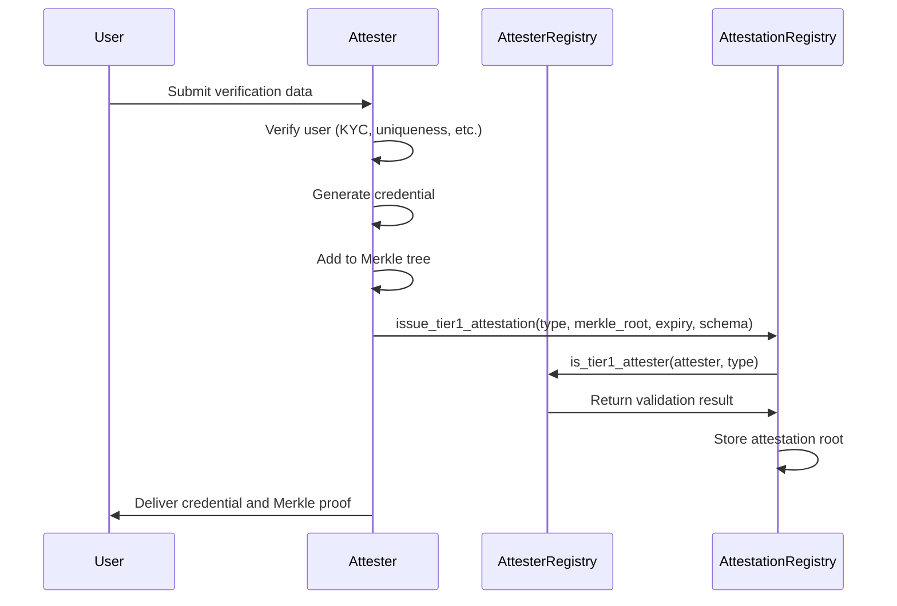
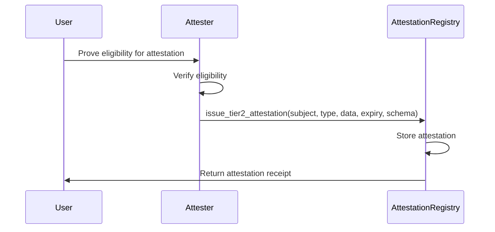

# Veridis: Attester Integration Documentation

**Technical Documentation v1.0**  
**May 8, 2025**

**Authors:**  
Cass402 and the Veridis Engineering Team

---

## Document Control

| Version | Date       | Author           | Changes                      |
| ------- | ---------- | ---------------- | ---------------------------- |
| 0.1     | 2025-03-30 | Integration Team | Initial draft                |
| 0.2     | 2025-04-12 | Security Team    | Added security requirements  |
| 0.3     | 2025-05-01 | API Team         | Updated API specifications   |
| 1.0     | 2025-05-08 | Cass402          | Final review and publication |

**Classification:** Internal Technical Documentation  
**Distribution:** Veridis Engineering, Attesters, Technical Partners

---

## Table of Contents

1. [Introduction](#1-introduction)
2. [Attester Architecture](#2-attester-architecture)
3. [Integration Process](#3-integration-process)
4. [Tier-1 Attester Integration](#4-tier-1-attester-integration)
5. [Tier-2 Attester Integration](#5-tier-2-attester-integration)
6. [Attestation API](#6-attestation-api)
7. [Cryptographic Requirements](#7-cryptographic-requirements)
8. [Security Guidelines](#8-security-guidelines)
9. [Testing and Certification](#9-testing-and-certification)
10. [Appendices](#10-appendices)

---

## 1. Introduction

### 1.1 Purpose and Scope

This document provides comprehensive technical guidance for external services to integrate with the Veridis protocol as attesters. It details the technical requirements, integration process, and best practices for issuing attestations within the Veridis ecosystem.

The document is targeted at:

- KYC providers seeking to become Tier-1 attesters
- Proof-of-personhood services integrating with the protocol
- Communities and DAOs building Tier-2 attestation systems
- Developers implementing the attestation APIs

### 1.2 Attester Role in Veridis

Attesters are a foundational component of the Veridis protocol, responsible for:

1. **Issuing Credentials**: Providing cryptographic attestations about user attributes or status
2. **Maintaining Trust**: Ensuring the validity and accuracy of issued attestations
3. **Supporting Privacy**: Enabling zero-knowledge verification of user credentials
4. **Facilitating Compliance**: Enabling regulatory compliance without compromising privacy
5. **Building Reputation**: Contributing to the Veridis reputation ecosystem

Veridis implements a dual-tier attestation model:

- **Tier-1 Attesters**: High-trust entities (KYC providers, government services, trusted identity verifiers) that issue foundational attestations (identity verification, uniqueness proof)
- **Tier-2 Attesters**: General entities (communities, protocols, individuals) that issue reputation-based or community attestations

### 1.3 Key Terminology

- **Attestation**: A cryptographic statement about a subject's attributes, status, or properties
- **Attester**: An entity authorized to issue attestations within the Veridis protocol
- **Credential**: A verifiable cryptographic attestation issued to a user
- **Merkle Tree**: Data structure used to efficiently store and verify batches of attestations
- **Zero-Knowledge Proof**: Cryptographic method allowing credential verification without revealing underlying data
- **Attestation Type**: Classification of different attestation categories (KYC, uniqueness, reputation, etc.)
- **Nullifier**: Cryptographic mechanism preventing credential reuse while preserving privacy

## 2. Attester Architecture

### 2.1 System Overview

The Veridis attester integration architecture consists of the following components:

```
┌─────────────────────────────────────────────────┐
│               Attester Systems                   │
├─────────────────────────────────────────────────┤
│ ┌───────────────┐      ┌─────────────────────┐  │
│ │  Verification  │      │  Attestation        │  │
│ │  Service       │─────►│  Generation         │  │
│ └───────────────┘      └─────────┬───────────┘  │
│                                  │              │
│ ┌───────────────┐     ┌──────────▼─────────────┐│
│ │  Subject      │     │  Merkle Tree           ││
│ │  Database     │────►│  Builder               ││
│ └───────────────┘     └───────────┬────────────┘│
└─────────────────────────────────┬─┬──────────┬──┘
                                  │ │          │
                                  │ │          │ Subject receives credential
┌────────────────────────────┐    │ │          ▼
│                            │    │ │   ┌──────────────────┐
│      StarkNet Chain        │    │ │   │                  │
│                            │    │ │   │   User Wallet    │
│ ┌──────────────────────┐   │    │ │   │                  │
│ │ Attester Registry    │◄──┼────┘ │   └──────────────────┘
│ │ Contract             │   │      │             ▲
│ └────────────┬─────────┘   │      │             │
│              │             │      │             │
│ ┌────────────▼─────────┐   │      │             │
│ │ Attestation Registry │◄──┼──────┘             │
│ │ Contract             │   │                    │
│ └────────────┬─────────┘   │                    │
│              │             │                    │
│ ┌────────────▼─────────┐   │                    │
│ │ ZK Verifier          │◄──┼────────────────────┘
│ │ Contract             │   │    ZK Proof of credential
│ └──────────────────────┘   │
└────────────────────────────┘
```

### 2.2 Attester Components

#### 2.2.1 Off-Chain Components

- **Verification Service**: Performs the actual verification process (KYC, uniqueness, etc.)
- **Attestation Generation**: Creates cryptographic attestations for verified subjects
- **Subject Database**: Securely stores information about verification subjects
- **Merkle Tree Builder**: Constructs Merkle trees for batch attestation issuance

#### 2.2.2 On-Chain Components

- **Attester Registry Contract**: Maintains the list of authorized attesters and their permissions
- **Attestation Registry Contract**: Stores attestation Merkle roots and metadata
- **ZK Verifier Contract**: Verifies zero-knowledge proofs of credential possession

### 2.3 Attestation Flows

#### 2.3.1 Tier-1 Attestation Flow



#### 2.3.2 Tier-2 Attestation Flow



## 3. Integration Process

### 3.1 Attester Onboarding

The process for becoming a Veridis attester involves the following steps:

1. **Application**: Submit application to the Veridis governance

   - Organization details and attestation plans
   - Technical specifications and security measures
   - Compliance documentation (for Tier-1 attesters)

2. **Technical Review**:

   - API compatibility assessment
   - Security audit
   - Cryptographic implementation verification

3. **Governance Approval**:

   - For Tier-1 attesters: Formal governance vote
   - For Tier-2 attesters: Simplified verification process

4. **Technical Integration**:

   - Implementation of required APIs
   - Key generation and registration
   - Integration testing

5. **Deployment**:
   - Registration in Attester Registry
   - Issuance of test attestations
   - Monitoring and quality assurance

### 3.2 Prerequisites

Attesters must meet the following prerequisites before integration:

1. **Technical Capabilities**:

   - Secure infrastructure for attestation issuance
   - Cryptographic key management system
   - API endpoints for attestation requests
   - Merkle tree generation capability (for Tier-1)

2. **Compliance Requirements** (Tier-1 only):

   - Regulatory authorization if applicable
   - Privacy and data protection compliance
   - Security certification
   - Audit history

3. **StarkNet Integration**:
   - StarkNet account for transaction submission
   - STARK cryptography support
   - Cairo contract interaction capability

### 3.3 Registration Process

#### 3.3.1 Tier-1 Attester Registration

Tier-1 attesters are registered through the governance process:

```cairo
// On the AttesterRegistry contract
#[external(v0)]
fn register_tier1_attester(
    ref self: ContractState,
    attester: ContractAddress,
    attestation_type: u256,
    metadata_uri: felt252,
) {
    // Only governance can register Tier-1 attesters
    let caller = get_caller_address();
    assert(caller == self.governance.read(), 'Not governance');

    // Check attestation type exists and is restricted
    let att_type = self.attestation_types.read(attestation_type);
    assert(att_type.restricted, 'Not a restricted type');

    // Register attester
    self.tier1_attesters.write((attester, attestation_type), true);
    self.attester_metadata.write(attester, metadata_uri);

    // Emit event
    self.emit(Tier1AttesterRegistered {
        attester: attester,
        attestation_type: attestation_type,
        metadata_uri: metadata_uri,
        timestamp: get_block_timestamp()
    });
}
```

#### 3.3.2 Tier-2 Attester Registration

Tier-2 attesters do not require formal registration and can begin issuing attestations immediately:

```cairo
// Anyone can be a Tier-2 attester by directly calling:
attestation_registry.issue_tier2_attestation(
    subject: ContractAddress,
    attestation_type: u256,
    data: felt252,
    expiration_time: u64,
    schema_uri: felt252,
);
```

## 4. Tier-1 Attester Integration

### 4.1 Tier-1 Attestation Types

The standard Tier-1 attestation types include:

| Type ID | Name                   | Description                         | Schema URI                 |
| ------- | ---------------------- | ----------------------------------- | -------------------------- |
| 1       | `KYC_BASIC`            | Basic KYC verification              | ipfs://QmVcS5YFceaZSfdK... |
| 2       | `KYC_ENHANCED`         | Enhanced KYC with additional checks | ipfs://QmTb8Qz6xJVbX4...   |
| 3       | `UNIQUE_HUMAN`         | Proof of personhood                 | ipfs://QmZxCv9Tg4hS7pN...  |
| 4       | `COUNTRY_VERIFICATION` | Verified country of residence       | ipfs://QmYjN8yFc3xBV4...   |
| 5       | `AGE_VERIFICATION`     | Age verification (18+, 21+, etc.)   | ipfs://QmWvQrFzk7EB2h...   |

### 4.2 Batch Attestation Implementation

Tier-1 attesters typically issue attestations in batches using Merkle trees:

```typescript
// Example TypeScript implementation for batch attestation
async function issueBatchAttestations(
  attestations: Array<AttestationData>,
  attestationType: bigint,
  expirationTime: bigint
): Promise<string> {
  // Compute leaves for each attestation
  const leaves = attestations.map((attestation) =>
    computeAttestationLeaf(
      attestationType,
      attestation.subject,
      attestation.data,
      attestation.nonce
    )
  );

  // Build Merkle tree
  const tree = new MerkleTree(leaves);
  const root = tree.getRoot();

  // Store tree data in attester's database for later proof generation
  await storeTreeData(root, leaves, attestations);

  // Register on-chain
  const tx = await attestationRegistry.issueTier1Attestation(
    attestationType,
    root,
    expirationTime,
    getSchemaURI(attestationType)
  );

  return root;
}

// Compute leaf for attestation
function computeAttestationLeaf(
  attestationType: bigint,
  subject: string,
  data: string,
  nonce: string
): string {
  // Compute type hash
  const typeHash = pedersen(
    attestationType.low.toString(),
    attestationType.high.toString()
  );

  // Compute data hash
  const dataHash = pedersen(subject, data);

  // Compute leaf
  const intermediateHash = pedersen(typeHash, dataHash);
  return pedersen(intermediateHash, nonce);
}
```

### 4.3 Merkle Tree Management

Tier-1 attesters must maintain their Merkle trees for proof generation:

```typescript
// Example TypeScript implementation for Merkle tree management
class AttesterMerkleTreeManager {
  private trees: Map<string, MerkleTreeData> = new Map();

  // Store tree data for a batch
  public async storeTree(
    root: string,
    leaves: string[],
    attestations: AttestationData[]
  ): Promise<void> {
    this.trees.set(root, {
      leaves,
      attestations,
      createdAt: Date.now(),
      tree: new MerkleTree(leaves),
    });

    // Also persist to database for durability
    await this.persistTree(root, leaves, attestations);
  }

  // Generate proof for a specific subject
  public async generateProof(
    root: string,
    subject: string
  ): Promise<MerkleProof | null> {
    const treeData = this.trees.get(root) || (await this.loadTreeFromDB(root));

    if (!treeData) return null;

    // Find the leaf index for this subject
    const index = treeData.attestations.findIndex((a) => a.subject === subject);
    if (index === -1) return null;

    // Generate Merkle proof
    return treeData.tree.getProof(index);
  }

  // Other tree management methods...
}
```

### 4.4 Credential Delivery

After issuing attestations, Tier-1 attesters must securely deliver credentials to users:

```typescript
// Example TypeScript implementation for credential delivery
async function deliverCredential(
  user: User,
  attestation: AttestationData,
  merkleRoot: string
): Promise<void> {
  // Generate proof for this specific attestation
  const proof = await merkleTreeManager.generateProof(
    merkleRoot,
    attestation.subject
  );

  if (!proof) {
    throw new Error("Failed to generate proof for attestation");
  }

  // Construct credential package
  const credential = {
    attestationType: attestation.attestationType,
    subject: attestation.subject,
    data: attestation.data,
    nonce: attestation.nonce,
    merkleRoot: merkleRoot,
    merkleProof: proof,
    attester: getAttesterAddress(),
    issuedAt: Date.now(),
    expirationTime: attestation.expirationTime,
  };

  // Deliver to user through secure channel
  await secureDeliveryService.deliverCredential(user, credential);
}
```

## 5. Tier-2 Attester Integration

### 5.1 Tier-2 Attestation Types

Common Tier-2 attestation types include:

| Type ID | Name                  | Description                            | Schema URI               |
| ------- | --------------------- | -------------------------------------- | ------------------------ |
| 100     | `DAO_MEMBERSHIP`      | Membership in a DAO                    | ipfs://Qmb8F3x7TpS2K1... |
| 101     | `CONTRIBUTION_BADGE`  | Recognition for protocol contributions | ipfs://QmVf4xN6qT8Bz7... |
| 102     | `REPUTATION_SCORE`    | Numeric reputation score               | ipfs://QmSjK8vP2zTh9t... |
| 103     | `SKILL_VERIFICATION`  | Verified technical skill               | ipfs://QmRv3xJ7tYzF6K... |
| 104     | `EVENT_PARTICIPATION` | Proof of event attendance              | ipfs://QmTgV5z8knF4jR... |

### 5.2 Direct Attestation Implementation

Tier-2 attesters typically issue attestations directly rather than in batches:

```typescript
// Example TypeScript implementation for direct attestation
async function issueDirectAttestation(
  subject: string,
  attestationType: bigint,
  data: string,
  expirationTime: bigint
): Promise<void> {
  // Validate data against schema
  validateAgainstSchema(data, attestationType);

  // Issue attestation on-chain
  const tx = await attestationRegistry.issueTier2Attestation(
    subject,
    attestationType,
    data,
    expirationTime,
    getSchemaURI(attestationType)
  );

  // Store record in attester database
  await storeAttestationRecord(
    subject,
    attestationType,
    data,
    tx.hash,
    expirationTime
  );
}
```

### 5.3 Schema Conformance

Tier-2 attesters must ensure their attestations conform to the standard schemas:

```typescript
// Example TypeScript implementation for schema validation
function validateAgainstSchema(data: string, attestationType: bigint): void {
  // Load schema for this attestation type
  const schema = loadSchema(getSchemaURI(attestationType));

  // Parse data (e.g., from hex to structured data)
  const parsedData = parseAttestationData(data);

  // Validate against schema
  const validationResult = validateData(parsedData, schema);

  if (!validationResult.valid) {
    throw new Error(
      `Invalid attestation data: ${validationResult.errors.join(", ")}`
    );
  }
}
```

### 5.4 Direct Attestation Querying

Users and applications can query Tier-2 attestations directly:

```cairo
// On the AttestationRegistry contract
#[view]
fn get_tier2_attestation(
    self: @ContractState,
    attester: ContractAddress,
    subject: ContractAddress,
    attestation_type: u256,
) -> AttestationData {
    return self.tier2_attestations.read((attester, subject, attestation_type));
}
```

## 6. Attestation API

### 6.1 Attester API Requirements

Attesters must implement the following API endpoints:

#### 6.1.1 Tier-1 Attester APIs

| Endpoint                     | Method | Description                      |
| ---------------------------- | ------ | -------------------------------- |
| `/attestations/verify`       | POST   | Submit verification data         |
| `/attestations/status`       | GET    | Check verification status        |
| `/attestations/credential`   | GET    | Retrieve credential with proof   |
| `/attestations/merkle-proof` | GET    | Get Merkle proof for attestation |
| `/attestations/verify-proof` | POST   | Verify a Merkle proof            |

#### 6.1.2 Tier-2 Attester APIs

| Endpoint               | Method | Description                |
| ---------------------- | ------ | -------------------------- |
| `/attestations/issue`  | POST   | Issue a direct attestation |
| `/attestations/query`  | GET    | Query issued attestations  |
| `/attestations/revoke` | POST   | Revoke an attestation      |

### 6.2 API Specifications

#### 6.2.1 Verification Submission

```http
POST /attestations/verify
Content-Type: application/json

{
  "verificationType": "KYC_BASIC",
  "subject": "0x04a23ba3f03a21d457407ca3ed170a8ef12f698436e65c9d64e6d622e0e1c0ab",
  "verificationData": {
    // Type-specific verification data
    "fullName": "John Doe",
    "dateOfBirth": "1990-01-01",
    "documentType": "PASSPORT",
    "documentNumber": "AB123456",
    // Additional data as required
  },
  "callbackUrl": "https://user-app.example/callback"
}

Response:
{
  "requestId": "ver_1234567890",
  "status": "PENDING",
  "estimatedCompletionTime": "2025-05-08T12:30:45Z"
}
```

#### 6.2.2 Credential Retrieval

```http
GET /attestations/credential?requestId=ver_1234567890
Authorization: Bearer <user_auth_token>

Response:
{
  "credential": {
    "attestationType": "1",  // KYC_BASIC
    "subject": "0x04a23ba3f03a21d457407ca3ed170a8ef12f698436e65c9d64e6d622e0e1c0ab",
    "data": "0xc70f64e2511094ce1989d3757346179b79bb29e39ce6397dfcc9de7a4155765a",
    "nonce": "0x9e35c072f8c15e38b5570e20b7eef7218ee78b18aff9d34d5cd8c90f92f1bbb7",
    "merkleRoot": "0x6a733a018bb5a639fae97cf3c7d529177c8348b4e1e2d31c6f64a6400498a7a1",
    "merkleProof": {
      "leaf": "0x94e5c16a8266ac62b6fcef8dcbe8e8a2bf415f3e5a1f8977da8b9241006c129f",
      "path": [
        {
          "sibling": "0x7ad8b366d0fb73b7e83f2200d744b105b3a7372778e2d91c85448fce206a0101",
          "isLeft": false
        },
        // Additional path elements
      ]
    },
    "attester": "0x0384927902349ab347c9a2910984abcdef9873492870100002798273982739845",
    "issuedAt": 1714911885,
    "expirationTime": 1746534285
  },
  "signature": "0x12345...",  // Attester signature of the credential package
  "usageInstructions": {
    "zkProvingKey": "https://attester.example/proving-keys/kyc-basic.json",
    "verificationContract": "0x0123456789abcdef0123456789abcdef0123456789abcdef0123456789abcdef"
  }
}
```

#### 6.2.3 Merkle Proof Retrieval

```http
GET /attestations/merkle-proof?merkleRoot=0x6a733a018bb5a639fae97cf3c7d529177c8348b4e1e2d31c6f64a6400498a7a1&subject=0x04a23ba3f03a21d457407ca3ed170a8ef12f698436e65c9d64e6d622e0e1c0ab
Authorization: Bearer <user_auth_token>

Response:
{
  "merkleRoot": "0x6a733a018bb5a639fae97cf3c7d529177c8348b4e1e2d31c6f64a6400498a7a1",
  "leaf": "0x94e5c16a8266ac62b6fcef8dcbe8e8a2bf415f3e5a1f8977da8b9241006c129f",
  "attestationType": "1",
  "subject": "0x04a23ba3f03a21d457407ca3ed170a8ef12f698436e65c9d64e6d622e0e1c0ab",
  "proof": [
    {
      "sibling": "0x7ad8b366d0fb73b7e83f2200d744b105b3a7372778e2d91c85448fce206a0101",
      "isLeft": false
    },
    // Additional path elements
  ],
  "issuedAt": 1714911885,
  "expirationTime": 1746534285
}
```

#### 6.2.4 Direct Attestation Issuance

```http
POST /attestations/issue
Content-Type: application/json
Authorization: Bearer <attester_api_key>

{
  "subject": "0x04a23ba3f03a21d457407ca3ed170a8ef12f698436e65c9d64e6d622e0e1c0ab",
  "attestationType": "102",  // REPUTATION_SCORE
  "data": {
    "score": 85,
    "category": "DEVELOPER",
    "details": "Active contributor to the protocol"
  },
  "expirationTime": 1746534285
}

Response:
{
  "attestationId": "att_8372650198",
  "transactionHash": "0x7c91f7e1283b45c73ef9a8c7100d27778e21b36a5a4547d24215a9228c10726c",
  "subject": "0x04a23ba3f03a21d457407ca3ed170a8ef12f698436e65c9d64e6d622e0e1c0ab",
  "attestationType": "102",
  "encodedData": "0x29384729837492837492387492387492387492387492374",
  "issuedAt": 1714911885,
  "expirationTime": 1746534285
}
```

### 6.3 SDK Integration

Veridis provides SDK libraries for attester integration:

```typescript
// Example TypeScript SDK usage for attesters
import {
  VeridisAttesterSDK,
  AttestationType,
  AttestationBatch,
} from "@veridis/attester-sdk";

// Initialize SDK
const attesterSDK = new VeridisAttesterSDK({
  privateKey: process.env.ATTESTER_PRIVATE_KEY,
  rpcUrl: "https://starknet-mainnet.infura.io/v3/YOUR_API_KEY",
  attestationRegistryAddress: "0x12345...",
});

// Issue a batch of Tier-1 attestations
async function issueKycBatch(verifiedUsers) {
  const batch = new AttestationBatch(AttestationType.KYC_BASIC);

  // Add each verified user to the batch
  for (const user of verifiedUsers) {
    batch.addAttestation({
      subject: user.identityCommitment,
      data: encodeKycData(user.kycData),
      nonce: generateSecureNonce(),
    });
  }

  // Issue the batch on-chain
  const result = await attesterSDK.issueTier1Batch(batch, {
    expirationTime: getExpirationTimestamp(365), // 1 year validity
  });

  // Store batch data for later proof generation
  await storeBatchData(result.merkleRoot, batch);

  return result;
}

// Issue a Tier-2 attestation
async function issueReputationScore(subject, score) {
  const result = await attesterSDK.issueTier2Attestation({
    subject,
    attestationType: AttestationType.REPUTATION_SCORE,
    data: encodeReputationData({ score, timestamp: Date.now() }),
    expirationTime: getExpirationTimestamp(90), // 90 days validity
  });

  return result;
}
```

## 7. Cryptographic Requirements

### 7.1 Key Management

Attesters must implement secure key management practices:

1. **Key Generation**:

   - Generate and store keys in hardware security modules (HSMs) or equivalent
   - Use strong entropy sources for key generation
   - Generate separate keys for different attestation types

2. **Key Rotation**:

   - Implement regular key rotation schedules
   - Maintain backward compatibility for previously issued attestations
   - Secure decommissioning of old keys

3. **Key Security**:
   - Multi-signature authorization for key usage
   - Access control and audit logging
   - Offline (cold) storage for root keys

### 7.2 Pedersen Hash Implementation

Attesters must correctly implement the Pedersen hash function used in Veridis:

```typescript
// Example TypeScript implementation using StarkNet.js
import { pedersen } from "starknet";

// Compute Pedersen hash of two field elements
function pedersenHash(a: string, b: string): string {
  return pedersen([a, b]);
}

// Compute hash of multiple elements
function hashMultiple(elements: string[]): string {
  let result = "0";
  for (const element of elements) {
    result = pedersenHash(result, element);
  }
  return result;
}
```

### 7.3 Merkle Tree Cryptography

Attesters must implement the Merkle tree according to the Veridis specification:

```typescript
// Example TypeScript implementation of Merkle tree for attesters
class VeridisStandardMerkleTree {
  private leaves: string[] = [];
  private layers: string[][] = [];

  constructor(leaves: string[]) {
    // Sort leaves if necessary
    this.leaves = [...leaves];

    // Build the tree
    this.buildTree();
  }

  private buildTree(): void {
    this.layers = [this.leaves];

    // Build each level
    while (this.layers[this.layers.length - 1].length > 1) {
      const currentLayer = this.layers[this.layers.length - 1];
      const nextLayer: string[] = [];

      // Process pairs of nodes
      for (let i = 0; i < currentLayer.length; i += 2) {
        if (i + 1 < currentLayer.length) {
          // Hash pair of nodes
          const left = currentLayer[i];
          const right = currentLayer[i + 1];
          nextLayer.push(pedersenHash(left, right));
        } else {
          // Odd node, promote to next level
          nextLayer.push(currentLayer[i]);
        }
      }

      // Add the new layer
      this.layers.push(nextLayer);
    }
  }

  // Get the Merkle root
  public getRoot(): string {
    return this.layers[this.layers.length - 1][0];
  }

  // Generate proof for a leaf
  public getProof(index: number): MerkleProof {
    if (index < 0 || index >= this.leaves.length) {
      throw new Error("Index out of range");
    }

    const leaf = this.leaves[index];
    const proof: { sibling: string; isLeft: boolean }[] = [];

    let currentIndex = index;

    for (let i = 0; i < this.layers.length - 1; i++) {
      const currentLayer = this.layers[i];
      const isRightNode = currentIndex % 2 === 1;
      const siblingIndex = isRightNode ? currentIndex - 1 : currentIndex + 1;

      if (siblingIndex < currentLayer.length) {
        proof.push({
          sibling: currentLayer[siblingIndex],
          isLeft: !isRightNode,
        });
      }

      // Move to the parent index
      currentIndex = Math.floor(currentIndex / 2);
    }

    return {
      leaf,
      path: proof,
    };
  }

  // Verify a proof
  public static verifyProof(root: string, proof: MerkleProof): boolean {
    let current = proof.leaf;

    for (const { sibling, isLeft } of proof.path) {
      if (isLeft) {
        // Sibling is on the left
        current = pedersenHash(sibling, current);
      } else {
        // Sibling is on the right
        current = pedersenHash(current, sibling);
      }
    }

    return current === root;
  }
}
```

### 7.4 Signature Scheme

Attesters should implement the StarkNet signature scheme for credential signing:

```typescript
// Example TypeScript implementation of StarkNet signature
import { ec, stark } from "starknet";

// Sign a message with attester's key
function signMessage(message: string, privateKey: string): string {
  const keyPair = ec.getKeyPair(privateKey);
  const signature = ec.sign(keyPair, message);
  return signature;
}

// Verify a signature
function verifySignature(
  message: string,
  signature: string,
  publicKey: string
): boolean {
  return ec.verify(publicKey, message, signature);
}

// Sign a credential package
function signCredential(credential: any, privateKey: string): string {
  // Serialize the credential to a string
  const serialized = JSON.stringify(credential);

  // Hash the serialized credential
  const messageHash = stark.keccak(serialized);

  // Sign the hash
  return signMessage(messageHash, privateKey);
}
```

## 8. Security Guidelines

### 8.1 Infrastructure Security

Attesters must implement the following infrastructure security measures:

1. **Network Security**:

   - Use TLS 1.3+ for all API endpoints
   - Implement API rate limiting and DDoS protection
   - Network segmentation for attestation systems
   - Regular security scanning and penetration testing

2. **Server Security**:

   - Hardened operating systems with minimal attack surface
   - Regular security updates and patch management
   - Host-based intrusion detection
   - Restricted access based on principle of least privilege

3. **Database Security**:
   - Encryption of sensitive data at rest
   - Database access controls and audit logging
   - Regular backup and recovery testing
   - Data retention policies compliant with regulations

### 8.2 Subject Data Protection

Attesters must implement strong protections for subject data:

1. **Data Minimization**:

   - Only collect necessary information
   - Implement privacy by design principles
   - Separate identification data from attestation data

2. **Data Encryption**:

   - End-to-end encryption for data transit
   - Field-level encryption for sensitive attributes
   - Key management separate from data storage

3. **Access Controls**:
   - Role-based access control for staff
   - Multi-factor authentication for all administrative access
   - Audit logging for all data access
   - Regular access review

### 8.3 Attestation Issuance Security

Secure the attestation issuance process with:

1. **Issuance Controls**:

   - Multi-signature approval for batch attestations
   - Anomaly detection for unusual attestation patterns
   - Separation of verification and issuance systems
   - Rate limiting and monitoring

2. **Revocation Capability**:

   - Ability to revoke compromised attestations
   - Regular testing of revocation process
   - Monitoring for potentially fraudulent attestations

3. **Key Protection**:
   - Hardware security for attestation keys
   - Ceremony-based key generation
   - Multiple authorization for key usage

### 8.4 Security Incident Response

Attesters must establish security incident response procedures:

1. **Incident Detection**:

   - Monitoring systems for unauthorized access
   - Anomaly detection for attestation operations
   - User reports of suspicious activity

2. **Response Procedures**:

   - Documented incident response plan
   - Roles and responsibilities during incidents
   - Communication protocols with Veridis governance
   - Ability to pause attestation issuance during incidents

3. **Recovery Process**:
   - Procedures for revoking compromised attestations
   - Key rotation after security incidents
   - Post-incident analysis and remediation

## 9. Testing and Certification

### 9.1 Test Environment

Veridis provides a test environment for attester integration:

1. **Testnet Integration**:

   - StarkNet Goerli testnet deployment
   - Test attestation registry contract
   - Faucet for test tokens

2. **Test Vectors**:

   - Standard test data for each attestation type
   - Test Merkle tree examples with known roots
   - Reference implementation output

3. **Compliance Testing**:
   - Automated test suite for attester integration
   - Performance benchmarking tools
   - Security scanning tools

### 9.2 Integration Testing

Attesters should perform the following integration tests:

1. **Functional Testing**:

   - Attestation issuance (Tier-1 and/or Tier-2)
   - Merkle proof generation and verification
   - Credential delivery to users
   - Revocation functionality

2. **Error Handling**:

   - Invalid input handling
   - Transaction failure recovery
   - Network interruption handling
   - Rate limit testing

3. **Performance Testing**:
   - Batch size optimization
   - Response time under load
   - Resource utilization
   - Scalability testing

### 9.3 Certification Process

Tier-1 attesters must complete a certification process:

1. **Technical Certification**:

   - Successful completion of integration tests
   - Security assessment
   - Performance benchmark results
   - API compliance verification

2. **Compliance Certification**:

   - Regulatory status verification
   - Privacy compliance assessment
   - Data protection audit
   - Terms of service review

3. **Operational Certification**:
   - Business continuity planning
   - Service level agreements
   - Support processes
   - Monitoring capabilities

### 9.4 Monitoring and Maintenance

Ongoing monitoring requirements for attesters:

1. **Operational Monitoring**:

   - Attestation issuance metrics
   - API performance and availability
   - Error rates and failure modes
   - User complaints and resolution

2. **Security Monitoring**:

   - Suspicious activity detection
   - Access pattern analysis
   - Vulnerability scanning
   - Security patch compliance

3. **Compliance Monitoring**:
   - Regulatory changes affecting attestations
   - Privacy compliance updates
   - Regular compliance assessments
   - User consent management

## 10. Appendices

### 10.1 Attestation Schemas

Detailed schemas for standard attestation types:

#### 10.1.1 KYC_BASIC Schema

```json
{
  "$schema": "http://json-schema.org/draft-07/schema#",
  "title": "Basic KYC Attestation",
  "type": "object",
  "properties": {
    "kycLevel": {
      "type": "string",
      "enum": ["BASIC", "INTERMEDIATE", "ADVANCED"]
    },
    "jurisdictionCode": {
      "type": "string",
      "pattern": "^[A-Z]{2}$"
    },
    "identityType": {
      "type": "string",
      "enum": ["INDIVIDUAL", "ENTITY"]
    },
    "completedAt": {
      "type": "integer",
      "description": "Unix timestamp when KYC was completed"
    },
    "riskScore": {
      "type": "integer",
      "minimum": 0,
      "maximum": 100
    },
    "isRestricted": {
      "type": "boolean"
    }
  },
  "required": ["kycLevel", "jurisdictionCode", "identityType", "completedAt"]
}
```

#### 10.1.2 UNIQUE_HUMAN Schema

```json
{
  "$schema": "http://json-schema.org/draft-07/schema#",
  "title": "Unique Human Attestation",
  "type": "object",
  "properties": {
    "verificationMethod": {
      "type": "string",
      "enum": ["BIOMETRIC", "SOCIAL_GRAPH", "GOVERNMENT_ID", "COMBINATION"]
    },
    "confidenceScore": {
      "type": "integer",
      "minimum": 1,
      "maximum": 100
    },
    "verificationsCount": {
      "type": "integer",
      "minimum": 1
    },
    "lastVerifiedAt": {
      "type": "integer"
    }
  },
  "required": ["verificationMethod", "confidenceScore", "lastVerifiedAt"]
}
```

#### 10.1.3 REPUTATION_SCORE Schema

```json
{
  "$schema": "http://json-schema.org/draft-07/schema#",
  "title": "Reputation Score Attestation",
  "type": "object",
  "properties": {
    "score": {
      "type": "integer",
      "minimum": 0,
      "maximum": 100
    },
    "category": {
      "type": "string"
    },
    "context": {
      "type": "string"
    },
    "evidence": {
      "type": "string"
    },
    "issueDate": {
      "type": "integer"
    }
  },
  "required": ["score", "category", "issueDate"]
}
```

### 10.2 API Error Codes

Standard error codes for attester APIs:

| Code | Message                          | Description                                    |
| ---- | -------------------------------- | ---------------------------------------------- |
| 1001 | "Invalid request format"         | Request does not match API specification       |
| 1002 | "Missing required field"         | A required field is missing from the request   |
| 1003 | "Invalid field format"           | A field has an invalid format                  |
| 1004 | "Authentication failed"          | API authentication failed                      |
| 1005 | "Authorization failed"           | Caller not authorized for this operation       |
| 2001 | "Verification failed"            | Subject verification failed                    |
| 2002 | "Attestation type not supported" | Attester doesn't support this attestation type |
| 2003 | "Subject not found"              | Referenced subject doesn't exist               |
| 2004 | "Merkle proof not found"         | Cannot generate proof for the given parameters |
| 3001 | "Transaction failed"             | On-chain transaction failed                    |
| 3002 | "Attestation already exists"     | Trying to issue duplicate attestation          |
| 3003 | "Attestation expired"            | Referenced attestation is expired              |
| 3004 | "Attestation revoked"            | Referenced attestation was revoked             |
| 5001 | "Internal server error"          | General server error                           |
| 5002 | "Service unavailable"            | Attestation service temporarily unavailable    |

### 10.3 Implementation Checklist

Checklist for attester implementation:

#### 10.3.1 Tier-1 Attester Checklist

- [ ] **Governance Approval**

  - [ ] Submit application to Veridis governance
  - [ ] Provide required documentation
  - [ ] Complete security assessment
  - [ ] Receive formal approval

- [ ] **Technical Implementation**

  - [ ] Implement attestation API endpoints
  - [ ] Implement Merkle tree generation
  - [ ] Implement secure key management
  - [ ] Integrate with StarkNet

- [ ] **Testing and Certification**

  - [ ] Complete integration testing
  - [ ] Pass security assessment
  - [ ] Verify attestation formats
  - [ ] Benchmark performance

- [ ] **Operations Setup**
  - [ ] Establish monitoring systems
  - [ ] Document operational procedures
  - [ ] Set up support channels
  - [ ] Define incident response plan

#### 10.3.2 Tier-2 Attester Checklist

- [ ] **Technical Implementation**

  - [ ] Implement attestation API endpoints
  - [ ] Generate StarkNet account
  - [ ] Implement secure key management
  - [ ] Integrate with StarkNet

- [ ] **Testing**

  - [ ] Test attestation issuance
  - [ ] Verify attestation formats
  - [ ] Test query functionality
  - [ ] Test revocation functionality

- [ ] **Operations Setup**
  - [ ] Set up monitoring
  - [ ] Document procedures
  - [ ] Define user support process

### 10.4 Sample Implementation Code

Complete sample implementation available at:

- GitHub: [https://github.com/veridis-protocol/attester-reference-implementation](https://github.com/veridis-protocol/attester-reference-implementation)
- Documentation: [https://docs.veridis.xyz/attesters/implementation-guide](https://docs.veridis.xyz/attesters/implementation-guide)

The sample implementation includes:

- API server implementation
- Merkle tree library
- Key management examples
- Test vectors
- StarkNet integration examples

---

## Document Metadata

**Document ID:** VERIDIS-SPEC-ATT-2025-001  
**Version:** 1.0  
**Date:** 2025-05-08  
**Authors:** Cass402 and the Veridis Engineering Team  
**Last Edit:** 2025-05-08 12:04:00 UTC by Cass402

**Classification:** Internal Technical Documentation  
**Distribution:** Veridis Engineering, Attesters, Technical Partners

**Document End**
