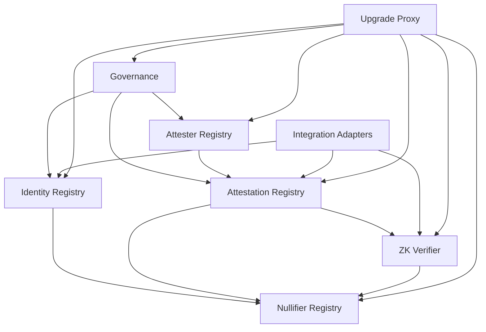
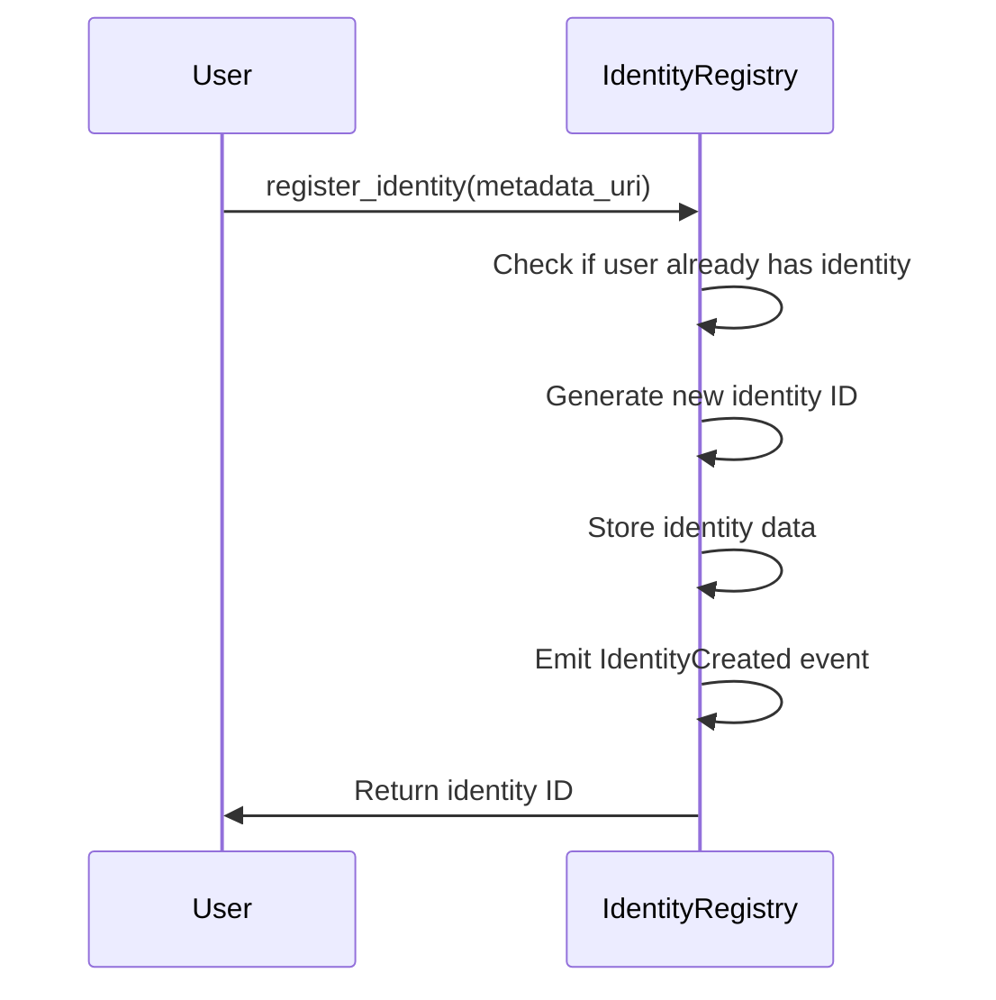
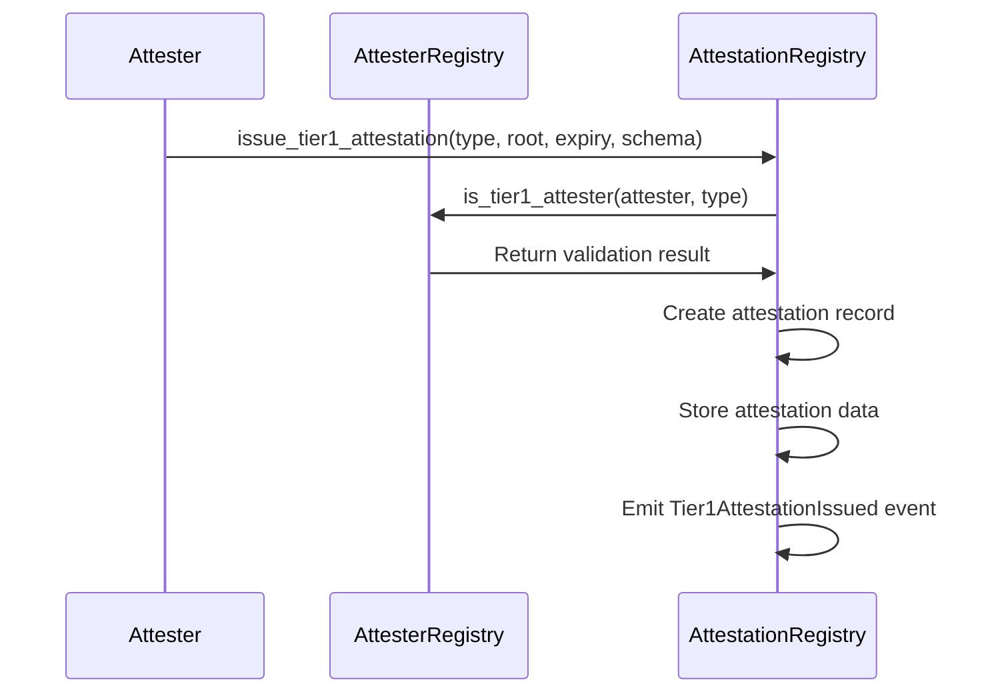
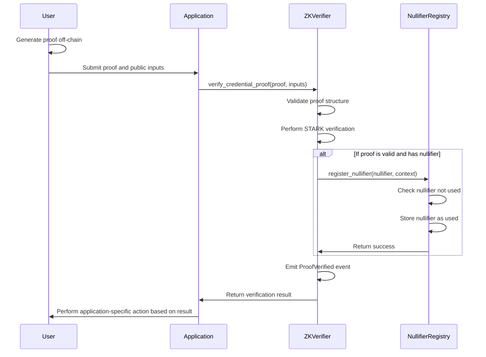
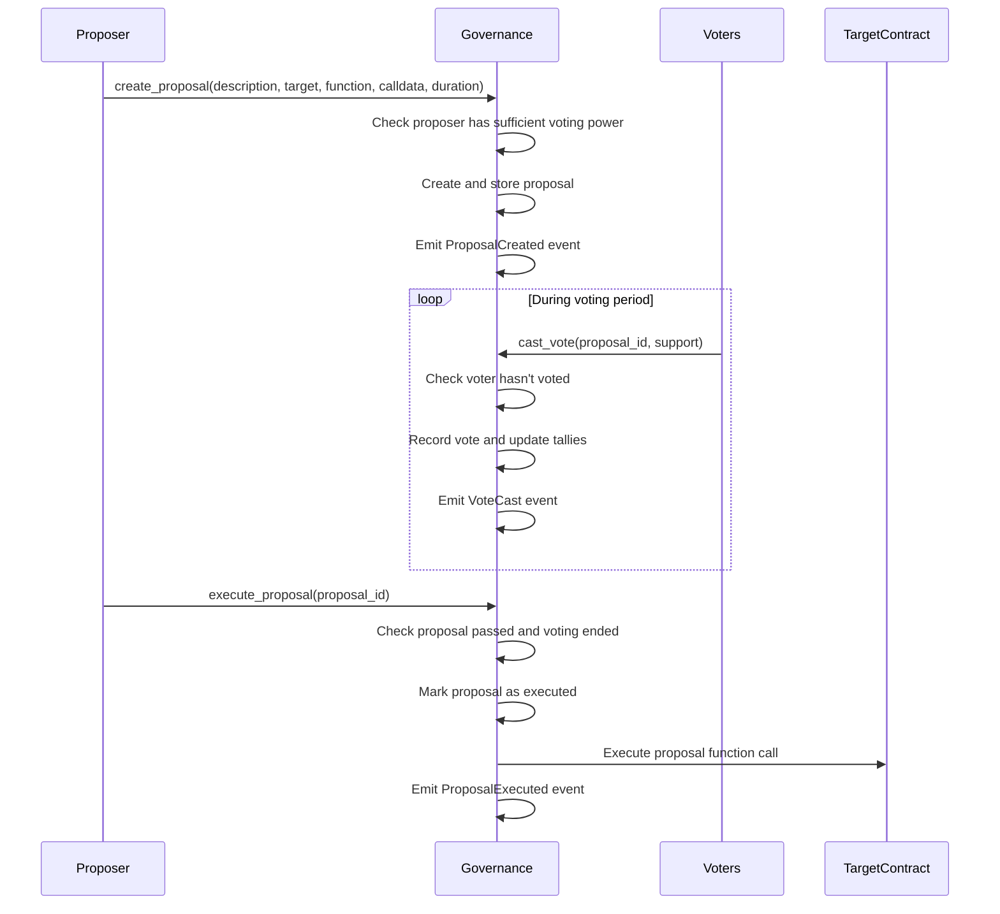

# Veridis: Smart Contract Architecture

**Technical Documentation v1.0**  
**May 8, 2025**

**Authors:**  
Cass402 and the Veridis Engineering Team

---

## Document Control

| Version | Date       | Author              | Changes                             |
| ------- | ---------- | ------------------- | ----------------------------------- |
| 0.1     | 2025-03-10 | Smart Contract Team | Initial draft                       |
| 0.2     | 2025-03-25 | Smart Contract Team | Added storage layouts               |
| 0.3     | 2025-04-15 | Core Dev Team       | Updated interfaces and integrations |
| 1.0     | 2025-05-08 | Cass402             | Final review and publication        |

**Classification:** Internal Technical Documentation  
**Distribution:** Veridis Engineering, Auditors, Technical Partners

---

## Table of Contents

1. [Introduction](#1-introduction)
2. [Architecture Overview](#2-architecture-overview)
3. [Core Contract Modules](#3-core-contract-modules)
4. [Storage and Data Structures](#4-storage-and-data-structures)
5. [Contract Interfaces](#5-contract-interfaces)
6. [Contract Interactions](#6-contract-interactions)
7. [Security Considerations](#7-security-considerations)
8. [Upgrade Strategy](#8-upgrade-strategy)
9. [Deployment Framework](#9-deployment-framework)
10. [Testing Strategy](#10-testing-strategy)
11. [Gas Optimization](#11-gas-optimization)
12. [Appendices](#12-appendices)

---

## 1. Introduction

### 1.1 Purpose and Scope

This document provides a comprehensive technical specification of the smart contract architecture for the Veridis protocol. It details the contract structure, interfaces, storage layouts, and interaction patterns necessary to implement the decentralized identity and reputation layer on StarkNet.

The architecture is designed to achieve the following objectives:

- Implement the dual-tier attestation model
- Support zero-knowledge verification of credentials
- Provide secure identity management
- Enable privacy-preserving attestation issuance and verification
- Integrate with existing StarkNet protocols and standards

### 1.2 Contract Architecture Goals

The Veridis smart contract architecture is guided by the following principles:

- **Modularity**: Separation of concerns with well-defined interfaces
- **Upgradability**: Ability to improve contracts while preserving state
- **Security**: Strong protection against common vulnerabilities
- **Efficiency**: Gas optimization for StarkNet environment
- **Composability**: Easy integration with other protocols
- **Standardization**: Adherence to emerging standards for identity and attestations

### 1.3 Technology Stack

The Veridis contracts are implemented using:

- **Language**: Cairo 1.0
- **Framework**: StarkNet Contracts Library
- **Development Tools**: Scarb, Starkli, Protostar
- **Testing Framework**: Cairo Test, Starknet Devnet
- **Formal Verification**: Custom StarkNet verification tools

## 2. Architecture Overview

### 2.1 System Architecture

The Veridis contract architecture consists of the following high-level components:

```

┌───────────────────────────────────────────────────────────┐
│ Governance & Administration │
└───────────────┬───────────────────────────┬───────────────┘
│ │
┌───────────────▼───────────────┐ ┌─────────▼─────────────┐
│ Identity Core │ │ Upgrade System │
└───────────────┬───────────────┘ └─────────┬─────────────┘
│ │
┌───────────────▼───────────────────────────▼───────────────┐
│ Registry Layer │
├─────────────┬──────────────┬───────────────┬──────────────┤
│ Identity │ Attestation │ Nullifier │ Attester │
│ Registry │ Registry │ Registry │ Registry │
└─────────────┴──────────┬───┴───────────────┴──────────────┘
│
┌────────────────────────▼─────────────────────────────────┐
│ Verification Layer │
├────────────────┬────────────────┬───────────────────────┬┘
│ ZK Verifier │ Merkle │ Credential │
│ Contract │ Verification │ Validation │
└────────────────┴────────────────┴───────────────────────┘
▲
┌─────────────────────────────────┴───────────────────────┐
│ Integration Layer │
├─────────────┬───────────────┬───────────────┬───────────┤
│ Airdrop │ DeFi │ Governance │ Bridge │
│ Adapter │ Adapter │ Adapter │ Adapter │
└─────────────┴───────────────┴───────────────┴───────────┘

```

### 2.2 Contract Dependencies

The core dependency relationships between Veridis contracts:



### 2.3 Event Flow

The typical event flows in the Veridis protocol:

1. **Identity Registration Flow**:

   - User calls `IdentityRegistry.register_identity()`
   - `IdentityCreated` event emitted
   - Identity NFT minted to user

2. **Attestation Issuance Flow**:

   - Attester calls `AttestationRegistry.issue_tier1_attestation()` or `issue_tier2_attestation()`
   - `AttestationIssued` event emitted
   - Attestation recorded in registry

3. **Verification Flow**:
   - User generates ZK proof off-chain
   - Verifier calls `ZKVerifier.verify_credential_proof()`
   - If valid, `ProofVerified` event emitted
   - Application-specific action performed

## 3. Core Contract Modules

### 3.1 Identity Registry

#### 3.1.1 Purpose

The Identity Registry manages the creation, updating, and deactivation of identities in the Veridis protocol. Each identity is a non-transferable NFT that serves as a user's core identity on StarkNet.

#### 3.1.2 Key Functions

```cairo
#[starknet::contract]
mod IdentityRegistry {
    use starknet::ContractAddress;
    use starknet::get_caller_address;
    use starknet::get_block_timestamp;

    #[storage]
    struct Storage {
        // Map identity ID to Identity struct
        identities: LegacyMap::<u256, Identity>,
        // Map user address to their identity ID
        identity_owners: LegacyMap::<ContractAddress, u256>,
        // Total number of identities
        identity_count: u256,
        // System administrator
        admin: ContractAddress,
    }

    #[derive(Drop, Serde)]
    struct Identity {
        id: u256,
        owner: ContractAddress,
        creation_time: u64,
        metadata_uri: felt252,
        active: bool,
    }

    #[event]
    #[derive(Drop, starknet::Event)]
    enum Event {
        IdentityCreated: IdentityCreated,
        IdentityUpdated: IdentityUpdated,
        IdentityDeactivated: IdentityDeactivated,
    }

    #[derive(Drop, starknet::Event)]
    struct IdentityCreated {
        identity_id: u256,
        owner: ContractAddress,
        timestamp: u64,
    }

    #[derive(Drop, starknet::Event)]
    struct IdentityUpdated {
        identity_id: u256,
        metadata_uri: felt252,
        timestamp: u64,
    }

    #[derive(Drop, starknet::Event)]
    struct IdentityDeactivated {
        identity_id: u256,
        timestamp: u64,
    }

    #[external(v0)]
    fn register_identity(
        ref self: ContractState,
        metadata_uri: felt252
    ) -> u256 {
        // Check user doesn't already have an identity
        let caller = get_caller_address();
        assert(self.identity_owners.read(caller) == 0, 'Identity already exists');

        // Generate new identity ID
        let id = self.identity_count.read() + 1;

        // Create identity
        let identity = Identity {
            id: id,
            owner: caller,
            creation_time: get_block_timestamp(),
            metadata_uri: metadata_uri,
            active: true,
        };

        // Update storage
        self.identities.write(id, identity);
        self.identity_owners.write(caller, id);
        self.identity_count.write(id);

        // Emit event
        self.emit(IdentityCreated {
            identity_id: id,
            owner: caller,
            timestamp: get_block_timestamp()
        });

        return id;
    }

    #[external(v0)]
    fn update_identity_metadata(
        ref self: ContractState,
        metadata_uri: felt252
    ) {
        // Get caller's identity
        let caller = get_caller_address();
        let identity_id = self.identity_owners.read(caller);
        assert(identity_id != 0, 'No identity found');

        // Get identity
        let mut identity = self.identities.read(identity_id);
        assert(identity.active, 'Identity not active');

        // Update metadata
        identity.metadata_uri = metadata_uri;
        self.identities.write(identity_id, identity);

        // Emit event
        self.emit(IdentityUpdated {
            identity_id: identity_id,
            metadata_uri: metadata_uri,
            timestamp: get_block_timestamp()
        });
    }

    #[external(v0)]
    fn deactivate_identity(ref self: ContractState) {
        // Get caller's identity
        let caller = get_caller_address();
        let identity_id = self.identity_owners.read(caller);
        assert(identity_id != 0, 'No identity found');

        // Get identity
        let mut identity = self.identities.read(identity_id);
        assert(identity.active, 'Identity already inactive');

        // Deactivate
        identity.active = false;
        self.identities.write(identity_id, identity);

        // Emit event
        self.emit(IdentityDeactivated {
            identity_id: identity_id,
            timestamp: get_block_timestamp()
        });
    }

    // Additional functions for admins, recovery, etc.
}
```

#### 3.1.3 Access Control

The Identity Registry implements the following access control:

- Only the identity owner can update or deactivate their identity
- Admin functions (emergency recovery, upgrades) restricted to governance
- Identity NFTs are non-transferable by design

### 3.2 Attestation Registry

#### 3.2.1 Purpose

The Attestation Registry stores and manages attestations from both Tier-1 and Tier-2 attesters. It implements the dual-tier model, handles Merkle roots for attestation batches, and provides verification interfaces.

#### 3.2.2 Key Functions

```cairo
#[starknet::contract]
mod AttestationRegistry {
    use starknet::ContractAddress;
    use starknet::get_caller_address;
    use starknet::get_block_timestamp;

    #[storage]
    struct Storage {
        // Tier-1 attestation storage (attester, type) -> attestation data
        tier1_attestations: LegacyMap::<(ContractAddress, u256), AttestationData>,

        // Tier-2 attestation storage (attester, subject, type) -> attestation data
        tier2_attestations: LegacyMap::<(ContractAddress, ContractAddress, u256), AttestationData>,

        // Reference to Attester Registry
        attester_registry: ContractAddress,

        // Reference to Nullifier Registry
        nullifier_registry: ContractAddress,

        // Admin address
        admin: ContractAddress,
    }

    #[derive(Drop, Serde)]
    struct AttestationData {
        attestation_type: u256,
        merkle_root: felt252,     // For Tier-1, or direct data for Tier-2
        timestamp: u64,
        expiration_time: u64,
        revoked: bool,
        schema_uri: felt252,
    }

    #[event]
    #[derive(Drop, starknet::Event)]
    enum Event {
        Tier1AttestationIssued: Tier1AttestationIssued,
        Tier2AttestationIssued: Tier2AttestationIssued,
        AttestationRevoked: AttestationRevoked,
    }

    #[derive(Drop, starknet::Event)]
    struct Tier1AttestationIssued {
        attester: ContractAddress,
        attestation_type: u256,
        merkle_root: felt252,
        expiration_time: u64,
        timestamp: u64,
    }

    #[derive(Drop, starknet::Event)]
    struct Tier2AttestationIssued {
        attester: ContractAddress,
        subject: ContractAddress,
        attestation_type: u256,
        data: felt252,
        expiration_time: u64,
        timestamp: u64,
    }

    #[derive(Drop, starknet::Event)]
    struct AttestationRevoked {
        attester: ContractAddress,
        attestation_type: u256,
        subject_or_batch: felt252,
        timestamp: u64,
    }

    #[external(v0)]
    fn issue_tier1_attestation(
        ref self: ContractState,
        attestation_type: u256,
        merkle_root: felt252,
        expiration_time: u64,
        schema_uri: felt252,
    ) {
        let caller = get_caller_address();

        // Check caller is a valid Tier-1 attester
        let attester_registry = IAttesterRegistry(self.attester_registry.read());
        assert(attester_registry.is_tier1_attester(caller, attestation_type), 'Not a Tier-1 attester');

        // Create attestation data
        let attestation = AttestationData {
            attestation_type: attestation_type,
            merkle_root: merkle_root,
            timestamp: get_block_timestamp(),
            expiration_time: expiration_time,
            revoked: false,
            schema_uri: schema_uri,
        };

        // Store attestation
        self.tier1_attestations.write((caller, attestation_type), attestation);

        // Emit event
        self.emit(Tier1AttestationIssued {
            attester: caller,
            attestation_type: attestation_type,
            merkle_root: merkle_root,
            expiration_time: expiration_time,
            timestamp: get_block_timestamp()
        });
    }

    #[external(v0)]
    fn issue_tier2_attestation(
        ref self: ContractState,
        subject: ContractAddress,
        attestation_type: u256,
        data: felt252,
        expiration_time: u64,
        schema_uri: felt252,
    ) {
        let caller = get_caller_address();

        // Create attestation data
        let attestation = AttestationData {
            attestation_type: attestation_type,
            merkle_root: data, // Direct data for Tier-2
            timestamp: get_block_timestamp(),
            expiration_time: expiration_time,
            revoked: false,
            schema_uri: schema_uri,
        };

        // Store attestation
        self.tier2_attestations.write((caller, subject, attestation_type), attestation);

        // Emit event
        self.emit(Tier2AttestationIssued {
            attester: caller,
            subject: subject,
            attestation_type: attestation_type,
            data: data,
            expiration_time: expiration_time,
            timestamp: get_block_timestamp()
        });
    }

    #[external(v0)]
    fn revoke_tier1_attestation(
        ref self: ContractState,
        attestation_type: u256,
    ) {
        let caller = get_caller_address();

        // Get attestation
        let mut attestation = self.tier1_attestations.read((caller, attestation_type));
        assert(!attestation.revoked, 'Already revoked');

        // Revoke
        attestation.revoked = true;
        self.tier1_attestations.write((caller, attestation_type), attestation);

        // Emit event
        self.emit(AttestationRevoked {
            attester: caller,
            attestation_type: attestation_type,
            subject_or_batch: 0, // 0 for batch attestation
            timestamp: get_block_timestamp()
        });
    }

    // Additional functions for querying, batch operations, etc.
}
```

#### 3.2.3 Tiered Access Model

The AttestationRegistry enforces the dual-tier model:

- Tier-1 attesters can only issue attestations if verified by the AttesterRegistry
- Tier-2 attestations are open but clearly differentiated from Tier-1
- Revoking attestations is only possible by the original issuer

### 3.3 Attester Registry

#### 3.3.1 Purpose

The Attester Registry manages the registration and verification of attesters, particularly Tier-1 attesters who require governance approval. It maintains the registry of trusted attesters and their permitted attestation types.

#### 3.3.2 Key Functions

```cairo
#[starknet::contract]
mod AttesterRegistry {
    use starknet::ContractAddress;
    use starknet::get_caller_address;
    use starknet::get_block_timestamp;

    #[storage]
    struct Storage {
        // Map attester address to approved status for Tier-1
        tier1_attesters: LegacyMap::<(ContractAddress, u256), bool>,

        // Map attester address to metadata URI
        attester_metadata: LegacyMap::<ContractAddress, felt252>,

        // Map attestation type to its info
        attestation_types: LegacyMap::<u256, AttestationType>,

        // Governance address
        governance: ContractAddress,
    }

    #[derive(Drop, Serde)]
    struct AttestationType {
        name: felt252,
        description: felt252,
        schema_uri: felt252,
        restricted: bool,  // Whether it's Tier-1 restricted
    }

    #[event]
    #[derive(Drop, starknet::Event)]
    enum Event {
        Tier1AttesterRegistered: Tier1AttesterRegistered,
        Tier1AttesterRevoked: Tier1AttesterRevoked,
        AttestationTypeRegistered: AttestationTypeRegistered,
    }

    #[derive(Drop, starknet::Event)]
    struct Tier1AttesterRegistered {
        attester: ContractAddress,
        attestation_type: u256,
        metadata_uri: felt252,
        timestamp: u64,
    }

    #[derive(Drop, starknet::Event)]
    struct Tier1AttesterRevoked {
        attester: ContractAddress,
        attestation_type: u256,
        timestamp: u64,
    }

    #[derive(Drop, starknet::Event)]
    struct AttestationTypeRegistered {
        attestation_type: u256,
        name: felt252,
        restricted: bool,
        timestamp: u64,
    }

    #[external(v0)]
    fn register_tier1_attester(
        ref self: ContractState,
        attester: ContractAddress,
        attestation_type: u256,
        metadata_uri: felt252,
    ) {
        // Only governance can register Tier-1 attesters
        let caller = get_caller_address();
        assert(caller == self.governance.read(), 'Not governance');

        // Check attestation type exists and is restricted
        let att_type = self.attestation_types.read(attestation_type);
        assert(att_type.restricted, 'Not a restricted type');

        // Register attester
        self.tier1_attesters.write((attester, attestation_type), true);
        self.attester_metadata.write(attester, metadata_uri);

        // Emit event
        self.emit(Tier1AttesterRegistered {
            attester: attester,
            attestation_type: attestation_type,
            metadata_uri: metadata_uri,
            timestamp: get_block_timestamp()
        });
    }

    #[external(v0)]
    fn revoke_tier1_attester(
        ref self: ContractState,
        attester: ContractAddress,
        attestation_type: u256,
    ) {
        // Only governance can revoke Tier-1 attesters
        let caller = get_caller_address();
        assert(caller == self.governance.read(), 'Not governance');

        // Revoke attester
        self.tier1_attesters.write((attester, attestation_type), false);

        // Emit event
        self.emit(Tier1AttesterRevoked {
            attester: attester,
            attestation_type: attestation_type,
            timestamp: get_block_timestamp()
        });
    }

    #[external(v0)]
    fn register_attestation_type(
        ref self: ContractState,
        attestation_type: u256,
        name: felt252,
        description: felt252,
        schema_uri: felt252,
        restricted: bool,
    ) {
        // Only governance can register attestation types
        let caller = get_caller_address();
        assert(caller == self.governance.read(), 'Not governance');

        // Register attestation type
        let att_type = AttestationType {
            name: name,
            description: description,
            schema_uri: schema_uri,
            restricted: restricted,
        };
        self.attestation_types.write(attestation_type, att_type);

        // Emit event
        self.emit(AttestationTypeRegistered {
            attestation_type: attestation_type,
            name: name,
            restricted: restricted,
            timestamp: get_block_timestamp()
        });
    }

    #[view]
    fn is_tier1_attester(
        self: @ContractState,
        attester: ContractAddress,
        attestation_type: u256,
    ) -> bool {
        return self.tier1_attesters.read((attester, attestation_type));
    }

    // Additional query and management functions
}
```

#### 3.3.3 Governance Controls

The AttesterRegistry is primarily controlled by governance:

- Only governance can register or revoke Tier-1 attesters
- Only governance can define new attestation types
- Verification functions are public and callable by anyone

### 3.4 Nullifier Registry

#### 3.4.1 Purpose

The Nullifier Registry tracks used nullifiers to prevent double-usage of credentials. It provides a central registry that other contracts can query to ensure credentials are only used once where required.

#### 3.4.2 Key Functions

```cairo
#[starknet::contract]
mod NullifierRegistry {
    use starknet::ContractAddress;
    use starknet::get_caller_address;
    use starknet::get_block_timestamp;

    #[storage]
    struct Storage {
        // Map nullifier hash to used status
        nullifiers: LegacyMap::<felt252, bool>,

        // Map nullifier hash to usage context (e.g., airdrop ID)
        nullifier_contexts: LegacyMap::<felt252, felt252>,

        // Map of authorized contracts that can register nullifiers
        authorized_registrars: LegacyMap::<ContractAddress, bool>,

        // Admin address
        admin: ContractAddress,
    }

    #[event]
    #[derive(Drop, starknet::Event)]
    enum Event {
        NullifierUsed: NullifierUsed,
        RegistrarAuthorized: RegistrarAuthorized,
        RegistrarRevoked: RegistrarRevoked,
    }

    #[derive(Drop, starknet::Event)]
    struct NullifierUsed {
        nullifier: felt252,
        context: felt252,
        registrar: ContractAddress,
        timestamp: u64,
    }

    #[derive(Drop, starknet::Event)]
    struct RegistrarAuthorized {
        registrar: ContractAddress,
        timestamp: u64,
    }

    #[derive(Drop, starknet::Event)]
    struct RegistrarRevoked {
        registrar: ContractAddress,
        timestamp: u64,
    }

    #[external(v0)]
    fn register_nullifier(
        ref self: ContractState,
        nullifier: felt252,
        context: felt252,
    ) {
        let caller = get_caller_address();

        // Check caller is authorized
        assert(self.authorized_registrars.read(caller), 'Not authorized');

        // Check nullifier not already used
        assert(!self.nullifiers.read(nullifier), 'Nullifier already used');

        // Register nullifier
        self.nullifiers.write(nullifier, true);
        self.nullifier_contexts.write(nullifier, context);

        // Emit event
        self.emit(NullifierUsed {
            nullifier: nullifier,
            context: context,
            registrar: caller,
            timestamp: get_block_timestamp()
        });
    }

    #[external(v0)]
    fn authorize_registrar(
        ref self: ContractState,
        registrar: ContractAddress,
    ) {
        // Only admin can authorize registrars
        let caller = get_caller_address();
        assert(caller == self.admin.read(), 'Not admin');

        // Authorize registrar
        self.authorized_registrars.write(registrar, true);

        // Emit event
        self.emit(RegistrarAuthorized {
            registrar: registrar,
            timestamp: get_block_timestamp()
        });
    }

    #[external(v0)]
    fn revoke_registrar(
        ref self: ContractState,
        registrar: ContractAddress,
    ) {
        // Only admin can revoke registrars
        let caller = get_caller_address();
        assert(caller == self.admin.read(), 'Not admin');

        // Revoke registrar
        self.authorized_registrars.write(registrar, false);

        // Emit event
        self.emit(RegistrarRevoked {
            registrar: registrar,
            timestamp: get_block_timestamp()
        });
    }

    #[view]
    fn is_nullifier_used(
        self: @ContractState,
        nullifier: felt252,
    ) -> bool {
        return self.nullifiers.read(nullifier);
    }

    // Additional query functions
}
```

#### 3.4.3 Access Control

The Nullifier Registry implements the following access controls:

- Only authorized registrars (like the ZK Verifier) can register nullifiers
- Only admin can authorize or revoke registrars
- Anyone can query nullifier status

### 3.5 ZK Verifier

#### 3.5.1 Purpose

The ZK Verifier contract validates zero-knowledge proofs submitted by users. It verifies proofs according to the appropriate verification keys, registers nullifiers when necessary, and provides a standard interface for applications to verify credentials.

#### 3.5.2 Key Functions

```cairo
#[starknet::contract]
mod ZKVerifier {
    use starknet::ContractAddress;
    use starknet::get_caller_address;
    use starknet::get_block_timestamp;
    use array::ArrayTrait;
    use veridis::proof::{Proof, PublicInputs};

    #[storage]
    struct Storage {
        // Map program hash to verification key
        verification_keys: LegacyMap::<felt252, VerificationKey>,

        // Nullifier registry address
        nullifier_registry: ContractAddress,

        // Admin address
        admin: ContractAddress,
    }

    #[derive(Drop, Serde)]
    struct VerificationKey {
        // STARK verification key components
        // This would include various cryptographic parameters
        key_hash: felt252,
        specialized: bool,
        created_at: u64,
    }

    #[event]
    #[derive(Drop, starknet::Event)]
    enum Event {
        ProofVerified: ProofVerified,
        VerificationKeySet: VerificationKeySet,
    }

    #[derive(Drop, starknet::Event)]
    struct ProofVerified {
        program_hash: felt252,
        nullifier: felt252,
        context: felt252,
        success: bool,
        timestamp: u64,
    }

    #[derive(Drop, starknet::Event)]
    struct VerificationKeySet {
        program_hash: felt252,
        key_hash: felt252,
        timestamp: u64,
    }

    #[external(v0)]
    fn verify_credential_proof(
        ref self: ContractState,
        proof: Proof,
        public_inputs: PublicInputs,
    ) -> bool {
        // Get verification key
        let vk = self.verification_keys.read(public_inputs.program_hash);
        assert(vk.key_hash != 0, 'Unknown program hash');

        // Verify the STARK proof
        let is_valid = self.verify_stark_proof(proof, public_inputs, vk);

        // If proof is valid and includes a nullifier, register it
        if is_valid && public_inputs.has_nullifier {
            let nullifier_registry = INullifierRegistry(self.nullifier_registry.read());
            nullifier_registry.register_nullifier(
                public_inputs.nullifier,
                public_inputs.context
            );
        }

        // Emit event
        self.emit(ProofVerified {
            program_hash: public_inputs.program_hash,
            nullifier: public_inputs.nullifier,
            context: public_inputs.context,
            success: is_valid,
            timestamp: get_block_timestamp()
        });

        return is_valid;
    }

    #[external(v0)]
    fn set_verification_key(
        ref self: ContractState,
        program_hash: felt252,
        key_components: Array<felt252>,
        specialized: bool,
    ) {
        // Only admin can set verification keys
        let caller = get_caller_address();
        assert(caller == self.admin.read(), 'Not admin');

        // Create verification key
        let key_hash = compute_key_hash(key_components.span());
        let vk = VerificationKey {
            key_hash: key_hash,
            specialized: specialized,
            created_at: get_block_timestamp(),
        };

        // Store verification key
        self.verification_keys.write(program_hash, vk);

        // Store components in separate mapping if needed
        // ...

        // Emit event
        self.emit(VerificationKeySet {
            program_hash: program_hash,
            key_hash: key_hash,
            timestamp: get_block_timestamp()
        });
    }

    #[internal]
    fn verify_stark_proof(
        self: @ContractState,
        proof: Proof,
        public_inputs: PublicInputs,
        vk: VerificationKey,
    ) -> bool {
        // This would call the appropriate StarkNet verification mechanism
        // The implementation depends on how STARK verification works in StarkNet

        // For specialized circuits, call optimized verifiers
        if vk.specialized {
            return self.verify_specialized(proof, public_inputs, vk);
        }

        // For general circuits, use standard verification
        return stark_verify(
            proof.proof_values,
            public_inputs.to_array(),
            vk.key_hash
        );
    }

    #[internal]
    fn verify_specialized(
        self: @ContractState,
        proof: Proof,
        public_inputs: PublicInputs,
        vk: VerificationKey,
    ) -> bool {
        // Call specialized verification logic based on program hash
        if public_inputs.program_hash == KYC_PROGRAM_HASH {
            return verify_kyc_proof(proof, public_inputs, vk);
        } else if public_inputs.program_hash == UNIQUENESS_PROGRAM_HASH {
            return verify_uniqueness_proof(proof, public_inputs, vk);
        } else {
            // Fall back to standard verification
            return stark_verify(
                proof.proof_values,
                public_inputs.to_array(),
                vk.key_hash
            );
        }
    }

    // Helper functions for specialized verification
    fn verify_kyc_proof(...) -> bool { /* ... */ }
    fn verify_uniqueness_proof(...) -> bool { /* ... */ }
}
```

#### 3.5.3 Specialized Verifiers

The ZKVerifier supports optimized verification for common credential types:

- KYC credential verification
- Uniqueness verification
- Reputation verification
- Custom credential verification

### 3.6 Governance Contract

#### 3.6.1 Purpose

The Governance contract manages protocol-level decision making, including attester approval, parameter updates, and contract upgrades. It implements a voting mechanism for critical protocol changes.

#### 3.6.2 Key Functions

```cairo
#[starknet::contract]
mod VeridisGovernance {
    use starknet::ContractAddress;
    use starknet::get_caller_address;
    use starknet::get_block_timestamp;
    use array::ArrayTrait;

    #[storage]
    struct Storage {
        // Map proposal ID to Proposal
        proposals: LegacyMap::<u256, Proposal>,

        // Next proposal ID
        next_proposal_id: u256,

        // Map address to voting power
        voting_power: LegacyMap::<ContractAddress, u256>,

        // Map (proposal ID, voter) to vote cast
        votes: LegacyMap::<(u256, ContractAddress), Vote>,

        // Map of contract addresses managed by governance
        managed_contracts: LegacyMap::<ContractAddress, bool>,

        // Identity registry address
        identity_registry: ContractAddress,

        // ZK verifier address
        zk_verifier: ContractAddress,
    }

    #[derive(Drop, Serde)]
    struct Proposal {
        id: u256,
        description: felt252,
        target_contract: ContractAddress,
        function_selector: felt252,
        calldata: Array<felt252>,
        votes_for: u256,
        votes_against: u256,
        start_time: u64,
        end_time: u64,
        executed: bool,
        canceled: bool,
    }

    #[derive(Drop, Serde)]
    struct Vote {
        power: u256,
        support: bool,
        timestamp: u64,
    }

    #[event]
    #[derive(Drop, starknet::Event)]
    enum Event {
        ProposalCreated: ProposalCreated,
        VoteCast: VoteCast,
        ProposalExecuted: ProposalExecuted,
        ProposalCanceled: ProposalCanceled,
    }

    #[derive(Drop, starknet::Event)]
    struct ProposalCreated {
        proposal_id: u256,
        proposer: ContractAddress,
        target: ContractAddress,
        description: felt252,
        start_time: u64,
        end_time: u64,
    }

    #[derive(Drop, starknet::Event)]
    struct VoteCast {
        proposal_id: u256,
        voter: ContractAddress,
        support: bool,
        power: u256,
        timestamp: u64,
    }

    #[derive(Drop, starknet::Event)]
    struct ProposalExecuted {
        proposal_id: u256,
        executor: ContractAddress,
        timestamp: u64,
    }

    #[derive(Drop, starknet::Event)]
    struct ProposalCanceled {
        proposal_id: u256,
        canceler: ContractAddress,
        timestamp: u64,
    }

    #[external(v0)]
    fn create_proposal(
        ref self: ContractState,
        description: felt252,
        target_contract: ContractAddress,
        function_selector: felt252,
        calldata: Array<felt252>,
        duration: u64,
    ) -> u256 {
        let caller = get_caller_address();

        // Check caller has sufficient voting power to propose
        let proposer_power = self.voting_power.read(caller);
        assert(proposer_power >= PROPOSAL_THRESHOLD, 'Insufficient voting power');

        // Check target contract is managed by governance
        assert(self.managed_contracts.read(target_contract), 'Target not managed');

        // Get proposal ID
        let proposal_id = self.next_proposal_id.read();

        // Create proposal
        let now = get_block_timestamp();
        let proposal = Proposal {
            id: proposal_id,
            description: description,
            target_contract: target_contract,
            function_selector: function_selector,
            calldata: calldata,
            votes_for: 0,
            votes_against: 0,
            start_time: now,
            end_time: now + duration,
            executed: false,
            canceled: false,
        };

        // Store proposal
        self.proposals.write(proposal_id, proposal);
        self.next_proposal_id.write(proposal_id + 1);

        // Emit event
        self.emit(ProposalCreated {
            proposal_id: proposal_id,
            proposer: caller,
            target: target_contract,
            description: description,
            start_time: now,
            end_time: now + duration,
        });

        return proposal_id;
    }

    #[external(v0)]
    fn cast_vote(
        ref self: ContractState,
        proposal_id: u256,
        support: bool,
    ) {
        let caller = get_caller_address();

        // Get proposal
        let mut proposal = self.proposals.read(proposal_id);
        assert(proposal.id == proposal_id, 'Proposal does not exist');

        // Check voting is active
        let now = get_block_timestamp();
        assert(now >= proposal.start_time, 'Voting not started');
        assert(now <= proposal.end_time, 'Voting ended');
        assert(!proposal.canceled, 'Proposal canceled');
        assert(!proposal.executed, 'Proposal executed');

        // Check caller hasn't voted
        assert(self.votes.read((proposal_id, caller)).timestamp == 0, 'Already voted');

        // Get voting power
        let power = self.voting_power.read(caller);
        assert(power > 0, 'No voting power');

        // Record vote
        let vote = Vote {
            power: power,
            support: support,
            timestamp: now,
        };
        self.votes.write((proposal_id, caller), vote);

        // Update proposal vote tallies
        if support {
            proposal.votes_for += power;
        } else {
            proposal.votes_against += power;
        }
        self.proposals.write(proposal_id, proposal);

        // Emit event
        self.emit(VoteCast {
            proposal_id: proposal_id,
            voter: caller,
            support: support,
            power: power,
            timestamp: now,
        });
    }

    #[external(v0)]
    fn execute_proposal(
        ref self: ContractState,
        proposal_id: u256,
    ) {
        let caller = get_caller_address();

        // Get proposal
        let mut proposal = self.proposals.read(proposal_id);
        assert(proposal.id == proposal_id, 'Proposal does not exist');

        // Check proposal is ready for execution
        assert(get_block_timestamp() > proposal.end_time, 'Voting not ended');
        assert(!proposal.executed, 'Already executed');
        assert(!proposal.canceled, 'Proposal canceled');

        // Check proposal passed
        assert(proposal.votes_for > proposal.votes_against, 'Proposal rejected');
        assert(proposal.votes_for >= EXECUTION_THRESHOLD, 'Below execution threshold');

        // Mark as executed
        proposal.executed = true;
        self.proposals.write(proposal_id, proposal);

        // Execute the call
        let success = call_contract_function(
            proposal.target_contract,
            proposal.function_selector,
            proposal.calldata,
        );
        assert(success, 'Execution failed');

        // Emit event
        self.emit(ProposalExecuted {
            proposal_id: proposal_id,
            executor: caller,
            timestamp: get_block_timestamp(),
        });
    }

    // Additional governance functions
}
```

#### 3.6.3 Governance Workflows

The Governance contract supports several key workflows:

- Registering new Tier-1 attesters
- Updating protocol parameters
- Upgrading contracts
- Emergency operations (pausing, unpausing)
- Managing verification keys

## 4. Storage and Data Structures

### 4.1 Core Data Structures

#### 4.1.1 Identity

```cairo
#[derive(Drop, Serde)]
struct Identity {
    id: u256,                    // Unique identifier
    owner: ContractAddress,      // Address of the identity owner
    creation_time: u64,          // Timestamp of creation
    metadata_uri: felt252,       // URI for additional metadata
    active: bool,                // Whether the identity is active
}
```

#### 4.1.2 Attestation

```cairo
#[derive(Drop, Serde)]
struct AttestationData {
    attestation_type: u256,      // Type of attestation
    merkle_root: felt252,        // Merkle root or direct data
    timestamp: u64,              // When issued
    expiration_time: u64,        // When it expires (0 for no expiration)
    revoked: bool,               // Whether it's been revoked
    schema_uri: felt252,         // Points to the schema definition
}
```

#### 4.1.3 Proof

```cairo
#[derive(Drop, Serde)]
struct Proof {
    proof_values: Array<felt252>, // STARK proof components
}

#[derive(Drop, Serde)]
struct PublicInputs {
    program_hash: felt252,       // Hash of the ZK program
    has_nullifier: bool,         // Whether a nullifier is included
    nullifier: felt252,          // Nullifier (if used)
    context: felt252,            // Context for this verification
    attester: ContractAddress,   // Attester address
    attestation_type: u256,      // Type of attestation
    extra_data: felt252,         // Additional public inputs
}
```

### 4.2 Storage Layouts

#### 4.2.1 Identity Registry Storage

```cairo
#[storage]
struct IdentityRegistryStorage {
    // Map identity ID to Identity struct
    identities: LegacyMap::<u256, Identity>,
    // Map user address to their identity ID
    identity_owners: LegacyMap::<ContractAddress, u256>,
    // Total number of identities
    identity_count: u256,
    // System administrator
    admin: ContractAddress,
}
```

#### 4.2.2 Attestation Registry Storage

```cairo
#[storage]
struct AttestationRegistryStorage {
    // Tier-1 attestation storage (attester, type) -> attestation data
    tier1_attestations: LegacyMap::<(ContractAddress, u256), AttestationData>,

    // Tier-2 attestation storage (attester, subject, type) -> attestation data
    tier2_attestations: LegacyMap::<(ContractAddress, ContractAddress, u256), AttestationData>,

    // Reference to Attester Registry
    attester_registry: ContractAddress,

    // Reference to Nullifier Registry
    nullifier_registry: ContractAddress,

    // Admin address
    admin: ContractAddress,
}
```

### 4.3 Storage Access Patterns

The Veridis contracts follow optimized storage patterns for StarkNet:

1. **Map Key Design**: Composite keys are structured to minimize collision risk
2. **Storage Caching**: Reading values once and caching in memory
3. **Batched Updates**: Combining multiple updates where possible
4. **Event-Based Data**: Using events for historical data instead of storage
5. **Off-Chain Data**: Storing large data off-chain with on-chain references

### 4.4 Storage Security

Key security measures for storage:

1. **Access Control**: Clear patterns for who can modify each storage slot
2. **Validation**: Input validation before storage updates
3. **Consistency Checks**: Ensuring related storage is updated atomically
4. **Initialization Patterns**: One-time initialization for critical values
5. **Upgrade Protection**: Preserving storage layout during upgrades

## 5. Contract Interfaces

### 5.1 External Interfaces

#### 5.1.1 Identity Registry Interface

```cairo
#[starknet::interface]
trait IIdentityRegistry {
    fn register_identity(ref self: ContractState, metadata_uri: felt252) -> u256;
    fn update_identity_metadata(ref self: ContractState, metadata_uri: felt252);
    fn deactivate_identity(ref self: ContractState);
    fn get_identity(self: @ContractState, identity_id: u256) -> Identity;
    fn get_identity_by_owner(self: @ContractState, owner: ContractAddress) -> Identity;
    fn is_active_identity(self: @ContractState, identity_id: u256) -> bool;
}
```

#### 5.1.2 Attestation Registry Interface

```cairo
#[starknet::interface]
trait IAttestationRegistry {
    fn issue_tier1_attestation(
        ref self: ContractState,
        attestation_type: u256,
        merkle_root: felt252,
        expiration_time: u64,
        schema_uri: felt252,
    );

    fn issue_tier2_attestation(
        ref self: ContractState,
        subject: ContractAddress,
        attestation_type: u256,
        data: felt252,
        expiration_time: u64,
        schema_uri: felt252,
    );

    fn revoke_tier1_attestation(
        ref self: ContractState,
        attestation_type: u256,
    );

    fn revoke_tier2_attestation(
        ref self: ContractState,
        subject: ContractAddress,
        attestation_type: u256,
    );

    fn get_tier1_attestation(
        self: @ContractState,
        attester: ContractAddress,
        attestation_type: u256,
    ) -> AttestationData;

    fn get_tier2_attestation(
        self: @ContractState,
        attester: ContractAddress,
        subject: ContractAddress,
        attestation_type: u256,
    ) -> AttestationData;

    fn is_valid_attestation(
        self: @ContractState,
        attester: ContractAddress,
        attestation_type: u256,
        subject_or_root: felt252,
    ) -> bool;
}
```

#### 5.1.3 ZK Verifier Interface

```cairo
#[starknet::interface]
trait IZKVerifier {
    fn verify_credential_proof(
        ref self: ContractState,
        proof: Proof,
        public_inputs: PublicInputs,
    ) -> bool;

    fn set_verification_key(
        ref self: ContractState,
        program_hash: felt252,
        key_components: Array<felt252>,
        specialized: bool,
    );

    fn has_verification_key(
        self: @ContractState,
        program_hash: felt252,
    ) -> bool;
}
```

### 5.2 Integration Interfaces

#### 5.2.1 Airdrop Adapter Interface

```cairo
#[starknet::interface]
trait IAirdropAdapter {
    fn register_airdrop(
        ref self: ContractState,
        token: ContractAddress,
        amount_per_claim: u256,
        required_attestation_type: u256,
        required_attester: ContractAddress,
        start_time: u64,
        end_time: u64,
    ) -> u256;

    fn claim_airdrop(
        ref self: ContractState,
        airdrop_id: u256,
        proof: Proof,
        public_inputs: PublicInputs,
    );

    fn get_airdrop_status(
        self: @ContractState,
        airdrop_id: u256,
    ) -> AirdropStatus;
}
```

#### 5.2.2 DeFi Adapter Interface

```cairo
#[starknet::interface]
trait IDeFiAdapter {
    fn register_kyc_verification(
        ref self: ContractState,
        protocol: ContractAddress,
        required_attestation_type: u256,
        allowed_attesters: Array<ContractAddress>,
    ) -> u256;

    fn verify_user(
        ref self: ContractState,
        verification_id: u256,
        proof: Proof,
        public_inputs: PublicInputs,
    ) -> bool;

    fn is_user_verified(
        self: @ContractState,
        verification_id: u256,
        user: ContractAddress,
    ) -> bool;
}
```

### 5.3 Internal Interfaces

#### 5.3.1 Access Control Interface

```cairo
#[starknet::interface]
trait IAccessControl {
    fn has_role(
        self: @ContractState,
        role: felt252,
        account: ContractAddress,
    ) -> bool;

    fn grant_role(
        ref self: ContractState,
        role: felt252,
        account: ContractAddress,
    );

    fn revoke_role(
        ref self: ContractState,
        role: felt252,
        account: ContractAddress,
    );

    fn renounce_role(
        ref self: ContractState,
        role: felt252,
    );
}
```

#### 5.3.2 Upgrade Interface

```cairo
#[starknet::interface]
trait IUpgradeable {
    fn upgrade(
        ref self: ContractState,
        new_implementation: ContractAddress,
    );

    fn get_implementation(
        self: @ContractState,
    ) -> ContractAddress;
}
```

## 6. Contract Interactions

### 6.1 Identity Creation Flow



### 6.2 Tier-1 Attestation Issuance Flow



### 6.3 Credential Verification Flow



### 6.4 Governance Workflow



## 7. Security Considerations

### 7.1 Access Control

Veridis implements a multi-layered access control system:

1. **Role-Based Access Control**: Defined roles for administrators, attesters, and operators
2. **Tiered Attestation Control**: Strict validation for Tier-1 attesters
3. **Function-Level Authorization**: Explicit checks on critical functions
4. **Identity Ownership Validation**: Ensuring only identity owners can manage their identities
5. **Admin Transfer Process**: Secure, two-step process for administrative role transfer

```cairo
// Example of layered access control implementation
#[external(v0)]
fn sensitive_operation(ref self: ContractState, param: felt252) {
    // Layer 1: Basic authorization
    let caller = get_caller_address();

    // Layer 2: Role check
    assert(self.has_role(ADMIN_ROLE, caller), 'Not admin');

    // Layer 3: Operational state check
    assert(!self.paused.read(), 'Contract paused');

    // Layer 4: Parameter validation
    assert(is_valid_param(param), 'Invalid parameter');

    // Perform operation
    // ...
}
```

### 7.2 Nullifier Security

Nullifiers are critical for preventing double-use of credentials:

1. **Deterministic Derivation**: Nullifiers are derived deterministically from user secrets and contexts
2. **Context Separation**: Different contexts (e.g., airdrops) have separate nullifier spaces
3. **Centralized Registry**: All nullifiers are checked against a single registry
4. **Authorized Registration**: Only authorized contracts can register nullifiers
5. **Event Tracking**: All nullifier usage is logged for auditability

### 7.3 Upgrade Safety

Contract upgrades follow strict safety protocols:

1. **Proxy Pattern**: Using the StarkNet proxy pattern for upgradeable contracts
2. **Storage Compatibility**: Ensuring new implementations maintain storage layout
3. **Governance Approval**: Requiring successful governance votes for upgrades
4. **Timelock**: Implementing a delay between upgrade approval and execution
5. **Fallback Mechanism**: Ability to revert to previous implementation if issues occur

```cairo
// Example of upgrade implementation with safeguards
#[external(v0)]
fn upgrade(ref self: ContractState, new_implementation: ContractAddress) {
    // Only governance can upgrade
    let caller = get_caller_address();
    assert(caller == self.governance.read(), 'Not governance');

    // Check new implementation is valid
    assert(
        self.is_valid_implementation(new_implementation),
        'Invalid implementation'
    );

    // Record upgrade intent with timelock
    self.pending_implementation.write(new_implementation);
    self.upgrade_time.write(get_block_timestamp() + UPGRADE_DELAY);

    // Emit event for transparency
    self.emit(UpgradePending {
        current_implementation: self.implementation.read(),
        pending_implementation: new_implementation,
        effective_time: get_block_timestamp() + UPGRADE_DELAY,
    });
}

#[external(v0)]
fn execute_upgrade(ref self: ContractState) {
    // Check timelock has passed
    let pending_implementation = self.pending_implementation.read();
    assert(pending_implementation != 0, 'No pending upgrade');
    assert(
        get_block_timestamp() >= self.upgrade_time.read(),
        'Timelock not elapsed'
    );

    // Perform the upgrade
    let current = self.implementation.read();
    self.implementation.write(pending_implementation);
    self.pending_implementation.write(0);

    // Emit event
    self.emit(UpgradeExecuted {
        previous_implementation: current,
        new_implementation: pending_implementation,
        timestamp: get_block_timestamp(),
    });
}
```

### 7.4 Reentrancy Protection

```cairo
// Example of reentrancy protection in Cairo
#[external(v0)]
fn protected_function(ref self: ContractState, params: felt252) {
    // Check and set reentrancy guard
    assert(!self.reentrancy_guard.read(), 'Reentrant call');
    self.reentrancy_guard.write(true);

    // Function implementation
    // ...

    // Reset reentrancy guard when done
    self.reentrancy_guard.write(false);
}
```

### 7.5 Additional Security Measures

1. **Input Validation**: Comprehensive validation of all function inputs
2. **Event Monitoring**: Extensive event emission for auditability
3. **Emergency Pause**: Ability to pause critical functions in emergency
4. **Rate Limiting**: Preventing abuse through rate limits on key operations
5. **Schema Validation**: Validation of attestation formats against schemas

## 8. Upgrade Strategy

### 8.1 Upgrade Architecture

Veridis uses the StarkNet proxy pattern for upgradeable contracts:

```
┌───────────────────────┐
│      User/Client      │
└──────────┬────────────┘
           │
           ▼
┌───────────────────────┐
│      Proxy Contract   │
│    (Stable Address)   │
└──────────┬────────────┘
           │ delegates calls
           ▼
┌───────────────────────┐
│   Implementation V1   │
│  (Can be upgraded)    │
└───────────────────────┘
```

### 8.2 Upgrade Governance

All upgrades must pass through the governance process:

1. **Proposal**: An upgrade proposal with new implementation address
2. **Review Period**: Time for the community to review the upgrade
3. **Voting**: Governance vote on the upgrade
4. **Timelock**: Delay between approval and execution
5. **Execution**: Actual implementation of the upgrade

### 8.3 Storage Migration

For upgrades requiring storage changes:

1. **Storage Extension**: Adding new slots at the end of existing storage
2. **Migration Contract**: When needed, a separate migration contract
3. **Data Consistency**: Validation of data consistency after migration
4. **Version Tracking**: Storage of contract version for migration logic

### 8.4 Backward Compatibility

Ensuring backward compatibility through:

1. **Interface Stability**: Maintaining existing external interfaces
2. **Event Compatibility**: Preserving event structures
3. **Testing**: Comprehensive regression testing of existing functionality
4. **Adapter Pattern**: When necessary, adapter contracts for breaking changes

## 9. Deployment Framework

### 9.1 Deployment Architecture

The Veridis deployment follows a structured approach:

```
┌───────────────────────────────────────────────┐
│               Deployment Script                │
└────────────────────┬──────────────────────────┘
                     │
          ┌──────────┴──────────┐
          │                     │
┌─────────▼──────────┐ ┌────────▼───────────┐
│  Core Deployment   │ │ Integration Deploy │
└─────────┬──────────┘ └────────┬───────────┘
          │                     │
┌─────────▼──────────┐ ┌────────▼───────────┐
│ 1. Identity Registry│ │ 1. Airdrop Adapter │
│ 2. Attester Registry│ │ 2. DeFi Adapter    │
│ 3. Nullifier Registry│ │ 3. Gov Adapter    │
│ 4. Attestation Registry│ │ 4. Bridge Adapter │
│ 5. ZK Verifier     │ └────────────────────┘
│ 6. Governance      │
└────────────────────┘
```

### 9.2 Deployment Process

The deployment follows a staged process:

1. **Environment Configuration**: Setting up network-specific parameters

````markdown name=Veridis_Smart_Contract_Architecture.md
2. **Implementation Deployment**: Deploying implementation contracts
3. **Proxy Deployment**: Deploying proxy contracts pointing to implementations
4. **Initialization**: Calling initialization functions on proxies
5. **Cross-Contract Configuration**: Setting up contract references
6. **Verification Key Setup**: Deploying initial verification keys
7. **Admin Handover**: Transferring admin rights to governance
8. **Verification**: Validating deployed contracts and configurations

### 9.3 StarkNet-Specific Considerations

Deployment on StarkNet has several unique aspects:

1. **Account Abstraction**: Deploying from StarkNet accounts rather than EOAs
2. **Declaration vs. Deployment**: Declaration of class hash before deployment
3. **Fixed vs. Variable Storage**: Careful management of storage slots
4. **Gas Estimation**: Accurate gas estimation for complex deployment operations
5. **Chain Presets**: Network-specific parameters (testnet vs. mainnet)

### 9.4 Deployment Configuration

Configuration parameters managed during deployment:

```cairo
// Example of deployment configuration
struct DeploymentConfig {
    // Network configuration
    network_id: felt252,

    // Contract addresses
    identity_registry_address: ContractAddress,
    attestation_registry_address: ContractAddress,
    attester_registry_address: ContractAddress,
    nullifier_registry_address: ContractAddress,
    zk_verifier_address: ContractAddress,
    governance_address: ContractAddress,

    // Initial parameters
    admin_address: ContractAddress,
    initial_tier1_attesters: Array<(ContractAddress, u256)>,
    initial_attestation_types: Array<AttestationType>,

    // Timelock durations
    upgrade_timelock: u64,
    governance_timelock: u64,

    // Feature flags
    enable_tier2_attestations: bool,
    enable_governance: bool,
}
```
````

## 10. Testing Strategy

### 10.1 Testing Framework

The Veridis contracts are tested using a multi-layered approach:

```
┌─────────────────────────────────────────────────────┐
│                End-to-End Testing                    │
│  (Integration tests with multiple contracts)         │
└─────────────────────────────────────────────────────┘
┌─────────────────────────┐ ┌─────────────────────────┐
│   Integration Testing   │ │   Governance Testing    │
│ (Focused multicontract) │ │   (Voting & execution)  │
└─────────────────────────┘ └─────────────────────────┘
┌─────────┐ ┌─────────┐ ┌─────────┐ ┌─────────┐ ┌─────────┐
│Identity │ │Attestation│ │Attester│ │Nullifier│ │  ZK     │
│Registry │ │Registry  │ │Registry│ │Registry │ │Verifier │
│Tests    │ │Tests    │ │Tests   │ │Tests    │ │Tests    │
└─────────┘ └─────────┘ └─────────┘ └─────────┘ └─────────┘
┌─────────────────────────────────────────────────────────┐
│              Property-Based Testing                      │
│       (Fuzz testing across parameters)                   │
└─────────────────────────────────────────────────────────┘
```

### 10.2 Unit Testing

Each contract is tested in isolation with extensive test cases:

```cairo
// Example of a unit test in Cairo
#[test]
fn test_register_identity() {
    // Setup test environment
    let (mut state, caller_address) = setup_identity_registry_test();

    // Execute function under test
    let identity_id = identity_registry_register_identity(
        ref state,
        'ipfs://metadata',
    );

    // Assertions
    assert(identity_id == 1, 'Should be first identity');

    // Verify identity was stored correctly
    let identity = identity_registry_get_identity(state, identity_id);
    assert(identity.owner == caller_address, 'Wrong owner');
    assert(identity.active == true, 'Should be active');

    // Verify owner mapping
    let owner_id = identity_registry_get_identity_by_owner(state, caller_address);
    assert(owner_id.id == identity_id, 'Wrong owner mapping');

    // Check events
    // Verify IdentityCreated event was emitted
    // ...
}
```

### 10.3 Integration Testing

Testing interactions between contracts:

```cairo
// Example of an integration test
#[test]
fn test_attestation_verification_flow() {
    // Setup test environment with multiple contracts
    let (mut state, contracts, addresses) = setup_integration_test();

    // Register a Tier-1 attester
    register_tier1_attester(
        ref state,
        contracts,
        addresses.attester,
        ATTESTATION_TYPE_KYC,
    );

    // Issue an attestation
    issue_tier1_attestation(
        ref state,
        contracts,
        addresses.attester,
        ATTESTATION_TYPE_KYC,
        MERKLE_ROOT,
    );

    // Verify a proof
    let valid = verify_credential_proof(
        ref state,
        contracts,
        TEST_PROOF,
        TEST_PUBLIC_INPUTS,
    );

    // Assertions
    assert(valid, 'Proof should be valid');

    // Check nullifier was registered
    let nullifier_used = is_nullifier_used(
        state,
        contracts,
        TEST_PUBLIC_INPUTS.nullifier,
    );
    assert(nullifier_used, 'Nullifier should be registered');
}
```

### 10.4 Fuzz Testing

Using property-based testing to identify edge cases:

```cairo
// Example of fuzz testing
#[test]
fn fuzz_attestation_expiry(
    expiration_time: u64,
    current_time: u64,
) {
    // Setup test environment
    let (mut state, contracts, addresses) = setup_integration_test();

    // Filter assumptions
    assume(expiration_time > 0);
    assume(current_time > 0);

    // Issue an attestation with the fuzzed expiration
    issue_tier1_attestation_with_expiry(
        ref state,
        contracts,
        addresses.attester,
        ATTESTATION_TYPE_KYC,
        MERKLE_ROOT,
        expiration_time,
    );

    // Set the block timestamp
    set_block_timestamp(ref state, current_time);

    // Check validity
    let is_valid = is_valid_attestation(
        state,
        contracts,
        addresses.attester,
        ATTESTATION_TYPE_KYC,
        MERKLE_ROOT,
    );

    // Property that should hold
    assert(is_valid == (current_time <= expiration_time), 'Expiry check incorrect');
}
```

### 10.5 Testnet Deployment

Pre-mainnet validation process:

1. **Alpha Testnet**: Initial deployment for developer testing
2. **Public Testnet**: Wider community testing with incentives
3. **Mainnet Simulation**: Full-scale simulation with production parameters
4. **Audit-Focused Deployment**: Specific deployment for auditor review
5. **Cross-Contract Testing**: Testing interactions with external protocols

## 11. Gas Optimization

### 11.1 Storage Optimization

Techniques for optimizing storage usage and costs:

```cairo
// Examples of storage optimization
// 1. Packing multiple values into a single slot
#[derive(Drop, Serde)]
struct PackedData {
    // Using bit-packed flags (up to 251 bits in a felt252)
    flags: felt252,
}

fn is_flag_set(packed: PackedData, flag_index: u8) -> bool {
    return (packed.flags & (1 << flag_index)) != 0;
}

fn set_flag(ref packed: PackedData, flag_index: u8, value: bool) {
    if value {
        packed.flags = packed.flags | (1 << flag_index);
    } else {
        packed.flags = packed.flags & ~(1 << flag_index);
    }
}

// 2. Using events for historical data instead of storage
fn process_with_history(ref self: ContractState, data: felt252) {
    // Instead of storing full history
    // self.history.write(self.history_index.read(), data);
    // self.history_index.write(self.history_index.read() + 1);

    // Emit an event
    self.emit(DataProcessed { data: data, timestamp: get_block_timestamp() });

    // Only store critical state
    self.latest_data.write(data);
}
```

### 11.2 Computation Optimization

Strategies for reducing computational cost:

```cairo
// Examples of computation optimization
// 1. Loop optimization
fn optimized_loop(elements: Array<felt252>) -> felt252 {
    let mut result: felt252 = 0;
    let mut i: u32 = 0;

    // Unroll small loops when length is known and small
    if elements.len() == 4 {
        result += *elements.at(0);
        result += *elements.at(1);
        result += *elements.at(2);
        result += *elements.at(3);
        return result;
    }

    // Regular loop for variable length
    loop {
        if i >= elements.len() {
            break;
        }

        result += *elements.at(i);
        i += 1;
    }

    return result;
}

// 2. Precalculation
// Store frequently used constants rather than calculating them
const SECONDS_PER_DAY: u64 = 86400;
const SECONDS_PER_WEEK: u64 = 604800;

fn get_expiry_time(duration_days: u64) -> u64 {
    return get_block_timestamp() + (duration_days * SECONDS_PER_DAY);
}
```

### 11.3 Call Optimization

Reducing the number and complexity of contract calls:

```cairo
// Examples of call optimization
// 1. Batching operations
#[external(v0)]
fn batch_issue_tier2_attestations(
    ref self: ContractState,
    subjects: Array<ContractAddress>,
    attestation_type: u256,
    data: Array<felt252>,
    expiration_time: u64,
    schema_uri: felt252,
) {
    assert(subjects.len() == data.len(), 'Length mismatch');

    let mut i: u32 = 0;
    loop {
        if i >= subjects.len() {
            break;
        }

        // Issue single attestation (internal call is cheaper)
        self._issue_tier2_attestation(
            *subjects.at(i),
            attestation_type,
            *data.at(i),
            expiration_time,
            schema_uri,
        );

        i += 1;
    }
}

// 2. Minimizing cross-contract calls
// Store frequently accessed values locally
#[storage]
struct Storage {
    // Cache of attester status to avoid frequent calls
    attester_status_cache: LegacyMap::<(ContractAddress, u256), (bool, u64)>,
    // Timestamp when cache was last updated
    attester_registry: ContractAddress,
}

fn get_attester_status(
    ref self: ContractState,
    attester: ContractAddress,
    attestation_type: u256,
) -> bool {
    let (cached_status, cache_time) = self.attester_status_cache.read((attester, attestation_type));
    let now = get_block_timestamp();

    // If cache is fresh (less than 1 hour old), use it
    if now - cache_time < 3600 {
        return cached_status;
    }

    // Otherwise refresh cache
    let attester_registry = IAttesterRegistry(self.attester_registry.read());
    let status = attester_registry.is_tier1_attester(attester, attestation_type);

    // Update cache
    self.attester_status_cache.write((attester, attestation_type), (status, now));

    return status;
}
```

### 11.4 Contract Size Optimization

Strategies for keeping contract size manageable:

1. **Modular Design**: Breaking functionality into smaller contracts
2. **Library Usage**: Moving common functions to library contracts
3. **Inheritance**: Using contract inheritance for shared functionality
4. **Inlining Control**: Strategic use of inlining for critical functions
5. **Dead Code Elimination**: Removing unused or redundant code

### 11.5 StarkNet-Specific Optimizations

Optimizations specific to the StarkNet environment:

1. **Memory Allocation**: Efficient management of memory in Cairo
2. **Pedersen Hash Usage**: Minimizing expensive hash operations
3. **Hint Optimization**: Strategic use of Cairo hints
4. **Function Selector Caching**: Caching selectors for cross-contract calls
5. **Contract Deployment Strategy**: Optimizing class declaration and deployment

## 12. Appendices

### 12.1 Common Attestation Types

Standard attestation types in the Veridis protocol:

| Type ID | Name                 | Description                            | Tier | Schema URI                 |
| ------- | -------------------- | -------------------------------------- | ---- | -------------------------- |
| 1       | KYC_BASIC            | Basic KYC verification                 | 1    | ipfs://QmVcS5YFceaZSfdK... |
| 2       | KYC_ENHANCED         | Enhanced KYC with additional checks    | 1    | ipfs://QmTb8Qz6xJVbX4...   |
| 3       | UNIQUE_HUMAN         | Proof of personhood                    | 1    | ipfs://QmZxCv9Tg4hS7pN...  |
| 4       | COUNTRY_VERIFICATION | Verified country of residence          | 1    | ipfs://QmYjN8yFc3xBV4...   |
| 5       | AGE_VERIFICATION     | Age verification (18+, 21+, etc.)      | 1    | ipfs://QmWvQrFzk7EB2h...   |
| 6       | DAO_MEMBERSHIP       | Membership in a DAO                    | 2    | ipfs://Qmb8F3x7TpS2K1...   |
| 7       | CONTRIBUTION_BADGE   | Recognition for protocol contributions | 2    | ipfs://QmVf4xN6qT8Bz7...   |
| 8       | REPUTATION_SCORE     | Numeric reputation score               | 2    | ipfs://QmSjK8vP2zTh9t...   |
| 9       | SKILL_VERIFICATION   | Verified technical skill               | 2    | ipfs://QmRv3xJ7tYzF6K...   |
| 10      | EVENT_PARTICIPATION  | Proof of event attendance              | 2    | ipfs://QmTgV5z8knF4jR...   |

### 12.2 Error Codes

Standard error codes and messages:

| Code | Message                  | Description                                     |
| ---- | ------------------------ | ----------------------------------------------- |
| 1    | "Not authorized"         | Caller lacks necessary permissions              |
| 2    | "Identity not found"     | Referenced identity doesn't exist               |
| 3    | "Identity inactive"      | Identity exists but is deactivated              |
| 4    | "Invalid attester"       | Attester not approved for this attestation type |
| 5    | "Invalid attestation"    | Attestation is invalid, expired, or revoked     |
| 6    | "Nullifier already used" | The nullifier has been used before              |
| 7    | "Invalid proof"          | Zero-knowledge proof verification failed        |
| 8    | "Invalid parameters"     | Function parameters are invalid                 |
| 9    | "Contract paused"        | Contract is in paused state                     |
| 10   | "Operation failed"       | Generic failure                                 |

### 12.3 Storage Layout Reference

Detailed storage layouts for key contracts:

```
IdentityRegistry
├─ identities: mapping(u256 => Identity) [slot 0]
├─ identity_owners: mapping(address => u256) [slot 1]
├─ identity_count: u256 [slot 2]
├─ admin: address [slot 3]
└─ paused: bool [slot 4]

AttestationRegistry
├─ tier1_attestations: mapping((address, u256) => AttestationData) [slot 0]
├─ tier2_attestations: mapping((address, address, u256) => AttestationData) [slot 1]
├─ attester_registry: address [slot 2]
├─ nullifier_registry: address [slot 3]
├─ admin: address [slot 4]
└─ paused: bool [slot 5]

AttesterRegistry
├─ tier1_attesters: mapping((address, u256) => bool) [slot 0]
├─ attester_metadata: mapping(address => felt252) [slot 1]
├─ attestation_types: mapping(u256 => AttestationType) [slot 2]
├─ governance: address [slot 3]
└─ paused: bool [slot 4]

NullifierRegistry
├─ nullifiers: mapping(felt252 => bool) [slot 0]
├─ nullifier_contexts: mapping(felt252 => felt252) [slot 1]
├─ authorized_registrars: mapping(address => bool) [slot 2]
├─ admin: address [slot 3]
└─ paused: bool [slot 4]

ZKVerifier
├─ verification_keys: mapping(felt252 => VerificationKey) [slot 0]
├─ nullifier_registry: address [slot 1]
├─ admin: address [slot 2]
└─ paused: bool [slot 3]

VeridisGovernance
├─ proposals: mapping(u256 => Proposal) [slot 0]
├─ next_proposal_id: u256 [slot 1]
├─ voting_power: mapping(address => u256) [slot 2]
├─ votes: mapping((u256, address) => Vote) [slot 3]
├─ managed_contracts: mapping(address => bool) [slot 4]
├─ identity_registry: address [slot 5]
├─ zk_verifier: address [slot 6]
└─ paused: bool [slot 7]
```

### 12.4 Common Integration Patterns

Standard patterns for integrating with Veridis:

```cairo
// Example: Integrating Veridis in a StarkNet application

// 1. Sybil-resistant airdrop integration
#[starknet::contract]
mod SybilResistantAirdrop {
    use starknet::ContractAddress;
    use veridis::verifier::{IZKVerifier, Proof, PublicInputs};

    #[storage]
    struct Storage {
        token: ContractAddress,
        veridis_verifier: ContractAddress,
        required_attestation_type: u256,
        required_attester: ContractAddress,
        claimed_nullifiers: LegacyMap::<felt252, bool>,
        airdrop_amount: u256,
    }

    #[external(v0)]
    fn claim_airdrop(
        ref self: ContractState,
        proof: Proof,
        public_inputs: PublicInputs,
    ) {
        // Validate inputs match requirements
        assert(
            public_inputs.attestation_type == self.required_attestation_type.read(),
            'Wrong attestation type'
        );
        assert(
            public_inputs.attester == self.required_attester.read(),
            'Wrong attester'
        );

        // Verify the proof
        let verifier = IZKVerifier(self.veridis_verifier.read());
        let is_valid = verifier.verify_credential_proof(proof, public_inputs);
        assert(is_valid, 'Invalid proof');

        // Check nullifier hasn't been used locally (belt and suspenders)
        assert(
            !self.claimed_nullifiers.read(public_inputs.nullifier),
            'Already claimed'
        );

        // Mark as claimed
        self.claimed_nullifiers.write(public_inputs.nullifier, true);

        // Transfer tokens
        let token = IERC20(self.token.read());
        token.transfer(get_caller_address(), self.airdrop_amount.read());
    }
}

// 2. KYC-gated DeFi integration
#[starknet::contract]
mod KYCGatedPool {
    use starknet::ContractAddress;
    use veridis::verifier::{IZKVerifier, Proof, PublicInputs};

    #[storage]
    struct Storage {
        veridis_verifier: ContractAddress,
        kyc_attestation_type: u256,
        approved_kyc_providers: LegacyMap::<ContractAddress, bool>,
        verified_users: LegacyMap::<ContractAddress, bool>,
    }

    #[external(v0)]
    fn verify_kyc(
        ref self: ContractState,
        proof: Proof,
        public_inputs: PublicInputs,
    ) {
        // Check attestation type
        assert(
            public_inputs.attestation_type == self.kyc_attestation_type.read(),
            'Wrong attestation type'
        );

        // Check attester is approved
        assert(
            self.approved_kyc_providers.read(public_inputs.attester),
            'Unapproved KYC provider'
        );

        // Verify the proof
        let verifier = IZKVerifier(self.veridis_verifier.read());
        let is_valid = verifier.verify_credential_proof(proof, public_inputs);
        assert(is_valid, 'Invalid proof');

        // Mark user as verified
        self.verified_users.write(get_caller_address(), true);
    }

    #[external(v0)]
    fn deposit(ref self: ContractState, amount: u256) {
        // Check user is KYC verified
        assert(
            self.verified_users.read(get_caller_address()),
            'Not KYC verified'
        );

        // Process deposit
        // ...
    }
}
```

### 12.5 Event Reference

Complete list of events for monitoring and indexing:

| Contract            | Event                     | Parameters                                                            | Description                               |
| ------------------- | ------------------------- | --------------------------------------------------------------------- | ----------------------------------------- |
| IdentityRegistry    | IdentityCreated           | identity_id, owner, timestamp                                         | New identity created                      |
| IdentityRegistry    | IdentityUpdated           | identity_id, metadata_uri, timestamp                                  | Identity metadata updated                 |
| IdentityRegistry    | IdentityDeactivated       | identity_id, timestamp                                                | Identity deactivated                      |
| AttestationRegistry | Tier1AttestationIssued    | attester, attestation_type, merkle_root, expiration_time, timestamp   | Tier-1 attestation issued                 |
| AttestationRegistry | Tier2AttestationIssued    | attester, subject, attestation_type, data, expiration_time, timestamp | Tier-2 attestation issued                 |
| AttestationRegistry | AttestationRevoked        | attester, attestation_type, subject_or_batch, timestamp               | Attestation revoked                       |
| AttesterRegistry    | Tier1AttesterRegistered   | attester, attestation_type, metadata_uri, timestamp                   | Tier-1 attester registered                |
| AttesterRegistry    | Tier1AttesterRevoked      | attester, attestation_type, timestamp                                 | Tier-1 attester revoked                   |
| AttesterRegistry    | AttestationTypeRegistered | attestation_type, name, restricted, timestamp                         | New attestation type registered           |
| NullifierRegistry   | NullifierUsed             | nullifier, context, registrar, timestamp                              | Nullifier registered as used              |
| NullifierRegistry   | RegistrarAuthorized       | registrar, timestamp                                                  | New nullifier registrar authorized        |
| NullifierRegistry   | RegistrarRevoked          | registrar, timestamp                                                  | Nullifier registrar authorization revoked |
| ZKVerifier          | ProofVerified             | program_hash, nullifier, context, success, timestamp                  | ZK proof verification result              |
| ZKVerifier          | VerificationKeySet        | program_hash, key_hash, timestamp                                     | New verification key set                  |
| VeridisGovernance   | ProposalCreated           | proposal_id, proposer, target, description, start_time, end_time      | New governance proposal created           |
| VeridisGovernance   | VoteCast                  | proposal_id, voter, support, power, timestamp                         | Vote cast on proposal                     |
| VeridisGovernance   | ProposalExecuted          | proposal_id, executor, timestamp                                      | Proposal successfully executed            |
| VeridisGovernance   | ProposalCanceled          | proposal_id, canceler, timestamp                                      | Proposal canceled                         |

---

## Document Metadata

**Document ID:** VERIDIS-SPEC-SC-2025-001  
**Version:** 1.0  
**Date:** 2025-05-08  
**Authors:** Cass402 and the Veridis Engineering Team  
**Last Edit:** 2025-05-08 07:14:18 UTC by Cass402

**Classification:** Internal Technical Documentation  
**Distribution:** Veridis Engineering, Auditors, Technical Partners

**Document End**
